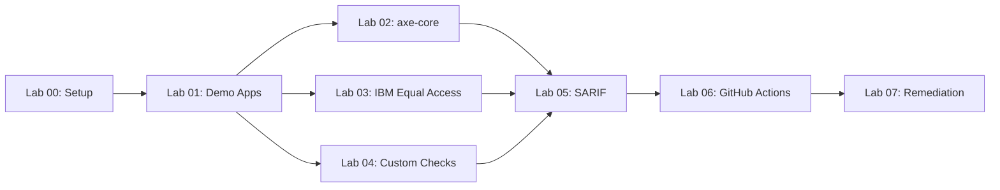

<!-- markdownlint-disable-file -->
# Implementation Details: Create accessibility-scan-workshop Repository and Refactor accessibility-scan-demo-app

## Context Reference

Sources: .copilot-tracking/research/2026-03-29/accessibility-scan-workshop-research.md, .copilot-tracking/research/subagents/2026-03-29/finops-scan-demo-app-research.md, .copilot-tracking/research/subagents/2026-03-29/finops-scan-workshop-research.md, .copilot-tracking/research/subagents/2026-03-29/finops-scripts-deep-dive-research.md, .copilot-tracking/research/subagents/2026-03-29/a11y-demo-apps-research.md

## Implementation Phase 1: Embed Demo App Template Directories

<!-- parallelizable: true -->

### Step 1.1: Copy a11y-demo-app-001 (Rust) into scanner repo

Clone the external `devopsabcs-engineering/a11y-demo-app-001` repository and copy its contents into `a11y-demo-app-001/` at the scanner repo root. This is a Rust-based travel agency web app serving on port 8001 with 15+ intentional WCAG violations.

Files:
* a11y-demo-app-001/.github/workflows/ci-cd.yml - GitHub Actions CI/CD pipeline for Rust app
* a11y-demo-app-001/.github/workflows/a11y-scan.yml - Accessibility scan workflow using scanner action
* a11y-demo-app-001/.azuredevops/pipelines/ci-cd.yml - ADO CI/CD pipeline
* a11y-demo-app-001/.azuredevops/pipelines/a11y-scan.yml - ADO accessibility scan pipeline
* a11y-demo-app-001/infra/main.bicep - ACR + App Service Plan (B1) + Web App
* a11y-demo-app-001/Cargo.toml - Rust dependencies (actix-web)
* a11y-demo-app-001/Dockerfile - Multi-stage Rust build
* a11y-demo-app-001/README.md - App description and instructions
* a11y-demo-app-001/start-local.ps1 - Local dev startup script
* a11y-demo-app-001/stop-local.ps1 - Local dev stop script
* a11y-demo-app-001/src/main.rs - Rust web server with static file serving
* a11y-demo-app-001/src/static/index.html - Deliberately inaccessible travel agency page

Discrepancy references:
* Addresses user requirement to embed demo apps as template directories

Success criteria:
* Directory `a11y-demo-app-001/` exists at repo root with all files listed above
* Dockerfile builds successfully with `docker build -t a11y-demo-app-001 ./a11y-demo-app-001`

Context references:
* .copilot-tracking/research/subagents/2026-03-29/a11y-demo-apps-research.md - Demo app structure details
* .copilot-tracking/research/2026-03-29/accessibility-scan-workshop-research.md (Lines 300-340) - Demo app template directory structure

Dependencies:
* Access to `devopsabcs-engineering/a11y-demo-app-001` repository

### Step 1.2: Copy a11y-demo-app-002 (C#) into scanner repo

Clone the external `devopsabcs-engineering/a11y-demo-app-002` repository and copy its contents into `a11y-demo-app-002/` at the scanner repo root. This is a C#/ASP.NET e-commerce web app serving on port 8002.

Files:
* a11y-demo-app-002/ - Same structure as 001 with C#-specific files (*.csproj, Program.cs, wwwroot/)

Discrepancy references:
* Addresses user requirement to embed demo apps as template directories

Success criteria:
* Directory `a11y-demo-app-002/` exists at repo root with complete C# app contents

Context references:
* .copilot-tracking/research/subagents/2026-03-29/a11y-demo-apps-research.md - C# demo app details

Dependencies:
* Access to `devopsabcs-engineering/a11y-demo-app-002` repository

### Step 1.3: Copy a11y-demo-app-003 (Java) into scanner repo

Clone the external `devopsabcs-engineering/a11y-demo-app-003` repository and copy its contents into `a11y-demo-app-003/` at the scanner repo root. This is a Java/Spring Boot learning platform web app serving on port 8003.

Files:
* a11y-demo-app-003/ - Same structure as 001 with Java-specific files (pom.xml, src/main/java/, src/main/resources/)

Discrepancy references:
* Addresses user requirement to embed demo apps as template directories

Success criteria:
* Directory `a11y-demo-app-003/` exists at repo root with complete Java app contents

Context references:
* .copilot-tracking/research/subagents/2026-03-29/a11y-demo-apps-research.md - Java demo app details

Dependencies:
* Access to `devopsabcs-engineering/a11y-demo-app-003` repository

### Step 1.4: Copy a11y-demo-app-004 (Python) into scanner repo

Clone the external `devopsabcs-engineering/a11y-demo-app-004` repository and copy its contents into `a11y-demo-app-004/` at the scanner repo root. This is a Python/Flask recipes web app serving on port 8004.

Files:
* a11y-demo-app-004/ - Same structure as 001 with Python-specific files (requirements.txt, app.py, templates/)

Discrepancy references:
* Addresses user requirement to embed demo apps as template directories

Success criteria:
* Directory `a11y-demo-app-004/` exists at repo root with complete Python app contents

Context references:
* .copilot-tracking/research/subagents/2026-03-29/a11y-demo-apps-research.md - Python demo app details

Dependencies:
* Access to `devopsabcs-engineering/a11y-demo-app-004` repository

### Step 1.5: Copy a11y-demo-app-005 (Go) into scanner repo

Clone the external `devopsabcs-engineering/a11y-demo-app-005` repository and copy its contents into `a11y-demo-app-005/` at the scanner repo root. This is a Go fitness tracker web app serving on port 8005.

Files:
* a11y-demo-app-005/ - Same structure as 001 with Go-specific files (go.mod, main.go, static/)

Discrepancy references:
* Addresses user requirement to embed demo apps as template directories

Success criteria:
* Directory `a11y-demo-app-005/` exists at repo root with complete Go app contents

Context references:
* .copilot-tracking/research/subagents/2026-03-29/a11y-demo-apps-research.md - Go demo app details

Dependencies:
* Access to `devopsabcs-engineering/a11y-demo-app-005` repository

## Implementation Phase 2: Create Bootstrap and OIDC Scripts

<!-- parallelizable: true -->

### Step 2.1: Create scripts/setup-oidc.ps1

Create the Azure AD application registration and federated identity credential script, adapted from the finops version. This script creates/reuses an Azure AD app named `a11y-scanner-github-actions`, configures 11 federated credentials (main branch for scanner + 5 demo apps, production environment for 5 demo apps), creates/reuses a service principal, and assigns Contributor role.

Files:
* scripts/setup-oidc.ps1 - OIDC setup script (~140 lines)

Discrepancy references:
* Addresses user requirement to add setup-oidc.ps1

Success criteria:
* Script accepts `-Org`, `-SubscriptionId` parameters
* Script creates Azure AD app registration named `a11y-scanner-github-actions`
* Script creates 11 federated credentials covering all repos and branches/environments
* Script outputs AZURE_CLIENT_ID, AZURE_TENANT_ID, AZURE_SUBSCRIPTION_ID
* Script is idempotent (safe to run multiple times)

Context references:
* .copilot-tracking/research/subagents/2026-03-29/finops-scripts-deep-dive-research.md - setup-oidc.ps1 pattern details
* .copilot-tracking/research/2026-03-29/accessibility-scan-workshop-research.md (Lines 325-340) - Key adaptations from finops

Dependencies:
* Azure CLI (`az`) installed and authenticated

Script structure:

```powershell
param(
    [string]$Org = 'devopsabcs-engineering',
    [string]$SubscriptionId = '',
    [string]$AppName = 'a11y-scanner-github-actions'
)

# 1. Get or create Azure AD app registration
# 2. Define federated credential subjects:
#    - repo:devopsabcs-engineering/accessibility-scan-demo-app:ref:refs/heads/main
#    - repo:devopsabcs-engineering/a11y-demo-app-001:ref:refs/heads/main
#    - repo:devopsabcs-engineering/a11y-demo-app-001:environment:production
#    - (repeat for 002-005)
# 3. Create federated credentials (skip existing)
# 4. Get or create service principal
# 5. Assign Contributor role on subscription
# 6. Output credential values
```

### Step 2.2: Create scripts/bootstrap-demo-apps.ps1

Create the demo app repository bootstrap script, adapted from the finops version. This script creates 5 public GitHub repos from the embedded template directories, configures OIDC secrets, creates production environments, and initializes wikis.

Files:
* scripts/bootstrap-demo-apps.ps1 - Bootstrap script (~280 lines)

Discrepancy references:
* Addresses user requirement to add bootstrap-demo-apps.ps1
* DD-01: Simpler than finops version (no VM_ADMIN_PASSWORD or INFRACOST_API_KEY)

Success criteria:
* Script accepts `-Org`, `-ScannerRepo` parameters
* Script defines 5 demo apps with correct names, ports, languages, and themes
* Script creates public repos idempotently using `gh repo create`
* Script pushes template directory content to each repo
* Script configures OIDC secrets (AZURE_CLIENT_ID, AZURE_TENANT_ID, AZURE_SUBSCRIPTION_ID)
* Script creates `production` environment on each repo
* Script configures ORG_ADMIN_TOKEN secret
* Script initializes wiki for each repo
* Script configures secrets on scanner repo (DISPATCH_PAT, OIDC values)

Context references:
* .copilot-tracking/research/subagents/2026-03-29/finops-scripts-deep-dive-research.md - bootstrap-demo-apps.ps1 pattern details
* .copilot-tracking/research/2026-03-29/accessibility-scan-workshop-research.md (Lines 300-330) - Key adaptations table

Dependencies:
* GitHub CLI (`gh`) authenticated with org admin permissions
* Step 2.1 completion (OIDC values needed as input)
* Phase 1 completion (demo app template directories must exist)

Script structure:

```powershell
param(
    [string]$Org = 'devopsabcs-engineering',
    [string]$ScannerRepo = 'accessibility-scan-demo-app'
)

$DemoApps = @(
    @{ Name = 'a11y-demo-app-001'; Port = 8001; Lang = 'Rust'; Theme = 'Travel Agency' }
    @{ Name = 'a11y-demo-app-002'; Port = 8002; Lang = 'C#'; Theme = 'E-Commerce' }
    @{ Name = 'a11y-demo-app-003'; Port = 8003; Lang = 'Java'; Theme = 'Learning Platform' }
    @{ Name = 'a11y-demo-app-004'; Port = 8004; Lang = 'Python'; Theme = 'Recipe Sharing' }
    @{ Name = 'a11y-demo-app-005'; Port = 8005; Lang = 'Go'; Theme = 'Fitness Tracker' }
)

# 1. Collect OIDC values (env vars or prompted)
# 2. Collect ORG_ADMIN_TOKEN
# 3. Optionally run setup-oidc.ps1
# 4. For each demo app:
#    a. gh repo create "$Org/$app.Name" --public (idempotent)
#    b. Clone, copy template content, push
#    c. Set topics: accessibility, a11y, wcag, aoda, $app.Lang
#    d. Enable code scanning
#    e. Set OIDC secrets
#    f. Create 'production' environment
#    g. Set ORG_ADMIN_TOKEN secret
#    h. Initialize wiki
# 5. Configure scanner repo secrets
```

### Step 2.3: Validate scripts with syntax check

Run PowerShell syntax validation on both scripts.

Validation commands:
* `pwsh -c "& { $null = [System.Management.Automation.Language.Parser]::ParseFile('scripts/setup-oidc.ps1', [ref]$null, [ref]$null) }"` - Syntax check setup-oidc.ps1
* `pwsh -c "& { $null = [System.Management.Automation.Language.Parser]::ParseFile('scripts/bootstrap-demo-apps.ps1', [ref]$null, [ref]$null) }"` - Syntax check bootstrap-demo-apps.ps1

## Implementation Phase 3: Update Scanner Repo README

<!-- parallelizable: true -->

### Step 3.1: Update README.md with demo apps section, scripts section, and quick-start

Add sections to the scanner repo README documenting the embedded demo apps, the scripts directory, and a quick-start guide for bootstrapping the environment.

Files:
* README.md - Add new sections below existing content

Discrepancy references:
* Derived objective: embedding demo apps requires documentation

Success criteria:
* README contains a "Demo Applications" section listing all 5 apps with language, theme, and port
* README contains a "Scripts" section documenting bootstrap-demo-apps.ps1 and setup-oidc.ps1
* README contains a "Quick Start" section with step-by-step bootstrap instructions
* README contains an updated project structure tree showing `a11y-demo-app-NNN/` and `scripts/` directories

Context references:
* .copilot-tracking/research/2026-03-29/accessibility-scan-workshop-research.md (Lines 625-630) - README update requirements

Dependencies:
* Phase 1 completion (demo app directories must exist to describe them)

README additions:

```markdown
## Demo Applications

This repository contains 5 intentionally inaccessible web applications used as scan targets:

| App | Language | Theme | Local Port |
|-----|----------|-------|------------|
| a11y-demo-app-001 | Rust | Travel Agency | 8001 |
| a11y-demo-app-002 | C# | E-Commerce | 8002 |
| a11y-demo-app-003 | Java | Learning Platform | 8003 |
| a11y-demo-app-004 | Python | Recipe Sharing | 8004 |
| a11y-demo-app-005 | Go | Fitness Tracker | 8005 |

Each app contains 15+ intentional WCAG 2.2 violations across categories
including missing alt text, contrast failures, keyboard traps, and more.

## Scripts

| Script | Purpose |
|--------|---------|
| `scripts/bootstrap-demo-apps.ps1` | Creates demo app repos from template directories, configures OIDC, secrets, environments |
| `scripts/setup-oidc.ps1` | Creates Azure AD app registration with federated credentials for OIDC auth |

## Quick Start

1. Clone this repository
2. Log in to Azure CLI: `az login`
3. Log in to GitHub CLI: `gh auth login`
4. Run OIDC setup: `./scripts/setup-oidc.ps1`
5. Run bootstrap: `./scripts/bootstrap-demo-apps.ps1`
```

## Implementation Phase 4: Create Workshop Repository Structure

<!-- parallelizable: false -->

### Step 4.1: Initialize accessibility-scan-workshop repository

Create the `devopsabcs-engineering/accessibility-scan-workshop` repository as a template repository with MIT license.

Files:
* README.md - Workshop landing page with architecture overview, lab table, prerequisites, delivery tiers
* LICENSE - MIT license
* .gitignore - Jekyll and Node.js ignores

Discrepancy references:
* Addresses user requirement to create workshop repository

Success criteria:
* Repository `devopsabcs-engineering/accessibility-scan-workshop` exists as a template repo
* README contains lab overview table with 8 labs, duration, and prerequisites
* README contains architecture diagram reference
* README contains delivery tiers table (half-day and full-day)

Context references:
* .copilot-tracking/research/subagents/2026-03-29/finops-scan-workshop-research.md - Workshop repo patterns
* .copilot-tracking/research/2026-03-29/accessibility-scan-workshop-research.md (Lines 360-420) - Workshop structure

Dependencies:
* GitHub CLI (`gh`) for repo creation

README structure:

```markdown
# Accessibility Scan Workshop

Hands-on workshop teaching WCAG 2.2 accessibility scanning using axe-core,
IBM Equal Access, and custom Playwright checks.

## Architecture


## Labs

| Lab | Title | Duration | Level |
|-----|-------|----------|-------|
| 00 | Prerequisites and Environment Setup | 30 min | Beginner |
| 01 | Explore the Demo Apps and WCAG Violations | 25 min | Beginner |
| 02 | axe-core — Automated Accessibility Testing | 35 min | Intermediate |
| 03 | IBM Equal Access — Comprehensive Policy Scanning | 30 min | Intermediate |
| 04 | Custom Playwright Checks — Manual Inspection Automation | 35 min | Intermediate |
| 05 | SARIF Output and GitHub Security Tab | 30 min | Intermediate |
| 06 | GitHub Actions Pipelines and Scan Gates | 40 min | Advanced |
| 07 | Remediation Workflows with Copilot Agents | 45 min | Advanced |

## Delivery Tiers

| Tier | Labs | Duration | Azure Required |
|------|------|----------|---------------|
| Half-Day | 00, 01, 02, 03, 05 | ~3 hours | No |
| Full-Day | 00–07 (all) | ~6.5 hours | Yes |

## Prerequisites

- GitHub account with Copilot access
- Node.js 20+
- Docker Desktop
- Azure subscription (full-day tier only)
- PowerShell 7+
```

### Step 4.2: Create Jekyll GitHub Pages infrastructure

Create the Jekyll configuration files for GitHub Pages hosting.

Files:
* _config.yml - Jekyll site configuration
* Gemfile - Ruby dependencies for Jekyll
* _includes/head-custom.html - Mermaid.js CDN integration
* index.md - Jekyll landing page with lab checklist

Discrepancy references:
* Derived objective: workshop requires browsable GitHub Pages site

Success criteria:
* `_config.yml` has correct title, description, theme, and plugins
* `Gemfile` includes jekyll, jekyll-theme-minimal, jekyll-relative-links
* `_includes/head-custom.html` loads Mermaid.js from CDN
* `index.md` has Jekyll frontmatter and links to all 8 labs

Context references:
* .copilot-tracking/research/2026-03-29/accessibility-scan-workshop-research.md (Lines 405-430) - Jekyll config examples

Dependencies:
* Step 4.1 completion (repository must exist)

File contents:

**_config.yml:**
```yaml
title: Accessibility Scan Workshop
description: >-
  Learn to scan web applications for WCAG 2.2 accessibility violations
  using axe-core, IBM Equal Access, and custom Playwright checks.
theme: jekyll-theme-minimal
plugins:
  - jekyll-relative-links
```

**Gemfile:**
```ruby
source 'https://rubygems.org'
gem 'jekyll', '~> 3.10'
gem 'jekyll-theme-minimal'
gem 'jekyll-relative-links'
```

**_includes/head-custom.html:**
```html
<script type="module">
  import mermaid from 'https://cdn.jsdelivr.net/npm/mermaid@10/dist/mermaid.esm.min.mjs';
  mermaid.initialize({ startOnLoad: true });
</script>
```

**index.md:**
```markdown
---
layout: default
title: Home
---

# Accessibility Scan Workshop

Complete hands-on labs to learn WCAG 2.2 accessibility scanning.

## Lab Checklist

- [ ] [Lab 00: Prerequisites and Environment Setup](labs/lab-00-setup.md)
- [ ] [Lab 01: Explore the Demo Apps and WCAG Violations](labs/lab-01.md)
- [ ] [Lab 02: axe-core — Automated Accessibility Testing](labs/lab-02.md)
- [ ] [Lab 03: IBM Equal Access — Comprehensive Policy Scanning](labs/lab-03.md)
- [ ] [Lab 04: Custom Playwright Checks — Manual Inspection](labs/lab-04.md)
- [ ] [Lab 05: SARIF Output and GitHub Security Tab](labs/lab-05.md)
- [ ] [Lab 06: GitHub Actions Pipelines and Scan Gates](labs/lab-06.md)
- [ ] [Lab 07: Remediation Workflows with Copilot Agents](labs/lab-07.md)
```

### Step 4.3: Create CONTRIBUTING.md with lab authoring style guide

Create contributing guidelines consistent with the finops workshop pattern.

Files:
* CONTRIBUTING.md - Lab authoring conventions and style guide

Discrepancy references:
* Derived objective: maintaining consistency across labs requires documented conventions

Success criteria:
* CONTRIBUTING.md documents the lab document structure (frontmatter, overview table, exercises, verification, next steps)
* CONTRIBUTING.md documents screenshot naming conventions and inventory README format
* CONTRIBUTING.md documents the delivery tier model

Context references:
* .copilot-tracking/research/subagents/2026-03-29/finops-scan-workshop-research.md - CONTRIBUTING.md patterns

Dependencies:
* Step 4.1 completion

Content outline:
- Lab document template with YAML frontmatter pattern
- Exercise numbering and code block formatting conventions
- Screenshot naming: `lab-XX-screenshot-description.png`
- Screenshot reference format: ``
- Inventory README format per lab
- Delivery tier annotations

## Implementation Phase 5: Create Workshop Lab Documents

<!-- parallelizable: true -->

### Step 5.1: Create Lab 00 — Prerequisites and Environment Setup

Create the setup lab covering tool installation, repository forking, and environment verification.

Files:
* labs/lab-00-setup.md - Prerequisites and environment setup lab

Discrepancy references:
* Addresses user requirement for 8 workshop labs

Success criteria:
* Lab has YAML frontmatter with permalink, title, description
* Lab has overview table (30 min, Beginner, no prerequisites)
* Lab covers: Node.js 20+, Docker Desktop, GitHub CLI, Azure CLI, PowerShell 7+, Charm freeze
* Lab covers: fork repos, clone scanner repo, verify tools
* Lab has verification checkpoint checklist
* Lab has next steps link to Lab 01

Context references:
* .copilot-tracking/research/2026-03-29/accessibility-scan-workshop-research.md (Lines 370-390) - Lab plan table
* .copilot-tracking/research/subagents/2026-03-29/finops-scan-workshop-research.md - Lab structure patterns

Dependencies:
* None (first lab)

Key exercises:
1. Install required tools (Node.js, Docker, gh, az, pwsh, freeze)
2. Fork and clone `accessibility-scan-demo-app`
3. Fork and clone `accessibility-scan-workshop`
4. Run `npm install` in scanner repo
5. Verify tool versions with `node --version`, `docker --version`, etc.
6. Start scanner locally with `./start-local.ps1`
7. Verify scanner is running at `http://localhost:3000`

### Step 5.2: Create Lab 01 — Explore the Demo Apps and WCAG Violations

Create the lab exploring the 5 deliberately inaccessible demo apps and understanding WCAG violation categories.

Files:
* labs/lab-01.md - Demo apps exploration lab

Discrepancy references:
* Addresses user requirement for 8 workshop labs

Success criteria:
* Lab covers all 5 demo apps with their themes and violation categories
* Lab demonstrates using browser DevTools accessibility audit
* Lab explains WCAG 2.2 POUR principles with examples from demo apps
* Lab has verification checkpoint and next steps

Context references:
* .copilot-tracking/research/subagents/2026-03-29/a11y-demo-apps-research.md - Demo app violations
* .github/instructions/wcag22-rules.instructions.md - WCAG 2.2 POUR principles

Dependencies:
* Lab 00 completion (tools and repos set up)

Key exercises:
1. Start demo apps locally (docker build/run for each)
2. Open each app in browser, identify visible violations
3. Run Chrome DevTools Lighthouse audit on demo app 001
4. Map violations to WCAG 2.2 success criteria
5. Categorize violations by POUR principle

### Step 5.3: Create Lab 02 — axe-core Automated Accessibility Testing

Create the lab covering axe-core scanning via the scanner API and CLI.

Files:
* labs/lab-02.md - axe-core scanning lab

Discrepancy references:
* Addresses user requirement for 8 workshop labs

Success criteria:
* Lab demonstrates scanning via scanner web UI (localhost:3000)
* Lab demonstrates scanning via CLI (`npx a11y-scan scan --url <url>`)
* Lab demonstrates scanning via API (`POST /api/scan`)
* Lab explains axe-core rule categories and impact levels
* Lab shows how to interpret scan results

Context references:
* .copilot-tracking/research/2026-03-29/accessibility-scan-workshop-research.md (Lines 378-380) - Lab 02 details
* src/lib/scanner/engine.ts - Scanner engine implementation

Dependencies:
* Lab 01 completion (demo apps running)

Key exercises:
1. Scan demo app 001 via web UI
2. Interpret scan results: violations, passes, incomplete
3. Scan via CLI with JSON output
4. Scan via API and parse response
5. Compare axe-core findings with manual DevTools audit

### Step 5.4: Create Lab 03 — IBM Equal Access Comprehensive Policy Scanning

Create the lab covering IBM accessibility-checker for policy-based scanning.

Files:
* labs/lab-03.md - IBM Equal Access scanning lab

Discrepancy references:
* Addresses user requirement for 8 workshop labs

Success criteria:
* Lab explains IBM Equal Access checker and its rule set
* Lab demonstrates running IBM checker via scanner
* Lab compares IBM findings with axe-core findings
* Lab covers configuration options

Context references:
* .copilot-tracking/research/2026-03-29/accessibility-scan-workshop-research.md (Lines 381-383) - Lab 03 details
* package.json - accessibility-checker dependency

Dependencies:
* Lab 01 completion (demo apps running)

Key exercises:
1. Run IBM Equal Access scan on demo app 002
2. Compare violation categories with axe-core
3. Examine policy-specific findings
4. Configure scanner mode (axe-only, ibm-only, combined)
5. Review combined report output

### Step 5.5: Create Lab 04 — Custom Playwright Checks Manual Inspection Automation

Create the lab covering custom Playwright accessibility checks.

Files:
* labs/lab-04.md - Custom Playwright checks lab

Discrepancy references:
* Addresses user requirement for 8 workshop labs

Success criteria:
* Lab explains why custom checks complement automated tools
* Lab demonstrates existing custom checks in the scanner
* Lab shows how to write a new custom check
* Lab covers keyboard navigation testing via Playwright

Context references:
* src/lib/scanner/custom-checks.ts - Custom checks implementation
* .copilot-tracking/research/2026-03-29/accessibility-scan-workshop-research.md (Lines 384-386) - Lab 04 details

Dependencies:
* Lab 01 completion (demo apps running)

Key exercises:
1. Review custom-checks.ts source code
2. Run scanner with custom checks enabled
3. Examine keyboard navigation check results
4. Write a new custom check for focus-visible
5. Run the updated scanner and verify new check output

### Step 5.6: Create Lab 05 — SARIF Output and GitHub Security Tab

Create the lab covering SARIF output format and GitHub Advanced Security integration.

Files:
* labs/lab-05.md - SARIF and Security tab lab

Discrepancy references:
* Addresses user requirement for 8 workshop labs

Success criteria:
* Lab explains SARIF v2.1.0 format and structure
* Lab demonstrates generating SARIF from scanner
* Lab shows uploading SARIF to GitHub Security tab
* Lab covers filtering and triaging findings in Security tab

Context references:
* src/lib/report/sarif-generator.ts - SARIF generator implementation
* src/lib/ci/formatters/sarif.ts - CI SARIF formatter
* .copilot-tracking/research/2026-03-29/accessibility-scan-workshop-research.md (Lines 387-389) - Lab 05 details

Dependencies:
* Lab 02, 03, or 04 completion (scan results from at least one engine)

Key exercises:
1. Generate SARIF output from CLI scan
2. Examine SARIF structure (runs, results, rules, locations)
3. Upload SARIF to GitHub using `codeql-action/upload-sarif`
4. Browse findings in GitHub Security tab
5. Filter by severity, rule, and file
6. Dismiss or triage findings

### Step 5.7: Create Lab 06 — GitHub Actions Pipelines and Scan Gates

Create the lab covering CI/CD integration with GitHub Actions and quality gates.

Files:
* labs/lab-06.md - GitHub Actions and scan gates lab

Discrepancy references:
* Addresses user requirement for 8 workshop labs

Success criteria:
* Lab demonstrates the ci.yml workflow structure
* Lab explains OIDC authentication with `setup-oidc.ps1`
* Lab shows scan-all.yml matrix dispatch pattern
* Lab covers threshold-based quality gates
* Lab demonstrates deploy-all.yml orchestration

Context references:
* .github/workflows/ci.yml - CI pipeline
* .github/workflows/deploy-all.yml - Deploy orchestrator
* .github/workflows/scan-all.yml - Scan dispatcher
* scripts/setup-oidc.ps1 - OIDC setup (created in Phase 2)

Dependencies:
* Lab 05 completion (SARIF understanding)
* Azure subscription (for deployment exercises)

Key exercises:
1. Review ci.yml workflow structure
2. Review deploy-all.yml matrix dispatch
3. Run OIDC setup script
4. Run bootstrap script to create demo app repos
5. Trigger deploy-all workflow
6. Monitor matrix job execution
7. Configure threshold-based scan gates

### Step 5.8: Create Lab 07 — Remediation Workflows with Copilot Agents

Create the lab covering AI-assisted accessibility remediation using Copilot agents.

Files:
* labs/lab-07.md - Copilot remediation lab

Discrepancy references:
* Addresses user requirement for 8 workshop labs

Success criteria:
* Lab demonstrates A11yDetector agent (scan, score, identify top-10)
* Lab demonstrates A11yResolver agent (pattern-based fixes)
* Lab shows the handoff pattern between detector and resolver
* Lab covers creating a remediation PR
* Lab verifies fixes with re-scan

Context references:
* .github/agents/a11y-detector.agent.md - Detector agent definition
* .github/agents/a11y-resolver.agent.md - Resolver agent definition
* .github/instructions/a11y-remediation.instructions.md - Fix patterns

Dependencies:
* Lab 06 completion (GitHub Actions understanding)
* GitHub Copilot access

Key exercises:
1. Open Copilot Chat and invoke A11yDetector on demo app 001
2. Review detector output: score, top-10 violations, WCAG mapping
3. Accept handoff to A11yResolver
4. Review resolver's proposed fixes
5. Apply fixes to demo app source code
6. Create a PR with fixes
7. Re-scan to verify score improvement

## Implementation Phase 6: Create Screenshot Infrastructure

<!-- parallelizable: true -->

### Step 6.1: Create screenshot inventory README.md files for each lab

Create inventory manifest files in each `images/lab-XX/` directory documenting expected screenshots.

Files:
* images/lab-00/README.md - Lab 00 screenshot inventory (7 screenshots)
* images/lab-01/README.md - Lab 01 screenshot inventory (6 screenshots)
* images/lab-02/README.md - Lab 02 screenshot inventory (6 screenshots)
* images/lab-03/README.md - Lab 03 screenshot inventory (5 screenshots)
* images/lab-04/README.md - Lab 04 screenshot inventory (5 screenshots)
* images/lab-05/README.md - Lab 05 screenshot inventory (6 screenshots)
* images/lab-06/README.md - Lab 06 screenshot inventory (7 screenshots)
* images/lab-07/README.md - Lab 07 screenshot inventory (5 screenshots)

Discrepancy references:
* Derived objective: automated capture script needs manifests

Success criteria:
* Each README lists all expected screenshots with filename, description, capture method, and phase
* Total across all labs is ~47 screenshots
* Each entry follows format: `| filename.png | Description | freeze/file/playwright | Phase |`

Context references:
* .copilot-tracking/research/2026-03-29/accessibility-scan-workshop-research.md (Lines 430-460) - Screenshot estimates table

Dependencies:
* Phase 5 completion (lab content determines screenshot needs)

Inventory format per README:

```markdown
# Lab XX: Title — Screenshot Inventory

| Filename | Description | Method | Phase |
|----------|-------------|--------|-------|
| lab-XX-tool-version.png | Tool version output | freeze | 1 |
| lab-XX-scan-output.png | Scan results | freeze | 1 |
```

### Step 6.2: Create images/lab-dependency-diagram.mmd

Create the Mermaid diagram showing lab dependency relationships.

Files:
* images/lab-dependency-diagram.mmd - Mermaid source for lab dependency graph

Discrepancy references:
* Derived objective: visualizing lab prerequisites

Success criteria:
* Diagram shows all 8 labs with correct dependencies
* Labs 02, 03, 04 are parallel after Lab 01
* Labs 05 depends on 02, 03, 04
* Lab 06 depends on 05
* Lab 07 depends on 06

Context references:
* .copilot-tracking/research/2026-03-29/accessibility-scan-workshop-research.md (Lines 395-405) - Mermaid diagram

Dependencies:
* None

Content:



## Implementation Phase 7: Create Capture-Screenshots Script

<!-- parallelizable: false -->

### Step 7.1: Create scripts/capture-screenshots.ps1 with helper functions

Create the main script file with parameters, helper functions, and phase orchestration.

Files:
* scripts/capture-screenshots.ps1 - Screenshot capture script (~650 lines)

Discrepancy references:
* Addresses user requirement for automated screenshot capture

Success criteria:
* Script accepts parameters: `-OutputDir`, `-LabFilter`, `-Theme`, `-FontSize`, `-Org`, `-Phase`
* Script defines 4 helper functions: `Invoke-FreezeScreenshot`, `Invoke-CapturedFreezeScreenshot`, `Invoke-FreezeFile`, `Invoke-PlaywrightScreenshot`
* Script defines `Test-ShouldCapture` for lab filtering
* Script reports summary with captured/failed/elapsed counts

Context references:
* .copilot-tracking/research/subagents/2026-03-29/finops-scripts-deep-dive-research.md - capture-screenshots.ps1 architecture
* .copilot-tracking/research/2026-03-29/accessibility-scan-workshop-research.md (Lines 460-520) - Script design

Dependencies:
* Charm `freeze` CLI installed
* Playwright installed (via scanner repo npm install)

Script parameters:

```powershell
param(
    [string]$OutputDir = 'images',
    [string]$LabFilter = '',
    [string]$Theme = 'dracula',
    [int]$FontSize = 14,
    [string]$Org = 'devopsabcs-engineering',
    [string]$GitHubAuthState = 'github-auth.json',
    [string]$AzureAuthState = 'azure-auth.json',
    [ValidateSet('', '1', '2', '3')]
    [string]$Phase = ''
)
```

Helper functions:

1. **Invoke-FreezeScreenshot** — Execute a command and capture terminal output via `freeze --execute`
2. **Invoke-CapturedFreezeScreenshot** — Pre-capture output to file, then render with `freeze`
3. **Invoke-FreezeFile** — Capture source file content with line numbers via `freeze --show-line-numbers`
4. **Invoke-PlaywrightScreenshot** — Capture browser page via `npx playwright screenshot`

### Step 7.2: Implement Phase 1 captures (offline: tool versions, file content, scan outputs)

Add Phase 1 capture calls for offline screenshots that require only local tools and scanner repo.

Files:
* scripts/capture-screenshots.ps1 - Phase 1 section (~150 lines added)

Discrepancy references:
* Addresses user requirement for automated capture across phases

Success criteria:
* Captures tool version outputs (node, docker, gh, az, pwsh, freeze)
* Captures demo app HTML source files showing violations
* Captures scanner engine source files (engine.ts, custom-checks.ts)
* Captures local scan outputs (axe-core, IBM, combined)
* Captures SARIF output sample
* Captures workflow YAML files

Context references:
* .copilot-tracking/research/2026-03-29/accessibility-scan-workshop-research.md (Lines 490-510) - Phase 1 capture details

Dependencies:
* Step 7.1 completion (helper functions defined)
* Scanner repo cloned with demo app directories
* Tools installed locally

Phase 1 capture targets (~20 screenshots):
- Lab 00: tool versions (7 freeze screenshots)
- Lab 01: demo app HTML source (3 freeze-file screenshots)
- Lab 02: axe-core scan output, SARIF (3 freeze + 1 freeze-file)
- Lab 03: IBM scan output (2 freeze)
- Lab 04: custom-checks.ts source, check output (2 freeze-file + 1 freeze)
- Lab 05: SARIF file structure (1 freeze-file)

### Step 7.3: Implement Phase 2 captures (Azure-deployed: app pages, portal)

Add Phase 2 capture calls for screenshots requiring deployed Azure resources.

Files:
* scripts/capture-screenshots.ps1 - Phase 2 section (~100 lines added)

Discrepancy references:
* Addresses user requirement for automated capture across phases

Success criteria:
* Captures deployed demo app pages via Playwright
* Captures Azure Portal resource group view (optional)
* Handles missing Azure auth gracefully with warnings

Context references:
* .copilot-tracking/research/2026-03-29/accessibility-scan-workshop-research.md (Lines 510-520) - Phase 2 capture details

Dependencies:
* Demo apps deployed to Azure
* Azure CLI authenticated

Phase 2 capture targets (~10 screenshots):
- Lab 00: fork page on GitHub (1 Playwright)
- Lab 01: deployed demo app pages (5 Playwright)
- Lab 04: deployed app showing focus issues (2 Playwright)
- Lab 05: deployed scanner results page (2 Playwright)

### Step 7.4: Implement Phase 3 captures (GitHub web UI: Security tab, Actions, PRs)

Add Phase 3 capture calls for screenshots requiring GitHub web authentication.

Files:
* scripts/capture-screenshots.ps1 - Phase 3 section (~100 lines added)

Discrepancy references:
* Addresses user requirement for automated capture across phases

Success criteria:
* Captures GitHub Security tab with accessibility findings
* Captures GitHub Actions workflow runs and matrix view
* Captures Copilot Chat remediation session (if automatable)
* Captures before/after comparison screenshots
* Handles missing GitHub auth gracefully

Context references:
* .copilot-tracking/research/2026-03-29/accessibility-scan-workshop-research.md (Lines 520-530) - Phase 3 capture details

Dependencies:
* GitHub authentication token
* Previous scans uploaded to Security tab

Phase 3 capture targets (~17 screenshots):
- Lab 05: Security tab overview, alert detail, filtering (3 Playwright)
- Lab 06: Actions runs, matrix view, artifacts, OIDC config (5 Playwright + 2 freeze-file)
- Lab 07: Copilot chat, remediation PR, before/after (5 Playwright)

### Step 7.5: Validate script syntax

Run PowerShell syntax validation.

Validation commands:
* `pwsh -c "& { $null = [System.Management.Automation.Language.Parser]::ParseFile('scripts/capture-screenshots.ps1', [ref]$null, [ref]$null) }"` - Syntax check

## Implementation Phase 8: Final Validation

<!-- parallelizable: false -->

### Step 8.1: Verify scanner repo structure

Validate that the scanner repo contains all expected new directories and files.

Validation checks:
* `Test-Path a11y-demo-app-001/Dockerfile` through `a11y-demo-app-005/Dockerfile`
* `Test-Path scripts/bootstrap-demo-apps.ps1`
* `Test-Path scripts/setup-oidc.ps1`
* Verify README.md contains "Demo Applications" section
* Verify no modifications to existing scanner source code (src/, package.json, Dockerfile, etc.)

### Step 8.2: Verify workshop repo structure

Validate workshop repository layout.

Validation checks:
* 8 lab files exist: `labs/lab-00-setup.md` through `labs/lab-07.md`
* Jekyll config files exist: `_config.yml`, `Gemfile`, `_includes/head-custom.html`, `index.md`
* 8 screenshot inventory directories with READMEs: `images/lab-00/README.md` through `images/lab-07/README.md`
* `scripts/capture-screenshots.ps1` exists
* `CONTRIBUTING.md` exists
* Lab dependency diagram exists: `images/lab-dependency-diagram.mmd`

### Step 8.3: Cross-reference screenshot references

Validate that all `` references in lab files have corresponding entries in the inventory READMEs.

### Step 8.4: Run bootstrap script Phase 1 dry-run (if available)

Verify that the bootstrap script logic is idempotent by reviewing repo creation guards and secret setting patterns. If `gh` CLI is authenticated, test with `--dry-run` or by inspecting the script output without creating real repos.

Validation checks:
* Script handles existing repos gracefully (no errors on re-run)
* OIDC values are validated before use
* Topics and secrets are set correctly for each app

### Step 8.5: Run capture-screenshots.ps1 Phase 1 (offline captures)

Execute Phase 1 of the capture script to verify offline screenshot generation works.

Validation commands:
* `pwsh -c "./scripts/capture-screenshots.ps1 -Phase 1"` - Run Phase 1 captures

### Step 8.5: Report blocking issues

Document any issues found during validation that require:
* Additional research (e.g., Copilot Chat screenshot automation feasibility)
* Azure deployment for Phase 2/3 capture validation
* Manual verification steps

## Dependencies

* GitHub CLI (`gh`) version 2.0+
* Azure CLI (`az`) version 2.50+
* PowerShell 7+ (`pwsh`)
* Node.js 20+ (`node`)
* Docker Desktop
* Charm `freeze` CLI
* Playwright (via scanner repo `npm install`)
* Jekyll + Ruby (for local workshop site testing)
* Git

## Success Criteria

* Scanner repo contains 5 demo app template directories with complete contents
* Scanner repo contains bootstrap and OIDC scripts that pass syntax validation
* Workshop repo contains 8 lab documents following consistent structure
* Workshop repo has Jekyll GitHub Pages infrastructure
* Capture-screenshots.ps1 Phase 1 generates screenshots without errors
* Both repos structurally mirror their finops counterparts
