<!-- markdownlint-disable-file -->
# Task Research: Phase 2 — Site Crawling & CI/CD Integration

Extend the Phase 1 single-page WCAG 2.2 accessibility scanner with two major capabilities: (1) crawl sub-URLs from a home URL to generate site-wide accessibility reports, and (2) CI/CD pipeline integration for automated accessibility testing in development workflows.

## Task Implementation Requests

* Multi-page site crawling: accept a root URL, discover sub-pages, scan each, and produce an aggregated site-wide report
* CI/CD integration: provide API endpoints and/or CLI tooling that enables automated accessibility checks in GitHub Actions, Azure DevOps, and other CI systems
* Maintain backward compatibility with Phase 1 single-page scanning
* Extend existing Next.js API routes and TypeScript types

## Scope and Success Criteria

* Scope: Phase 2 features — site crawling + CI/CD. Builds on the existing Next.js + axe-core + Playwright codebase. Excludes authentication/login flows and dual-engine (IBM Equal Access) integration.
* Assumptions:
  * Phase 1 is stable and deployed (single-page scan, scoring, PDF export all working)
  * In-memory store (`Map<string, ScanRecord>`) may need to evolve for multi-page scans
  * Crawling must respect robots.txt and rate-limit requests to target sites
  * CI/CD integration should support threshold-based pass/fail (e.g., "fail if score < 80")
  * The app remains a single Next.js codebase
* Success Criteria:
  * User can enter a root URL and get a site-wide accessibility report covering discovered sub-pages
  * Crawling respects configurable depth, page limit, and domain boundaries
  * Aggregated report shows per-page scores + overall site score
  * CI/CD endpoint accepts configuration (URL, thresholds) and returns machine-readable results
  * GitHub Actions workflow example is documented
  * API remains backward-compatible with Phase 1 single-page scanning

## Outline

1. Site Crawling Architecture
2. Crawling Libraries and Approaches
3. Multi-Page Scan Orchestration
4. Aggregated Scoring and Reporting
5. CI/CD API Design
6. CLI Tooling
7. GitHub Actions Integration
8. Azure DevOps Integration
9. Data Store Evolution
10. Concurrency and Performance
11. Rate Limiting and Ethical Crawling
12. Selected Approach and Alternatives

---

## Research Executed

### Subagent Research Documents

* [site-crawling-research.md](../subagents/2026-03-06/site-crawling-research.md) — Crawling libraries, architecture patterns, ethical crawling, integration with Playwright, sitemap discovery, URL deduplication
* [cicd-integration-research.md](../subagents/2026-03-06/cicd-integration-research.md) — Existing CI/CD tools, API design, SARIF format, GitHub Actions, Azure DevOps, CLI tool, thresholds
* [api-store-aggregation-research.md](../subagents/2026-03-06/api-store-aggregation-research.md) — API route expansion, data store evolution, orchestration, aggregated scoring, type system, concurrency

### Phase 1 Codebase Analysis

| File | Purpose | Phase 2 Impact |
|---|---|---|
| [src/lib/scanner/engine.ts](../../../src/lib/scanner/engine.ts) | Playwright + axe-core scan; launches browser per scan | Refactor to accept `Page` object; let crawler manage browser |
| [src/lib/scanner/store.ts](../../../src/lib/scanner/store.ts) | In-memory `Map<string, ScanRecord>` | Extend with `CrawlRecord` + TTL cleanup |
| [src/lib/scanner/result-parser.ts](../../../src/lib/scanner/result-parser.ts) | Parses axe results into `ScanResults` | Unchanged — reused per page |
| [src/lib/scoring/calculator.ts](../../../src/lib/scoring/calculator.ts) | Weighted scoring formula | Unchanged — new `site-calculator.ts` aggregates |
| [src/app/api/scan/route.ts](../../../src/app/api/scan/route.ts) | POST endpoint with SSRF protection | Unchanged — new `/api/crawl` routes added |
| [src/app/api/scan/[id]/status/route.ts](../../../src/app/api/scan/%5Bid%5D/status/route.ts) | SSE progress stream | Pattern reused for crawl progress with per-page events |
| [src/lib/types/scan.ts](../../../src/lib/types/scan.ts) | `ScanRecord`, `ScanResults`, `AxeViolation` | Unchanged — new `crawl.ts` types added |
| [src/lib/types/score.ts](../../../src/lib/types/score.ts) | `ScoreResult`, `PrincipleScores` | Unchanged — reused within `SiteScoreResult` |
| [Dockerfile](../../../Dockerfile) | Multi-stage build with Chromium | Add crawlee dependency; tune memory settings |
| [infra/main.bicep](../../../infra/main.bicep) | Azure App Service + ACR | May need higher SKU for crawl memory (B2+) |

### External Sources Researched

| Source | Key Finding |
|---|---|
| [crawlee npm](https://www.npmjs.com/package/crawlee) | 77K weekly DL, TypeScript-first, native `PlaywrightCrawler`, built-in URL dedup |
| [sitemapper npm](https://www.npmjs.com/package/sitemapper) | 56K weekly DL, TypeScript, active, sitemap index support |
| [robots-parser npm](https://www.npmjs.com/package/robots-parser) | 2.2M weekly DL, TypeScript, MIT, mature |
| [p-queue npm](https://www.npmjs.com/package/p-queue) | ESM, zero deps, 707K dependents, AbortSignal cancellation |
| [pa11y-ci npm](https://www.npmjs.com/package/pa11y-ci) | 120K weekly DL, reference CI runner, threshold support |
| [@axe-core/cli npm](https://www.npmjs.com/package/@axe-core/cli) | 35K weekly DL, built-in TypeScript, axe-only scanning |
| [commander npm](https://www.npmjs.com/package/commander) | 311M weekly DL, built-in TypeScript, zero deps |
| [SARIF v2.1.0 spec](https://docs.oasis-open.org/sarif/sarif/v2.1.0/sarif-v2.1.0.html) | OASIS standard; maps cleanly from axe-core violations |
| [GitHub SARIF upload](https://docs.github.com/en/code-security/code-scanning/integrating-with-code-scanning/uploading-a-sarif-file-to-github) | Requires `security-events: write`, max 10 MB, 25K results/run |
| [microsoft/accessibility-insights-action](https://github.com/microsoft/accessibility-insights-action) | TypeScript + Playwright + axe-core; ADO-only now; reference architecture |
| [Playwright browser contexts](https://playwright.dev/docs/browser-contexts) | Lightweight isolation (~5-10 MB each vs ~100 MB per browser) |

---

## Key Discoveries

### 1. Crawling Library Landscape

| Library | Weekly DLs | Last Update | TypeScript | Playwright | Verdict |
|---|---|---|---|---|---|
| **crawlee** (Apify) | 77,882 | 1 day ago | Built-in | Native `PlaywrightCrawler` | **RECOMMENDED** |
| simplecrawler | 22,307 | 6 years ago | No | None | Abandoned, HTTP-only |
| website-scraper | 24,444 | 4 months ago | No | None | Disk-oriented, wrong fit |
| headless-chrome-crawler | 158 | 8 years ago | No | None | Dead |
| Custom Playwright | N/A | N/A | Yes | 100% | Viable but high effort |

**crawlee** is the clear winner: native `PlaywrightCrawler`, built-in URL deduplication (`RequestQueue`), `enqueueLinks()` for automatic same-hostname link discovery, `AutoscaledPool` for concurrency management, configurable `maxRequestsPerCrawl`, and TypeScript-first design.

### 2. Crawling Architecture

* **BFS (breadth-first)** recommended — scans important top-level pages first, produces useful partial results early
* **Combined discovery**: sitemap parsing (via `sitemapper`) + link crawling (via `enqueueLinks()`) for maximum coverage
* **robots.txt** compliance via `robots-parser` — `isAllowed()`, `getCrawlDelay()`, `getSitemaps()`
* **Default limits**: 50 pages max, depth 3, concurrency 3, 1s delay between requests
* **Domain boundary**: `same-hostname` strategy by default (configurable to `same-domain` for subdomains)

### 3. Engine Refactoring

Phase 1 `scanUrl(url)` creates a fresh browser per scan. For Phase 2, refactor to `scanPage(page: Page)` that accepts an existing Playwright `Page` object, letting the crawler manage browser lifecycle:

```typescript
// Refactored engine.ts
export async function scanPage(page: Page): Promise<AxeResults> {
  await page.evaluate(`var module = { exports: {} }; ${axeSource}`);
  return page.evaluate(() => (window as any).axe.run({
    runOnly: { type: 'tag', values: ['wcag2a', 'wcag2aa', 'wcag21a', 'wcag21aa', 'wcag22aa'] },
  }));
}

// Backward-compatible wrapper for Phase 1 single-page scans
export async function scanUrl(url: string, onProgress?: ...) { /* existing logic, calls scanPage internally */ }
```

### 4. API Route Design

**Separate `/api/crawl` resource** — a crawl is a distinct entity with child pages, aggregated results, and different lifecycle states. Phase 1 scan endpoints remain unchanged.

| Method | Endpoint | Purpose |
|---|---|---|
| `POST` | `/api/crawl` | Start multi-page crawl → `202 { crawlId }` |
| `GET` | `/api/crawl/:id` | Crawl status + summary |
| `GET` | `/api/crawl/:id/status` | SSE crawl progress (per-page events) |
| `GET` | `/api/crawl/:id/pages` | List all page results with scores |
| `GET` | `/api/crawl/:id/pages/:pageId` | Specific page scan result |
| `GET` | `/api/crawl/:id/report` | Aggregated site report JSON |
| `GET` | `/api/crawl/:id/pdf` | Site-wide PDF (executive summary) |
| `GET` | `/api/crawl/:id/pages/:pageId/pdf` | Per-page PDF (reuse Phase 1) |
| `POST` | `/api/crawl/:id/cancel` | Cancel running crawl |
| `POST` | `/api/ci/scan` | CI/CD synchronous single-page scan |
| `POST` | `/api/ci/crawl` | CI/CD synchronous site crawl |

**CI/CD endpoints** are synchronous (block until completion) for simple CI integration — single HTTP call returns results with `passed` boolean based on thresholds.

### 5. Data Store Evolution

**Keep in-memory Map** with new `CrawlRecord` referencing child `ScanRecord`s. Add TTL-based cleanup.

* 200 pages of scan results ≈ 3 MB — well within Node.js heap limits
* Scan TTL: 1 hour; Crawl TTL: 4 hours; cleanup every 30 minutes
* Migration path to `better-sqlite3` in Phase 3 if persistence needed

### 6. Multi-Page Orchestration

**Two viable approaches evaluated**:

| Approach | Library | Pros | Cons |
|---|---|---|---|
| **A: crawlee PlaywrightCrawler** | `crawlee` | Built-in dedup, retry, concurrency, browser pool; BFS; `enqueueLinks()` | Large dependency tree; opinionated; file storage needs disabling |
| **B: Custom p-queue + Playwright** | `p-queue` | Zero deps; full control; lighter weight | Must build queue, dedup, retry, depth tracking manually |

**Selected: Approach A (crawlee)** for the web UI crawl experience, with `Configuration({ persistStorage: false })` for in-memory operation.

**Approach B (p-queue)** is viable as a fallback or for CI-only mode where URL list is pre-known (e.g., sitemap-only scanning).

### 7. Aggregated Scoring

* **Site overall score** = arithmetic mean of all page scores (equal weighting)
* **AODA compliant** = `true` only if ALL pages have zero violations
* **Unique violations**: deduplicate by rule ID across pages; track both unique violations and total instances with affected-page lists
* **POUR principle scores**: sum violations/passes across all pages per principle

```typescript
interface SiteScoreResult {
  overallScore: number;
  grade: ScoreGrade;
  lowestPageScore: number;
  highestPageScore: number;
  medianPageScore: number;
  pageCount: number;
  principleScores: PrincipleScores;
  impactBreakdown: ImpactBreakdown;
  totalUniqueViolations: number;
  totalViolationInstances: number;
  totalPasses: number;
  aodaCompliant: boolean;
}
```

### 8. CI/CD Tool Landscape

| Tool | Weekly DLs | Engine | CI Focus | Notes |
|---|---|---|---|---|
| **pa11y-ci** | 120K | htmlcs/axe | High | Reference impl, threshold + sitemap support |
| **@axe-core/cli** | 35K | axe-core | Moderate | Simple, built-in TS, Selenium-based |
| **accessibility-insights-action** | N/A | axe-core + Playwright | High | ADO-only, MS-internal now |
| **lighthouse-ci** | N/A | Lighthouse (axe subset) | High | Score budgets per category |

### 9. SARIF Integration

SARIF v2.1.0 maps cleanly from axe-core violations:

| axe-core Field | SARIF Field |
|---|---|
| `violation.id` | `result.ruleId` |
| `violation.impact` | `result.level` (critical/serious → error, moderate → warning, minor → note) |
| `violation.description` | `result.message.text` |
| `violation.helpUrl` | `rule.helpUri` |
| `violation.nodes[].target` | `result.locations[].physicalLocation` |

GitHub integration: `github/codeql-action/upload-sarif@v4` with `security-events: write` permission.

### 10. CLI Tool

**Commander.js** (311M weekly DL, built-in TypeScript, zero deps) is the clear choice. Design:

```bash
a11y-scan --url https://example.com --threshold 80 --format sarif --output results.sarif
```

Exit codes: 0 = pass, 1 = accessibility fail, 2 = technical error.

Configuration via `.a11yrc.json` with score-based, count-based, and rule-based thresholds.

### 11. Concurrency and Performance

| Site Size | Concurrency | Estimated Time | Memory |
|---|---|---|---|
| 10 pages | 2 | 30-60 sec | ~300 MB |
| 50 pages | 3 | 2-5 min | ~500 MB |
| 100 pages | 3 | 5-10 min | ~600 MB |
| 200 pages | 5 | 10-20 min | ~800 MB |

* One Playwright browser + multiple BrowserContexts (5-10x more efficient than multiple browsers)
* Per-page timeout: 60s; crawl timeout: 30 min
* `Promise.allSettled` pattern: failed pages don't halt the crawl

### 12. Ethical Crawling

* `robots-parser` for robots.txt compliance (2.2M weekly DL, TypeScript, MIT)
* Custom `User-Agent`: `AccessibilityScanBot/1.0 (+https://yoursite.com/about-scanning)`
* Meta robots tag checking (`noindex` → skip scan, `nofollow` → skip link extraction)
* Default 1s delay between requests; honor `Crawl-delay` from robots.txt

---

## Technical Scenarios

### Scenario A: crawlee-Based Full Architecture — SELECTED

**Description**: Extend the Next.js app with crawlee's `PlaywrightCrawler` for site crawling, `p-queue` for CI orchestration, new `/api/crawl` and `/api/ci` routes, Commander.js CLI, and composite GitHub Action. Two-tier PDF: site summary + per-page reuse.

**Requirements:**

* `crawlee`, `sitemapper`, `robots-parser` for crawling
* `p-queue` for CI-mode concurrency (lighter than full crawlee for known URL lists)
* `commander` for CLI tool
* Custom SARIF generator (no external dep needed)
* All existing Phase 1 types/routes unchanged

**Preferred Approach:**

* crawlee `PlaywrightCrawler` with `Configuration({ persistStorage: false })` for web UI crawls
* Combined discovery: sitemap + link extraction
* BFS traversal, same-hostname boundary, 50 page / depth 3 defaults
* Separate `/api/crawl` resource with hierarchical routes
* Synchronous `/api/ci/scan` and `/api/ci/crawl` endpoints for CI
* SARIF v2.1.0 output for GitHub code scanning integration
* Commander.js CLI wrapping the CI API
* Composite GitHub Action wrapping the CLI

```text
src/
├── app/
│   ├── api/
│   │   ├── scan/                          ← Phase 1 (UNCHANGED)
│   │   │   ├── route.ts
│   │   │   └── [id]/
│   │   │       ├── route.ts
│   │   │       ├── status/route.ts
│   │   │       └── pdf/route.ts
│   │   ├── crawl/                         ← NEW: site crawling
│   │   │   ├── route.ts                   # POST: start crawl
│   │   │   └── [id]/
│   │   │       ├── route.ts              # GET: crawl status + summary
│   │   │       ├── status/route.ts       # GET: SSE progress
│   │   │       ├── report/route.ts       # GET: aggregated report JSON
│   │   │       ├── pdf/route.ts          # GET: site-wide PDF
│   │   │       ├── cancel/route.ts       # POST: cancel crawl
│   │   │       └── pages/
│   │   │           ├── route.ts          # GET: list page results
│   │   │           └── [pageId]/
│   │   │               ├── route.ts      # GET: page scan result
│   │   │               └── pdf/route.ts  # GET: per-page PDF
│   │   └── ci/                            ← NEW: CI/CD endpoints
│   │       ├── scan/route.ts             # POST: sync single-page scan
│   │       └── crawl/route.ts            # POST: sync site crawl
│   ├── crawl/                             ← NEW: crawl results UI
│   │   └── [id]/page.tsx
│   ├── page.tsx                           ← Extend with crawl tab/option
│   └── layout.tsx
├── components/
│   ├── ScanForm.tsx                       ← Extend with crawl mode toggle
│   ├── CrawlProgress.tsx                  ← NEW: multi-page progress
│   ├── PageList.tsx                       ← NEW: page results table
│   ├── SiteScoreDisplay.tsx               ← NEW: site-wide score gauge
│   └── ...existing Phase 1 components
├── lib/
│   ├── crawler/                           ← NEW: crawling module
│   │   ├── site-crawler.ts               # crawlee PlaywrightCrawler orchestration
│   │   ├── url-utils.ts                  # normalizeUrl(), domain filtering
│   │   ├── robots.ts                     # robots.txt fetching
│   │   └── sitemap.ts                    # Sitemap discovery + parsing
│   ├── scanner/
│   │   ├── engine.ts                      ← Refactor: add scanPage(page)
│   │   ├── result-parser.ts               ← UNCHANGED
│   │   └── store.ts                       ← Extend: CrawlRecord + TTL cleanup
│   ├── scoring/
│   │   ├── calculator.ts                  ← UNCHANGED
│   │   ├── wcag-mapper.ts                 ← UNCHANGED
│   │   └── site-calculator.ts             ← NEW: aggregated site scoring
│   ├── report/
│   │   ├── generator.ts                   ← UNCHANGED
│   │   ├── pdf-generator.ts               ← UNCHANGED
│   │   ├── site-generator.ts              ← NEW: site-wide report assembly
│   │   ├── sarif-generator.ts             ← NEW: SARIF output generation
│   │   └── templates/
│   │       ├── report-template.ts         ← UNCHANGED
│   │       └── site-report-template.ts    ← NEW: site-wide HTML template
│   ├── ci/                                ← NEW: CI utilities
│   │   ├── threshold.ts                   # Threshold evaluation
│   │   └── formatters/
│   │       ├── json.ts
│   │       ├── sarif.ts
│   │       └── junit.ts
│   └── types/
│       ├── scan.ts                        ← UNCHANGED
│       ├── score.ts                       ← UNCHANGED
│       ├── report.ts                      ← UNCHANGED
│       └── crawl.ts                       ← NEW: all crawl/site types
├── cli/                                   ← NEW: CLI tool (separate entry)
│   ├── bin/a11y-scan.ts
│   ├── commands/scan.ts
│   ├── commands/crawl.ts
│   └── config/loader.ts
└── action/                                ← NEW: GitHub Action definition
    └── action.yml
```



```mermaid
graph TB
    subgraph "Phase 1 — Unchanged"
        A1[URL Input Form] --> B1[POST /api/scan]
        B1 --> C1[SSE Progress]
        C1 --> D1[Results + PDF]
    end

    subgraph "Phase 2A — Site Crawling"
        A2[Crawl Form: root URL + config] --> B2[POST /api/crawl]
        B2 --> C2[crawlee PlaywrightCrawler]
        C2 --> D2[sitemap + link discovery]
        D2 --> E2[Per-page axe-core scan]
        E2 --> F2[SSE per-page progress]
        F2 --> G2[Aggregated Report + Site PDF]
    end

    subgraph "Phase 2B — CI/CD"
        H1[POST /api/ci/scan] --> I1[Synchronous scan + threshold eval]
        I1 --> J1[JSON / SARIF / JUnit response]
        H2[CLI: a11y-scan] --> H1
        H3[GitHub Action] --> H2
        H4[Azure DevOps Task] --> H2
    end

    subgraph "Crawl Engine Detail"
        CE1[robots.txt check] --> CE2[Sitemap fetch]
        CE2 --> CE3[Seed URL queue]
        CE3 --> CE4[PlaywrightCrawler BFS]
        CE4 --> CE5[enqueueLinks - same-hostname]
        CE4 --> CE6[scanPage per page]
        CE6 --> CE7[Result parser + score]
        CE7 --> CE8[Store per-page results]
        CE8 --> CE9[Site-wide aggregation]
    end
```

**Implementation Details:**

* **Crawl flow**: User enters root URL + config → POST /api/crawl → crawlId returned (202) → crawlee discovers and scans pages → SSE streams per-page progress → client fetches aggregated report on completion
* **Engine refactoring**: `scanPage(page: Page)` accepts a Playwright Page, `scanUrl(url)` wraps it for backward compat
* **Browser management**: crawlee's `BrowserPool` manages one Chromium instance with multiple `BrowserContext`s (~5-10 MB each vs ~100 MB per browser)
* **URL discovery**: `robots-parser` → `sitemapper` → `enqueueLinks({ strategy: 'same-hostname' })` — combined discovery
* **URL normalization**: Remove fragments, trailing slashes, tracking params, default ports; sort query params; lowercase hostname
* **Error isolation**: `Promise.allSettled` — failed pages don't halt crawl; tracked separately
* **Aggregated scoring**: Arithmetic mean of page scores; unique violations by rule ID; AODA compliant only if ALL pages pass
* **Site-wide PDF**: Executive summary (5-15 pages) — omits per-page violation nodes; per-page PDFs reuse Phase 1 pipeline
* **CI/CD API**: Synchronous `POST /api/ci/scan` and `/api/ci/crawl` — blocks until complete, returns JSON or SARIF (via `Accept` header)
* **SARIF**: Custom generator maps axe-core violations to SARIF v2.1.0 with `partialFingerprints` for GitHub dedup
* **Thresholds**: Three-layer — score-based (`score >= 80`), count-based (`critical: 0`), rule-based (`failOnRules: ['color-contrast']`); config via `.a11yrc.json`
* **CLI**: Commander.js with `--url`, `--threshold`, `--format`, `--output`, `--config`; exit codes 0/1/2
* **GitHub Action**: Composite type wrapping CLI; SARIF upload + PR comment

### New Dependencies

```bash
# Crawling
npm install crawlee sitemapper robots-parser

# Concurrency (for CI-mode / fallback orchestration)
npm install p-queue

# CLI
npm install commander
```

### New Type Definitions

```typescript
// src/lib/types/crawl.ts

export type CrawlStatus = 'pending' | 'discovering' | 'scanning' | 'aggregating' | 'complete' | 'error' | 'cancelled';

export interface CrawlConfig {
  maxPages: number;        // default: 50, max: 200
  maxDepth: number;        // default: 3
  concurrency: number;     // default: 3, max: 5
  includePatterns: string[];
  excludePatterns: string[];
}

export interface CrawlRequest {
  url: string;
  maxPages?: number;
  maxDepth?: number;
  concurrency?: number;
  includePatterns?: string[];
  excludePatterns?: string[];
}

export interface CrawlRecord {
  id: string;
  seedUrl: string;
  config: CrawlConfig;
  status: CrawlStatus;
  progress: number;
  message: string;
  startedAt: string;
  completedAt?: string;
  error?: string;
  discoveredUrls: string[];
  pageIds: string[];
  completedPageCount: number;
  failedPageCount: number;
  totalPageCount: number;
  siteScore?: SiteScoreResult;
  aggregatedViolations?: AggregatedViolation[];
}

export interface PageSummary {
  pageId: string;
  url: string;
  score: number;
  grade: ScoreGrade;
  violationCount: number;
  passCount: number;
  status: ScanStatus;
  scannedAt: string;
}

export interface AggregatedViolation {
  ruleId: string;
  impact: 'critical' | 'serious' | 'moderate' | 'minor';
  description: string;
  help: string;
  helpUrl: string;
  principle: string;
  totalInstances: number;
  affectedPages: { url: string; pageId: string; nodeCount: number }[];
}

export interface SiteScoreResult {
  overallScore: number;
  grade: ScoreGrade;
  lowestPageScore: number;
  highestPageScore: number;
  medianPageScore: number;
  pageCount: number;
  principleScores: PrincipleScores;
  impactBreakdown: ImpactBreakdown;
  totalUniqueViolations: number;
  totalViolationInstances: number;
  totalPasses: number;
  aodaCompliant: boolean;
}

export interface SiteReportData {
  seedUrl: string;
  scanDate: string;
  engineVersion: string;
  siteScore: SiteScoreResult;
  aggregatedViolations: AggregatedViolation[];
  pageSummaries: PageSummary[];
  config: CrawlConfig;
  aodaNote: string;
  disclaimer: string;
}

export interface CrawlProgressEvent {
  status: CrawlStatus;
  progress: number;
  message: string;
  totalPages: number;
  completedPages: number;
  failedPages: number;
  currentPage?: string;
  pagesCompleted: PageSummary[];
}
```

### Threshold Configuration Schema

```jsonc
// .a11yrc.json
{
  "$schema": "https://your-domain.com/schemas/a11yrc.schema.json",
  "url": "https://example.com",
  "standard": "WCAG2AA",
  "threshold": {
    "score": 80,
    "maxViolations": {
      "critical": 0,
      "serious": 5,
      "moderate": null,
      "minor": null
    },
    "failOnRules": ["color-contrast", "image-alt"],
    "ignoreRules": []
  },
  "output": {
    "format": ["json", "sarif"],
    "directory": "./a11y-results"
  }
}
```

### GitHub Actions Workflow Example

```yaml
name: Accessibility Scan
on:
  pull_request:
    branches: [main]
  schedule:
    - cron: '0 6 * * 1'

jobs:
  accessibility:
    runs-on: ubuntu-latest
    permissions:
      security-events: write
      pull-requests: write
      contents: read
    steps:
      - uses: actions/checkout@v5
      - name: Run Accessibility Scan
        id: scan
        uses: your-org/a11y-scan-action@v1
        with:
          url: ${{ vars.STAGING_URL }}
          threshold: 80
          output-format: sarif
      - name: Upload SARIF
        if: always()
        uses: github/codeql-action/upload-sarif@v4
        with:
          sarif_file: ./a11y-results/results.sarif
          category: accessibility-scan
      - name: Comment on PR
        if: github.event_name == 'pull_request' && always()
        uses: actions/github-script@v7
        with:
          script: |
            const fs = require('fs');
            const results = JSON.parse(fs.readFileSync('./a11y-results/results.json'));
            const body = `## Accessibility Scan Results
            | Metric | Value |
            |--------|-------|
            | Score | ${results.score}/100 (${results.grade}) |
            | Violations | ${results.totalViolations} |
            | Passed | ${results.passed ? '✅' : '❌'} |`;
            github.rest.issues.createComment({
              issue_number: context.issue.number,
              owner: context.repo.owner,
              repo: context.repo.repo,
              body
            });
```

### Azure DevOps Pipeline Example

```yaml
steps:
  - task: NodeTool@0
    inputs:
      versionSpec: '20.x'
  - script: |
      npx @your-org/a11y-scan-cli \
        --url "$(SCAN_URL)" \
        --format junit \
        --output $(Build.ArtifactStagingDirectory)/a11y-results
    displayName: 'Run Accessibility Scan'
  - task: PublishTestResults@2
    condition: always()
    inputs:
      testResultsFormat: 'JUnit'
      testResultsFiles: '$(Build.ArtifactStagingDirectory)/a11y-results/*.xml'
      testRunTitle: 'Accessibility Scan Results'
      failTaskOnFailedTests: true
```

#### Considered Alternatives

**Scenario B: Custom Playwright + p-queue Only (No crawlee)**

Build URL discovery, queue management, deduplication, retry, and depth tracking manually using `p-queue` for concurrency. Lighter dependency footprint (~zero new deps beyond `p-queue`) but significantly more engineering effort. The custom approach lacks crawlee's battle-tested `BrowserPool`, automatic retry with backoff, `AutoscaledPool` memory management, and `enqueueLinks()` link extraction. **Rejected for the crawl feature** but retained as the orchestration approach for CI-mode scanning where URLs are pre-known.

**Scenario C: pa11y-ci Integration (Wrapper Approach)**

Use `pa11y-ci` as the crawl + CI engine and build a web UI wrapper around it. pa11y-ci already supports sitemap crawling, threshold-based exit codes, and multiple reporters. However, pa11y uses Puppeteer (not Playwright), uses HTML_CodeSniffer by default (not axe-core), requires MongoDB for dashboard persistence, and provides less control over output format and scoring. **Rejected** — building on our existing axe-core + Playwright stack provides better control and avoids dual-browser-engine complexity.

**Scenario D: Separate Microservice for Crawling**

Extract the crawling engine into a separate Node.js service (e.g., Express) that the Next.js app calls via internal API. Provides better isolation and scalability but adds deployment complexity (two services), Docker Compose for local dev, and service-to-service communication overhead. **Rejected for Phase 2** — the single-codebase approach is simpler and sufficient for the demo app. Consider for Phase 3 if horizontal scaling is needed.

**Scenario E: Database-Backed Store (SQLite)**

Replace in-memory Map with `better-sqlite3` for persistent scan/crawl results. Survives process restarts, enables historical queries, and supports larger datasets. But adds deployment complexity (volume mounts, migrations) without clear Phase 2 need — 200 pages of results fit in ~3 MB of memory. **Rejected for Phase 2** — keep in-memory with TTL cleanup. SQLite is the recommended Phase 3 migration path.

---

## Potential Next Research

* **Authenticated crawling**: How to handle login-protected sites (Playwright actions, cookie injection)
* **Docker memory tuning**: Playwright + crawlee memory configuration for container deployments
* **Frontend UI design**: Crawl progress dashboard, page list table, site-wide score visualization components
* **Site-wide PDF template**: HTML/CSS design for executive summary layout
* **Rate limiting for CI endpoints**: Token bucket per API key to prevent abuse
* **Database migration**: `better-sqlite3` schema design for persistent scan/crawl history (Phase 3)
* **Monorepo structure**: Whether to use npm workspaces for CLI package separation
* **normalize-url npm package**: Evaluate vs custom `normalizeUrl()` function
* **axe-sarif-converter**: Check if existing package provides reusable axe→SARIF mapping

---

## Implementation Priority

| Priority | Feature | Complexity | Dependencies |
|---|---|---|---|
| 1 | Engine refactoring (`scanPage(page)`) | Low | None |
| 2 | New types (`crawl.ts`) | Low | None |
| 3 | Store extension (`CrawlRecord` + cleanup) | Low | Types |
| 4 | Crawler module (`site-crawler.ts`, `url-utils.ts`, `robots.ts`, `sitemap.ts`) | High | crawlee, sitemapper, robots-parser |
| 5 | Site scoring (`site-calculator.ts`) | Medium | Types |
| 6 | Crawl API routes (`/api/crawl/...`) | Medium | Crawler, store |
| 7 | Crawl UI (`CrawlProgress`, `PageList`, `SiteScoreDisplay`) | Medium | API routes |
| 8 | Site-wide report + PDF template | Medium | Site scoring |
| 9 | SARIF generator | Medium | None |
| 10 | Threshold evaluator | Low | Types |
| 11 | CI API routes (`/api/ci/scan`, `/api/ci/crawl`) | Medium | SARIF, thresholds |
| 12 | CLI tool (Commander.js) | Medium | CI API |
| 13 | GitHub Action (composite) | Low | CLI |
| 14 | Azure DevOps pipeline example | Low | CLI |

---

## References

| Source | URL |
|---|---|
| crawlee npm | https://www.npmjs.com/package/crawlee |
| crawlee docs | https://crawlee.dev/docs/introduction |
| PlaywrightCrawler API | https://crawlee.dev/js/api/playwright-crawler/class/PlaywrightCrawler |
| sitemapper npm | https://www.npmjs.com/package/sitemapper |
| robots-parser npm | https://www.npmjs.com/package/robots-parser |
| p-queue npm | https://www.npmjs.com/package/p-queue |
| commander npm | https://www.npmjs.com/package/commander |
| pa11y-ci npm | https://www.npmjs.com/package/pa11y-ci |
| pa11y-ci GitHub | https://github.com/pa11y/pa11y-ci |
| @axe-core/cli npm | https://www.npmjs.com/package/@axe-core/cli |
| SARIF v2.1.0 Specification | https://docs.oasis-open.org/sarif/sarif/v2.1.0/sarif-v2.1.0.html |
| GitHub SARIF Support | https://docs.github.com/en/code-security/code-scanning/integrating-with-code-scanning/sarif-support-for-code-scanning |
| GitHub Upload SARIF | https://docs.github.com/en/code-security/code-scanning/integrating-with-code-scanning/uploading-a-sarif-file-to-github |
| GitHub Custom Actions | https://docs.github.com/en/actions/sharing-automations/creating-actions/about-custom-actions |
| microsoft/accessibility-insights-action | https://github.com/microsoft/accessibility-insights-action |
| Playwright Browser Contexts | https://playwright.dev/docs/browser-contexts |
| better-sqlite3 npm | https://www.npmjs.com/package/better-sqlite3 |
