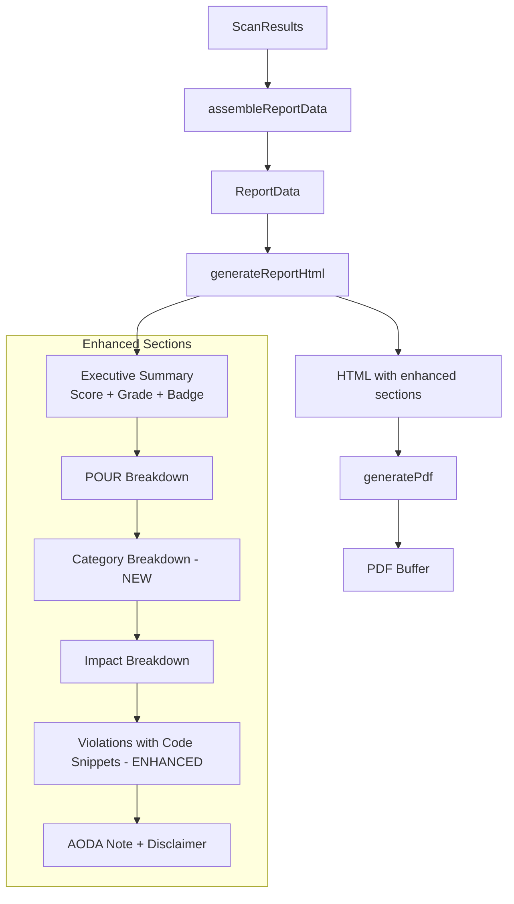

<!-- markdownlint-disable-file -->
# Task Research: Report Output Parity with Reference PDFs (Epic 1975)

Ensure the accessibility scanner produces report output that is comparable in content, structure, and quality to the reference PDF samples in the `assets/` folder. This covers both accessible (ontario.ca) and inaccessible (codepen.io example) site reports.

## Task Implementation Requests

* Enhance the HTML report template and PDF generation pipeline so produced reports match the structure, content sections, and detail level of the reference PDFs
* Create automated regression tests that scan known reference URLs, generate reports, and validate output matches expected structure and quality metrics
* Integrate report regression tests into the GitHub Actions CI workflow

## Scope and Success Criteria

* Scope: Report template improvements, output validation against reference PDFs, automated regression tests comparing report structure and content for known URLs, integration into GitHub Actions CI workflow
* Assumptions:
  * Reference PDFs in `assets/` define the gold-standard report structure
  * `sample-accessibility-report.pdf` = accessible site (ontario.ca) — 40 pages, 27 issues
  * `sample-accessibility-report-BAD.pdf` = inaccessible site (codepen.io example) — 42 pages, 107 issues
  * Both PDFs are from a third-party vendor using a custom rule taxonomy (not axe-core directly)
  * All reports use the same HTML→PDF pipeline via Puppeteer
  * Current template enhancements (letter grade, POUR breakdown, AODA note) are retained as additions on top of reference PDF parity
* Success Criteria:
  * Generated reports contain all sections present in reference PDFs: summary dashboard, per-rule detail with code snippets, best practices section
  * HTML code snippets for affected elements rendered per violation
  * Failure summaries / remediation guidance rendered per violation
  * `helpUrl` (Deque University link) rendered as "Learn more" per violation
  * Category breakdown section added using axe-core native `cat.*` tags
  * Automated tests validate report structure, score ranges, and violation counts
  * PDF generation smoke tests pass in CI
  * Tests integrated into GitHub Actions CI workflow with no changes to `ci.yml`

## Work Item Hierarchy

```text
Epic 1975: Report Output Parity with Reference PDFs
├── Feature 1982: Report Template Enhancement for Reference PDF Parity
│   ├── User Story 1991: Enhance report template to match sample-accessibility-report.pdf structure
│   └── User Story 1993: Enhance report template to match sample-accessibility-report-BAD.pdf for inaccessible sites
└── Feature 1980: Report Output Regression Tests in CI
    ├── User Story 1992: Create integration test scanning inaccessible site and validating BAD report output
    ├── User Story 1994: Create integration test scanning ontario.ca and validating report output
    └── User Story 1995: Add report output regression tests to GitHub Actions CI workflow
```

## Outline

1. Reference PDF Analysis — extracted section structure from both PDFs
2. Current Report Template Gap Analysis — compared current templates against reference PDFs
3. Template Enhancement Plan — specific changes needed per section
4. Data Availability Analysis — what axe-core data is already captured vs needs adding
5. Regression Test Strategy — selected approach with fixture-based structural validation
6. CI Integration Plan — no workflow changes needed
7. Technical Scenarios — evaluated alternatives with selected approach
8. Key Discoveries — critical findings from codebase and PDF analysis
9. Implementation File Changes — exact files and changes needed

## Potential Next Research

* Determine whether to add `best-practice` to scan engine `runOnly` tags
  * Reasoning: Reference PDFs include 13 non-scored best-practice rules. Current engine excludes them. Adding changes scan behavior for all users.
  * Reference: `src/lib/scanner/engine.ts` `runOnly` configuration
* Finalize code snippet display cap (5 or 10 nodes per violation)
  * Reasoning: Reference PDFs show up to 10 per rule. Need to balance detail vs PDF size.
  * Reference: `AxeNode[]` arrays can have 100+ nodes
* Design the template layout for code snippets and remediation text
  * Reasoning: Choose between `<pre><code>` blocks vs styled cards. Reference PDFs use simple numbered code blocks.
  * Reference: Current template uses inline CSS for all styling

## Research Executed

### File Analysis

* `src/lib/report/generator.ts` (L1-32)
  * `assembleReportData()` sorts violations by severity, assembles `ReportData` with URL, scan date, engine version, score, violations, passes, incomplete, AODA note, and disclaimer
* `src/lib/report/pdf-generator.ts` (L1-28)
  * Uses Puppeteer headless browser, A4 format, 1.5cm margins, header with "WCAG 2.2 Accessibility Report", footer with page numbers
* `src/lib/report/templates/report-template.ts` (L1-136)
  * Single-page report template with sections: title, executive summary (score circle, compliance badge, violation/pass/review counts), WCAG Principles (POUR bars), Impact Breakdown table, Detailed Violations table (impact/issue/rule/elements/principle), AODA Compliance Note, Disclaimer
  * Uses `escapeHtml()` for XSS safety, inline CSS for PDF compatibility, template literals for HTML construction
* `src/lib/report/templates/site-report-template.ts` (L1-186)
  * Site-wide report template with sections: title, executive summary (score circle, compliance badge, pages scanned, unique violations, total instances, passed rules, highest/lowest/median scores), WCAG Principles (POUR bars), Impact Breakdown table, Top 10 Violations table, Per-Page Scores table, AODA Compliance Note, Disclaimer
* `src/lib/report/site-generator.ts` (L1-52)
  * Site-level report assembler — gathers scan records, calculates site score, aggregates violations, generates page summaries
* `src/lib/report/sarif-generator.ts` (L1-100)
  * Generates SARIF v2.1.0 for GitHub Advanced Security integration
* `src/lib/types/report.ts` (L1-14)
  * `ReportData` interface: url, scanDate, engineVersion, score, violations, passes, incomplete, aodaNote, disclaimer
* `src/lib/types/scan.ts` (L1-80)
  * Core scan types including `ScanResults`, `AxeViolation` (with `principle?` field, `description`, `helpUrl`), `AxeNode` (with `html`, `failureSummary?`, `target`)
* `src/lib/types/score.ts` (L1-30)
  * `ScoreResult`, `ScoreGrade` (A-F), `PrincipleScores`, `ImpactBreakdown`
* `src/lib/types/crawl.ts` (L1-100)
  * `SiteReportData`, `SiteScoreResult`, `AggregatedViolation`, `PageSummary`, `CrawlRecord`
* `src/lib/scoring/calculator.ts` (L1-100)
  * Weighted scoring: critical=10, serious=7, moderate=3, minor=1. Grade thresholds: A≥90, B≥70, C≥50, D≥30, F<30
* `src/lib/scoring/wcag-mapper.ts` (L1-30)
  * Maps WCAG tags to POUR principles based on first digit: 1=perceivable, 2=operable, 3=understandable, 4=robust
* `src/components/ReportView.tsx` (L1-100)
  * React component: Executive Summary, Issue Summary, Detailed Violations, Passed Rules, AODA note, Disclaimer, with PDF download link

### Code Search Results

* Report generation pipeline: `assembleReportData()` → `generateReportHtml()` → `generatePdf()` used in:
  * `src/app/api/scan/[id]/pdf/route.ts`
  * `src/app/api/crawl/[id]/pages/[pageId]/pdf/route.ts`
* Site report pipeline: `generateSiteReport()` → `generateSiteReportHtml()` → `generatePdf()` used in:
  * `src/app/api/crawl/[id]/pdf/route.ts`

### External Research

* Reference PDF text extraction via Node.js `pdf-parse`
  * Both PDFs extracted successfully (40/42 pages, ~42K/47K chars)
  * Source: `.copilot-tracking/research/subagents/2026-03-07/reference-pdf-analysis-research.md`
* Axe-core rule taxonomy and data model
  * 104 rules total: 74 WCAG + 30 best-practice
  * 13 `cat.*` categories, every rule has exactly one
  * Source: `.copilot-tracking/research/subagents/2026-03-07/axe-rules-and-test-strategy-research.md`

### Existing Tests

* `src/lib/report/__tests__/generator.test.ts` — Validates report data assembly, violation sorting, required fields, AODA note, disclaimer (5 tests)
* `src/lib/report/__tests__/pdf-generator.test.ts` — Mocked Puppeteer tests for PDF generation (8 tests)
* `src/lib/report/__tests__/sarif-generator.test.ts` — SARIF output validation (8 tests)
* `src/lib/report/__tests__/site-generator.test.ts` — Site report assembly with mocked dependencies (~8 tests)
* All tests use synthetic mock data and assert on function output — no live URL tests

### CI Workflow

* `.github/workflows/ci.yml` — Runs lint, `npm run test:ci` (vitest with coverage), and build on push/PR to main
* Tests discovered from `src/**/__tests__/**/*.test.ts` pattern
* Coverage thresholds: 80% statement/function/line, 65% branch
* No existing integration or regression tests for report output validation

### Project Conventions

* Standards referenced: Vitest, TypeScript, Next.js, Puppeteer, axe-core
* Instructions followed: ADO workflow (`.github/instructions/ado-workflow.instructions.md`)

## Key Discoveries

### Discovery 1: Reference PDF Structure (Both PDFs Identical Layout)

Both reference PDFs share this 3-part structure:

1. **Page 1 — Dashboard Summary**: Total issue count, severity breakdown (Critical/Serious/Moderate/Minor counts), category breakdown (11 categories), compliance badge ("Non-compliant"), URL, date
2. **Pages 2–35 — Per-Rule Detail (60 rules)**: Each rule has numbered section with multi-sentence description, Relevant (Yes/No), Successes count, Failures count, Score (0-100/Pass/Fail), and HTML code snapshots of up to 10 successful + 10 failed elements
3. **Pages 35–42 — Best Practices (13 rules, not scored)**: Separate "WCAG Best Practices (Not included in score)" section with same per-rule format

Neither PDF shows a letter grade (A/B/C/D/F), overall numeric score, or POUR principle breakdown.

### Discovery 2: Data Already Captured but Not Displayed

The project's type system already captures all data needed for reference PDF parity:

| Data Field | Type Location | Captured | Rendered in Templates |
|------------|--------------|----------|----------------------|
| `html` (code snippet) | `AxeNode.html` | YES | **NO** |
| `failureSummary` (remediation) | `AxeNode.failureSummary` | YES | **NO** |
| `target` (CSS selector) | `AxeNode.target` | YES | **NO** |
| `helpUrl` (Deque link) | `AxeViolation.helpUrl` | YES | **NO** |
| `description` (rule explanation) | `AxeViolation.description` | YES | **NO** (only `help` shown) |
| `tags` (categories) | `AxeViolation.tags` | YES | **NO** (only POUR principle) |

**No type changes or parser changes are needed** — only template rendering changes.

### Discovery 3: Axe-Core Categories Map to Reference PDF Categories

Axe-core provides 13 `cat.*` category tags (every rule has exactly one):

| Axe-Core Category | Reference PDF Closest Match |
|--------------------|-----------------------------|
| `cat.aria` (24 rules) | ARIA |
| `cat.color` (3 rules) | (not separate in reference) |
| `cat.forms` (5 rules) | Forms |
| `cat.keyboard` (9 rules) | Interactive Content |
| `cat.language` (4 rules) | Metadata |
| `cat.name-role-value` (7 rules) | Interactive Content |
| `cat.parsing` (4 rules) | General |
| `cat.semantics` (14 rules) | Landmarks / General |
| `cat.sensory-and-visual-cues` (3 rules) | Dragging Alternative |
| `cat.structure` (8 rules) | Lists / General |
| `cat.tables` (6 rules) | Tables |
| `cat.text-alternatives` (12 rules) | Graphics |
| `cat.time-and-media` (5 rules) | (not separate in reference) |

**Selected approach**: Use axe-core's native `cat.*` tags for the category breakdown. They are stable, well-documented by Deque, and every rule has exactly one. Human-friendly labels: `cat.forms` → "Forms", `cat.tables` → "Tables", etc.

### Discovery 4: Best Practices Currently Excluded from Scans

`engine.ts` `runOnly` configuration only scans WCAG level tags (`wcag2a`, `wcag2aa`, `wcag21a`, `wcag21aa`, `wcag22aa`). The 30 best-practice-only rules are excluded. The reference PDFs include 13 non-scored best-practice rules. Adding `best-practice` to `runOnly` would include them as axe-core `incomplete` or separate results.

### Discovery 5: Report Pipeline Architecture

```text
scanUrl() → parseAxeResults() → calculateScore() → assembleReportData() → generateReportHtml() → generatePdf()
                                                     ↳ ReportData type      ↳ HTML string          ↳ PDF Buffer
```

Three API routes consume this pipeline:
- `GET /api/scan/[id]/pdf` — Single-page report
- `GET /api/crawl/[id]/pdf` — Site-wide report (uses `generateSiteReportHtml`)
- `GET /api/crawl/[id]/pages/[pageId]/pdf` — Per-page report within a crawl

### Discovery 6: Reference PDFs Have No Remediation Suggestions

Contrary to the Epic description expectation, the reference PDFs do **not** include explicit "how to fix" remediation guidance. They include multi-sentence rule descriptions explaining *why* each check matters for screen readers, but no step-by-step fixes. However, axe-core provides `failureSummary` and `helpUrl` which together offer richer remediation than the reference PDFs.

### Discovery 7: Score/Grade is a Project Enhancement Over Reference PDFs

The reference PDFs show only per-rule scores (0-100, Pass, Fail) and a compliance badge. They do **not** have an overall numeric score or letter grade. The current template's score circle, letter grade, and POUR breakdown are project-specific enhancements worth retaining.

## Gap Analysis: Reference PDFs vs Current Templates

### Sections That Need Adding

| Priority | Gap | Impact | Data Available |
|----------|-----|--------|----------------|
| 1 | **Code snippets per violation** — Reference PDFs show HTML code of affected elements (up to 10 per rule) | Major — ~75% of reference PDF content | `AxeNode.html` ✅ |
| 2 | **Per-rule detail view** — Reference PDFs have full sections per rule with description, relevance, pass/fail counts, and code | Major — fundamentally different UX | `AxeViolation.description`, `nodes.length` ✅ |
| 3 | **Failure summary / remediation** — "Fix the following: ..." text per violation node | Moderate — enriches beyond reference PDFs | `AxeNode.failureSummary` ✅ |
| 4 | **Help/Learn More links** — Deque University links for each rule | Moderate — enriches beyond reference PDFs | `AxeViolation.helpUrl` ✅ |
| 5 | **Category breakdown** — Reference PDFs group by 11 categories | Moderate | `AxeViolation.tags` (extract `cat.*`) ✅ |
| 6 | **Success elements shown** — Reference PDFs show passing elements + code | Moderate — data from `passes` array | `AxePass.nodes[].html` ✅ |
| 7 | **Best practices section** — Reference PDFs have 13 non-scored rules | Moderate — needs engine config change | Requires adding `best-practice` to `runOnly` |
| 8 | **CSS selector display** — Show element target path | Low | `AxeNode.target` ✅ |

### Current Template Features to Retain (Not in Reference PDFs)

| Feature | Template Location | Retain? |
|---------|------------------|---------|
| Overall score circle (0-100) | `report-template.ts` L71-75 | YES — project enhancement |
| Letter grade (A/B/C/D/F) | `report-template.ts` L73 | YES — project enhancement |
| WCAG Principles (POUR) breakdown | `report-template.ts` L85-95 | YES — project enhancement |
| AODA-specific compliance note | `report-template.ts` L121-124 | YES — Ontario-specific value |
| Automation disclaimer | `report-template.ts` L126-127 | YES — important caveat |
| Engine version display | `report-template.ts` L66 | YES — useful metadata |

## Technical Scenarios

### Scenario 1: Template Enhancement Approach

**Description:** Enhance `report-template.ts` to add code snippets, remediation, help links, and category breakdown while retaining existing score/grade/POUR sections.

**Requirements:**

* Add per-violation expandable detail with code snippets, failure summary, CSS selector, help link
* Add category breakdown section (using axe-core `cat.*` tags)
* Cap code snippets at 5 per violation to manage PDF size (with "and N more..." overflow text)
* Maintain inline CSS for PDF compatibility
* Preserve `escapeHtml()` for XSS safety
* Apply same enhancements to `site-report-template.ts`

#### Preferred Approach: Enhanced Flat Template with Expandable Violation Details

Extend the current flat-table approach by adding a detail section below each violation row. This preserves the executive summary + violation table layout but adds code snippets and remediation inline.

**Template structure after enhancement:**

```text
1. Title + URL + Date + Engine Version (existing)
2. Executive Summary — Score Circle + Grade + Compliance Badge + Stats (existing)
3. WCAG Principles (POUR) — Progress bars (existing)
4. Category Breakdown — NEW: bar chart or table of violations by axe-core category
5. Impact Breakdown — Table (existing)
6. Detailed Violations — ENHANCED: Each violation gets:
   a. Summary row: Impact badge | Issue | Rule ID | Element Count | Principle
   b. Rule description (AxeViolation.description)
   c. Affected elements (up to 5): CSS selector + HTML code snippet in <pre><code>
   d. Failure summary / remediation text (AxeNode.failureSummary)
   e. "Learn more" link (AxeViolation.helpUrl)
7. AODA Compliance Note (existing)
8. Disclaimer (existing)
```

**Rationale:** This approach:
- Achieves code snippet and remediation parity with reference PDFs
- Retains project enhancements (score, grade, POUR) that add value
- Uses axe-core's native category taxonomy instead of reverse-engineering the reference PDFs' custom taxonomy
- Keeps PDF size manageable with per-violation node cap
- Requires no type system changes — all data already available

```text
File Changes:
src/lib/report/templates/report-template.ts     — Add violation detail expansion, category breakdown
src/lib/report/templates/site-report-template.ts — Same enhancements for site-level report
```

**Mermaid diagram — Enhanced template flow:**



#### Considered Alternatives

**Alternative A: Per-Rule Detail Pages (Match Reference PDF Exactly)**

Each of the 60+ axe-core rules gets its own page/section like the reference PDFs: rule number, description, relevance, success count, failure count, score, and code snapshots.

- **Pros**: Closest match to reference PDF structure
- **Cons**: Fundamentally restructures the template; very long PDFs (40+ pages); the reference PDFs' 60-rule taxonomy is a different vendor's taxonomy (not axe-core's 104 rules); would lose the flat-table overview that's useful for quick scanning
- **Rejected because**: The vendor's rule taxonomy doesn't map to axe-core rules. Restructuring would be a rewrite, not an enhancement.

**Alternative B: Accordion/Expandable UI Only (No Template Change)**

Keep PDF template as-is, enhance only the web UI (`ReportView.tsx`) with expandable violation details.

- **Pros**: Simpler change; interactive UI works well
- **Cons**: PDF reports (the deliverable for this epic) would remain feature-incomplete; doesn't solve the parity problem
- **Rejected because**: Epic specifically targets PDF output parity.

### Scenario 2: Regression Test Strategy

**Description:** Create automated tests validating report output structure and content.

**Requirements:**

* Tests for both clean (zero violations) and dirty (many violations) scenarios
* HTML structural validation (section presence, content completeness)
* PDF generation smoke tests
* No live URL dependency
* Deterministic, fast execution

#### Preferred Approach: Fixture-Based Structural Validation

Create synthetic `ScanResults` / `AxeViolation` fixtures representing known scenarios, then validate:

1. **Template structural tests** — Generate HTML with `generateReportHtml(syntheticData)`, assert sections exist via `toContain()`
2. **Scenario-based tests** — Multiple fixtures covering: clean site, minor issues, critical violations, mixed severity, large volume
3. **PDF smoke tests** — Generate actual PDF buffer, verify `length > 1000` and PDF magic bytes (`%PDF-`)
4. **Site report template tests** — Same pattern for `generateSiteReportHtml()`

**Test files and scenarios:**

```text
NEW: src/lib/report/__tests__/report-template.test.ts
  - test: HTML contains Executive Summary section
  - test: HTML contains WCAG Principles (POUR) section
  - test: HTML contains Impact Breakdown section
  - test: HTML contains violation details with code snippets (after enhancement)
  - test: HTML contains failure summary text (after enhancement)
  - test: HTML contains category breakdown section (after enhancement)
  - test: HTML contains AODA note and disclaimer
  - test: Clean site shows "AODA Compliant" badge and "No violations found"
  - test: Dirty site shows "Needs Remediation" badge and violation table
  - test: Code snippets are HTML-escaped (escapeHtml applied)
  - test: Large violation set renders without error (50+ violations)

NEW: src/lib/report/__tests__/site-report-template.test.ts
  - test: HTML contains site-level sections (per-page scores, top violations)
  - test: Clean site and dirty site scenarios

EXTEND: src/lib/report/__tests__/pdf-generator.test.ts (optional PDF smoke)
  - test: Real Puppeteer generates valid PDF buffer (mark as slow, optional)
```

**Rationale:**
- Deterministic: synthetic fixtures never change
- Fast: no network calls, runs in milliseconds
- Follows established project test patterns (all existing tests use synthetic data)
- No new test infrastructure or dependencies needed
- Automatically picked up by CI (`src/**/__tests__/**/*.test.ts` pattern)

#### Considered Alternatives

**Alternative A: Live URL Integration Tests**

Scan real URLs (ontario.ca, codepen.io), generate reports, validate output.

- **Pros**: Tests full pipeline end-to-end
- **Cons**: Flaky (sites change), slow (10-30s per scan), network-dependent, nondeterministic violation counts
- **Rejected because**: Too flaky for CI. Could be used as optional manual smoke tests.

**Alternative B: Snapshot Testing**

Use `toMatchSnapshot()` on generated HTML.

- **Pros**: Catches any unintended template change
- **Cons**: Breaks on every intentional template change, requiring snapshot updates; high maintenance burden
- **Rejected because**: Template changes are the whole point of this epic — snapshots would constantly break.

### Scenario 3: CI Integration

**Description:** Ensure regression tests run as part of the CI pipeline.

#### Preferred Approach: No CI Workflow Changes Needed

New test files in `src/lib/report/__tests__/` are automatically discovered by the existing vitest configuration (`src/**/__tests__/**/*.test.ts` pattern) and run by `npm run test:ci`. No changes to `.github/workflows/ci.yml` are required.

For optional real-Puppeteer PDF smoke tests:
- Ubuntu CI runners have Chromium (Puppeteer downloads via `npm ci`)
- Mark as slow with vitest `it.skipIf()` or separate test tag if needed
- Or keep PDF smoke tests mocked (current pattern) and skip real-Puppeteer tests

**Rationale:** The existing CI workflow is well-configured for this. Adding test files is sufficient.

#### Considered Alternative

**Separate CI Job for Integration Tests**

Add a new job in `ci.yml` specifically for report regression tests.

- **Pros**: Isolated failure reporting
- **Cons**: Unnecessary complexity — fixture-based tests are fast and don't need special setup
- **Rejected because**: Fixture-based tests run in milliseconds and fit within the existing job.

## Implementation Details

### Changes by User Story

#### US 1991: Enhance report template to match sample-accessibility-report.pdf

* **File**: `src/lib/report/templates/report-template.ts`
* **Changes**:
  1. Add category breakdown section after POUR section — extract `cat.*` from `violation.tags`, group violations by category, render counts table/bars
  2. Enhance violation detail section — for each violation:
     - Add `AxeViolation.description` as multi-line rule explanation
     - Add expandable "Affected Elements" showing first 5 nodes with `AxeNode.target` (CSS selector) and `AxeNode.html` (code snippet in `<pre><code>` block, escaped)
     - Add `AxeNode.failureSummary` as remediation text
     - Add `AxeViolation.helpUrl` as "Learn more" link
     - Add "and N more elements..." overflow text if >5 nodes
  3. Helper function: extract category from tags — `function extractCategory(tags: string[]): string`
  4. Helper function: cap nodes — `function cappedNodes(nodes: AxeNode[], max: number): { shown: AxeNode[]; remaining: number }`

#### US 1993: Enhance report template for inaccessible sites

* Same file as US 1991 — the enhanced template handles both accessible and inaccessible sites through the same code path
* The key difference is volume: inaccessible sites have more violations → more code snippets
* The node cap (5 per violation) ensures PDF remains manageable even for sites with 100+ violations
* Test with fixture data representing high-violation scenarios

#### US 1994: Integration test scanning ontario.ca

* **File**: `src/lib/report/__tests__/report-template.test.ts` (NEW)
* Create "accessible site" fixture with: high score (90+), minimal violations, compliance badge `aodaCompliant: true`
* Validate generated HTML contains: "AODA Compliant", score circle with high score, "No violations found" or minimal violation rows

#### US 1992: Integration test scanning inaccessible site

* **File**: Same `report-template.test.ts`
* Create "inaccessible site" fixture with: low score (<50), many violations across all impact levels, `aodaCompliant: false`
* Validate generated HTML contains: "Needs Remediation", violation table with entries, code snippets (after enhancement), remediation text

#### US 1995: Add report output regression tests to CI

* No changes to `.github/workflows/ci.yml` needed — tests auto-discovered
* Ensure test file follows `src/**/__tests__/**/*.test.ts` pattern
* Optionally add a PDF smoke test (real or mocked Puppeteer)

### Example Code Snippet Enhancement for report-template.ts

```typescript
// Enhanced violation detail section (conceptual — applied to each violation)
const violationDetails = data.violations.map(v => {
  const capped = v.nodes.slice(0, 5);
  const remaining = v.nodes.length - capped.length;
  const category = v.tags.find(t => t.startsWith('cat.'))?.replace('cat.', '') || 'other';

  return `
    <div class="section" style="margin-bottom:24px;border:1px solid #e5e7eb;border-radius:8px;padding:16px;">
      <div style="display:flex;align-items:center;gap:8px;margin-bottom:8px;">
        <span style="...badge styles...">${v.impact}</span>
        <strong>${escapeHtml(v.help)}</strong>
        <span style="color:#6b7280;font-size:12px;">${escapeHtml(v.id)}</span>
      </div>
      <p style="font-size:13px;color:#374151;">${escapeHtml(v.description)}</p>
      <p style="font-size:12px;color:#6b7280;">Category: ${escapeHtml(category)} · ${v.nodes.length} element(s) · Principle: ${v.principle || '-'}</p>

      ${capped.map((node, i) => `
        <div style="margin-top:8px;background:#f9fafb;border-radius:4px;padding:8px;">
          <div style="font-size:11px;color:#6b7280;margin-bottom:4px;">Element ${i + 1}: ${escapeHtml(node.target.join(' > '))}</div>
          <pre style="margin:0;font-size:11px;overflow-x:auto;white-space:pre-wrap;"><code>${escapeHtml(node.html)}</code></pre>
          ${node.failureSummary ? `<p style="font-size:12px;color:#dc2626;margin:4px 0 0;">${escapeHtml(node.failureSummary)}</p>` : ''}
        </div>
      `).join('')}

      ${remaining > 0 ? `<p style="font-size:12px;color:#6b7280;margin-top:8px;">...and ${remaining} more element(s)</p>` : ''}
      <a href="${escapeHtml(v.helpUrl)}" style="font-size:12px;color:#2563eb;margin-top:8px;display:inline-block;">Learn more →</a>
    </div>
  `;
}).join('');
```

### Example Test Code for report-template.test.ts

```typescript
import { describe, it, expect } from 'vitest';
import { generateReportHtml } from '../templates/report-template';
import { assembleReportData } from '../generator';
import type { ScanResults, AxeViolation } from '../../types/scan';
import type { ScoreResult } from '../../types/score';

function makeViolation(overrides: Partial<AxeViolation> = {}): AxeViolation {
  return {
    id: 'color-contrast',
    impact: 'serious',
    tags: ['wcag143', 'cat.color'],
    description: 'Elements must have sufficient color contrast',
    help: 'Ensure contrast ratio is sufficient',
    helpUrl: 'https://dequeuniversity.com/rules/axe/4.0/color-contrast',
    nodes: [{
      html: '<span style="color:#fff">text</span>',
      target: ['span.low-contrast'],
      impact: 'serious',
      failureSummary: 'Fix the following: Element has insufficient color contrast of 1.07:1',
    }],
    ...overrides,
  };
}

describe('generateReportHtml', () => {
  it('contains all required sections', () => {
    const data = assembleReportData(makeScanResults([makeViolation()]));
    const html = generateReportHtml(data);

    expect(html).toContain('Executive Summary');
    expect(html).toContain('WCAG Principles (POUR)');
    expect(html).toContain('Impact Breakdown');
    expect(html).toContain('AODA Compliance Note');
    expect(html).toContain('Disclaimer');
  });

  it('renders code snippets for violations', () => {
    const data = assembleReportData(makeScanResults([makeViolation()]));
    const html = generateReportHtml(data);

    expect(html).toContain('&lt;span style=');  // escaped HTML snippet
    expect(html).toContain('span.low-contrast'); // CSS selector
  });

  it('renders failure summary text', () => {
    const data = assembleReportData(makeScanResults([makeViolation()]));
    const html = generateReportHtml(data);

    expect(html).toContain('Fix the following');
    expect(html).toContain('insufficient color contrast');
  });

  it('renders help URL link', () => {
    const data = assembleReportData(makeScanResults([makeViolation()]));
    const html = generateReportHtml(data);

    expect(html).toContain('dequeuniversity.com');
    expect(html).toContain('Learn more');
  });
});
```

## Implementation File Changes

```text
MODIFY: src/lib/report/templates/report-template.ts
  — Add category breakdown section
  — Add per-violation detail: description, code snippets, failure summary, help link
  — Add helper functions: extractCategory(), cappedNodes()

MODIFY: src/lib/report/templates/site-report-template.ts
  — Mirror single-page template enhancements for aggregated violations

NEW: src/lib/report/__tests__/report-template.test.ts
  — Structural validation tests for single-page report HTML
  — Scenarios: clean site, minor issues, critical violations, mixed severity, large set

NEW: src/lib/report/__tests__/site-report-template.test.ts
  — Structural validation tests for site-level report HTML

NO CHANGES NEEDED:
  — src/lib/types/report.ts (data already available)
  — src/lib/types/scan.ts (fields already exist)
  — src/lib/report/generator.ts (assembler already passes all data)
  — src/lib/report/pdf-generator.ts (no changes needed)
  — .github/workflows/ci.yml (tests auto-discovered)
```
