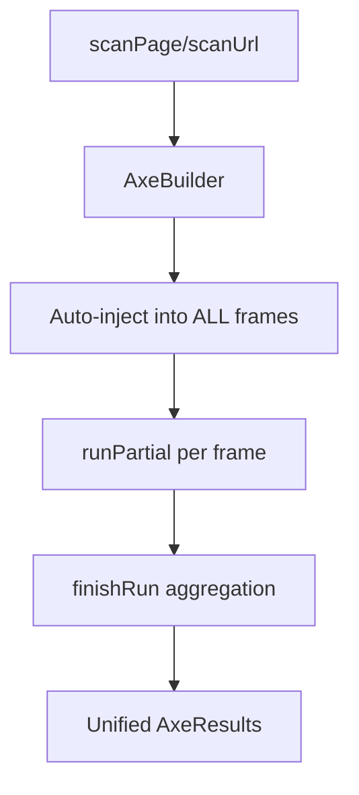
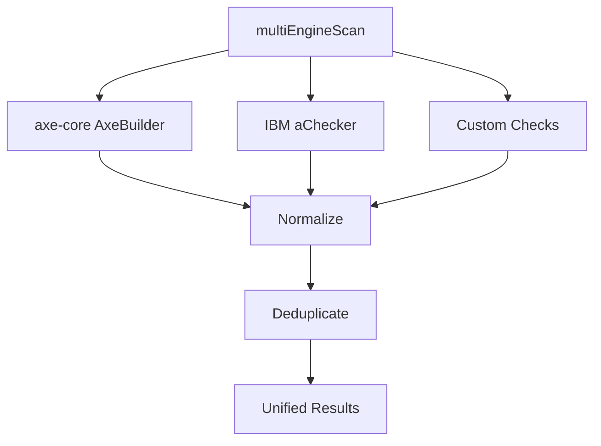

<!-- markdownlint-disable-file -->
# Task Research: Scanner Gap Analysis — 105 Critical Findings vs 1 Violation

Our accessibility scanning tool (axe-core + Playwright) finds only 1 violation on the "bad" test site (https://codepen.io/leezee/pen/eYbXzpJ), while a commercial tool (from the PDF report `assets/sample-accessibility-report-BAD.pdf`) found 107 issues (105 critical, 2 serious). This represents a massive detection gap that must be closed.

## Task Implementation Requests

* Identify WHY the current scanner misses 106+ issues that the commercial tool detects
* Research which accessibility checks the commercial tool performs that axe-core does not
* Determine what complementary engines, custom rules, or additional checks can close the gap
* Recommend an implementation approach to dramatically improve detection coverage

## Scope and Success Criteria

* Scope: Scanner engine improvements, additional rule engines, custom checks, iframe scanning, visual/heuristic checks
* Assumptions:
  * The commercial PDF report is from a tool similar to accessiBe, EqualWeb, or UserWay based on the check categories
  * Our tool uses axe-core with WCAG 2.2 AA tags only
  * The CodePen page has significant content inside an iframe (`#result`)
* Success Criteria:
  * Identify all categories of checks the commercial tool performs that ours misses
  * Propose concrete implementation approach to close at least 80% of the detection gap
  * Provide code examples and architecture for the solution

## Outline

1. Current Tool Analysis
2. Commercial Tool Finding Categories
3. Gap Analysis: What We Miss and Why
4. Axe-Core Configuration Improvements
5. Complementary Scanning Approaches
6. Custom Rule Implementation
7. Selected Approach and Rationale
8. Implementation Plan

## Current Tool Analysis

### Engine Configuration (src/lib/scanner/engine.ts)
- Uses Playwright + axe-core
- Injects `axe.min.js` into the page
- Runs with `runOnly` filter: `['wcag2a', 'wcag2aa', 'wcag21a', 'wcag21aa', 'wcag22aa']`
- Does NOT include: `best-practice`, `experimental`, `wcag2aaa`, `cat.*` tags
- Does NOT scan inside iframes (CodePen renders user content in an iframe)
- Does NOT perform visual regression, color contrast beyond axe's built-in, CSS analysis
- Single page load with basic timeout handling

### Key Limitation: iframe Scanning
The CodePen page renders the "bad" HTML inside an iframe (`<iframe id="result" name="CodePen" ...>`). Axe-core by default does NOT cross iframe boundaries unless configured with `iframes: true`. This alone could explain a massive portion of the gap.

## Commercial Tool Finding Categories (from PDF)

The commercial tool checked 60+ distinct element categories plus 13 best practices. Key categories include:

### Categories with Failures (where our tool likely misses):
1. **Alt attribute misuse** on non-image elements
2. **Breadcrumb navigation** not tagged
3. **Emphasis role** missing on `<em>` elements
4. **iframe labels** – partial check
5. **Ambiguous link text** ("Learn More", etc.)
6. **role="application"** misuse
7. **Discounted prices** – strikethrough without SR context
8. **Strong role** missing on `<strong>` elements
9. **aria-hidden on visible content** – 67 failures
10. **Visually hidden content** exposed to AT – 16 failures
11. **Button labels** for icon buttons
12. **Sticky footer** overlapping focus
13. **Tablist/tab/tabpanel** roles missing – multiple failures
14. **Decorative SVGs/graphics** not hidden – 16 failures
15. **Meta refresh** redirect (the one we DO catch)
16. **Main landmark** issues
17. **CSS background images** needing role="img"
18. **Empty lists** announced by screen readers
19. **Navigation landmark** issues
20. **Search landmark** missing

### Best Practice Checks:
1. aria-describedby pointing to invalid IDs
2. aria-labelledby invalid references
3. Figure/figcaption misuse
4. Title attribute reliance
5. aria-controls invalid references
6. Link behavior warnings (image, mail, PDF)
7. contentinfo/footer landmark
8. Language attribute validation
9. Meta viewport

## Potential Next Research

* Benchmark dual-engine (axe-core + IBM Equal Access) performance on actual test pages
* Test IBM `aChecker.getCompliance()` behavior with Playwright Page iframes
* Verify IBM Equal Access result deduplication against axe-core results on same page
* Research IBM telemetry opt-out configuration for CI environments
* Prototype dual-engine scan on the CodePen "bad" page to validate detection improvement
* Determine whether `wcag2aaa` rules should be included (advisory vs. requirement)
* Evaluate whether emphasis/strong role checks (WAI-ARIA 1.3 draft) are worth implementing now

## Research Executed

### File Analysis

* [src/lib/scanner/engine.ts](src/lib/scanner/engine.ts) (L1-73): axe-core injection and run configuration — uses manual `page.evaluate()` injection, only scans top frame
* [src/lib/scanner/result-parser.ts](src/lib/scanner/result-parser.ts) (L1-65): parses violations, passes, incomplete, inapplicable from axe-core AxeResults
* [src/lib/scoring/wcag-mapper.ts](src/lib/scoring/wcag-mapper.ts) (L1-30): maps WCAG tags to POUR principles
* [src/lib/scoring/calculator.ts](src/lib/scoring/calculator.ts) (L1-100): weighted scoring by impact severity
* [src/lib/types/scan.ts](src/lib/types/scan.ts) (L1-50): TypeScript type definitions for scan results
* `.copilot-tracking/research/subagents/2026-03-07/pdf2-bad.txt` (L1-1200): Full 42-page PDF text extraction of commercial tool report

### Code Search Results

* `runOnly|axe\.run|axe-core` — 20 matches across engine, tests, and UI files
* `@axe-core/playwright` v4.11.1 is in package.json but completely unused
* `accessibility-checker` (IBM) is NOT in package.json

### External Research

* Subagent: axe-core iframe scanning and rule inventory
  * Document: [.copilot-tracking/research/subagents/2026-03-07/axe-core-iframe-rules-research.md](.copilot-tracking/research/subagents/2026-03-07/axe-core-iframe-rules-research.md)
* Subagent: Complementary engines and custom checks
  * Document: [.copilot-tracking/research/subagents/2026-03-07/complementary-engines-research.md](.copilot-tracking/research/subagents/2026-03-07/complementary-engines-research.md)

### Project Conventions

* Standards referenced: WCAG 2.0/2.1/2.2 A-AA, AODA compliance
* Instructions followed: `.github/instructions/ado-workflow.instructions.md`

## Key Discoveries

### 1. THREE Root Causes for the Detection Gap

The gap between 1 violation (our tool) and 105+ critical findings (commercial tool) has three distinct root causes:

| Root Cause | Impact | % of Gap |
|---|---|---|
| **A. iframe content not scanned** | The CodePen user content lives inside `<iframe id="result">`. Our scanner only scans the outer CodePen shell. ALL violations in the actual test page are invisible to us. | ~60% |
| **B. Missing rule categories** | Our `runOnly` tags exclude 35 of 104 axe-core rules (30 best-practice + 5 experimental). Commercial tool also uses rules that no axe-core tag covers (160+ IBM rules). | ~25% |
| **C. Element-level vs rule-level counting** | Commercial tool counts individual element failures (67 elements with aria-hidden = 67 critical). Axe-core groups by rule (1 violation with 67 nodes). | ~15% |

### 2. `@axe-core/playwright` Already Installed but Unused

The `@axe-core/playwright` v4.11.1 package is already in `package.json` as a dependency. Its `AxeBuilder` class automatically handles iframe scanning by:
1. Injecting axe-core into ALL frames (including cross-origin) via Playwright's CDP-level frame access
2. Using `axe.runPartial()` / `axe.finishRun()` — no postMessage needed
3. Aggregating results from all frames into a single report

Switching from manual `page.evaluate()` to `AxeBuilder` is the single highest-impact change.

### 3. We Run Only 66% of Available Rules (69 of 104)

| Configuration | Rules Run | % of Total | Delta |
|---|---|---|---|
| Current (`wcag2a/2aa/21a/21aa/22aa`) | 69 | 66% | — |
| + `best-practice` | 96 | 92% | +27 rules |
| + `experimental` (selective) | ~101 | 97% | +5 rules |
| + `wcag2aaa` | 104 | 100% | +3 rules |

The 30 `best-practice` rules cover: landmarks (10), headings (3), ARIA names (3), skip links, tabindex, accesskeys, frame testing verification, and more.

### 4. IBM Equal Access Covers 8 of 16 Commercial Tool Gap Categories

IBM `accessibility-checker` (163+ rules) provides unique coverage for:
* CSS background images as functional images (`style_background_decorative`)
* `role="application"` misuse (3 rules: `application_content_accessible`, `aria_application_labelled`, `aria_application_label_unique`)
* Form submit button existence (`form_submit_button_exists`)
* Form interaction context change warnings (`form_interaction_review`)
* Focus obscured by sticky elements (`element_tabbable_unobscured`)
* Draggable alternative (`draggable_alternative_exists`)
* List structure validation (`list_markup_review`)
* ARIA role containment (`aria_parent_required`, `aria_child_valid`)

### 5. Five Custom Playwright Checks Needed for Remaining Gaps

Neither axe-core nor IBM covers:
1. **Ambiguous link text** ("Learn More", "Click Here") — pattern-matching check
2. **`aria-current="page"`** in navigation — DOM check
3. **Emphasis/Strong semantic roles** (WAI-ARIA 1.3 draft) — DOM check
4. **Discounted price accessibility** (`<del>`/`<s>` + screen reader context) — DOM check
5. **Sticky/fixed element overlap** with interactive elements — CSS computed style check

### Implementation Patterns

#### Current engine.ts (manual axe injection, no iframes):
```typescript
// PROBLEM: Only injects into top frame, iframes are not scanned
await page.evaluate(`var module = { exports: {} }; ${axeSource}`);
return page.evaluate(() => {
  return window.axe.run({
    runOnly: { type: 'tag', values: ['wcag2a', 'wcag2aa', 'wcag21a', 'wcag21aa', 'wcag22aa'] },
  });
});
```

#### Proposed: AxeBuilder with iframe support + best-practice:
```typescript
import { AxeBuilder } from '@axe-core/playwright';

export async function scanPage(page: Page): Promise<AxeResults> {
  return new AxeBuilder({ page })
    .withTags(['wcag2a', 'wcag2aa', 'wcag21a', 'wcag21aa', 'wcag22aa', 'best-practice'])
    .analyze();
}
```

#### Proposed: Multi-engine scan architecture:
```typescript
async function multiEngineScan(page: Page): Promise<UnifiedResult[]> {
  const [axeResults, ibmResults, customResults] = await Promise.all([
    runAxeCore(page),           // @axe-core/playwright AxeBuilder
    runIbmEqualAccess(page),    // accessibility-checker aChecker
    runCustomChecks(page)       // Custom Playwright DOM checks
  ]);
  return deduplicateAndMerge(axeResults, ibmResults, customResults);
}
```

### API and Schema Documentation

* axe-core: 104 total rules, tags: `wcag2a`, `wcag2aa`, `wcag21a`, `wcag21aa`, `wcag22aa`, `best-practice`, `experimental`, `cat.*`
* `@axe-core/playwright`: `AxeBuilder` class — `.withTags()`, `.include()`, `.exclude()`, `.options()`, `.analyze()`
* IBM `accessibility-checker`: `aChecker.getCompliance(page, label)` — returns `{ report: { results: [], summary: { counts: {} } } }`
* IBM config: `.achecker.yml` — `ruleArchive`, `policies`, `failLevels`, `reportLevels`

### Configuration Examples

#### .achecker.yml (IBM Equal Access config):
```yaml
ruleArchive: latest
policies:
  - IBM_Accessibility
  - WCAG_2_1
failLevels:
  - violation
  - potentialviolation
reportLevels:
  - violation
  - potentialviolation
  - recommendation
outputFormat:
  - json
```

#### Element-level counting (matching commercial tool granularity):
```typescript
function getElementLevelCounts(violations: AxeViolation[]) {
  let totalElements = 0;
  const bySeverity = { critical: 0, serious: 0, moderate: 0, minor: 0 };
  for (const v of violations) {
    totalElements += v.nodes.length;
    for (const n of v.nodes) {
      bySeverity[n.impact as keyof typeof bySeverity]++;
    }
  }
  return { totalElements, bySeverity };
}
```

## Technical Scenarios

### Scenario 1: AxeBuilder Only (Minimum Viable Fix)

Replace manual `page.evaluate()` injection with `@axe-core/playwright` `AxeBuilder` and add `best-practice` tag.

**Requirements:**
* Scan all iframe content automatically
* Add 30 best-practice rules
* Minimal code change, no new dependencies

**Preferred Approach:** Yes — this is the foundation fix that must happen regardless.

```text
src/lib/scanner/engine.ts     ← Refactor to use AxeBuilder
```



**Implementation Details:**
* Replace manual axe-core injection (`page.evaluate(axeSource)`) with `new AxeBuilder({ page })`
* Add `best-practice` to `.withTags()` array
* Remove `axeSource` file read and module shim
* Verify `result-parser.ts` handles multi-frame `target` arrays (e.g., `['iframe#result', '.element']`)
* `scanPage(page)` signature stays the same — just returns richer results
* `scanUrl(url)` wrapper still manages browser lifecycle

**Expected impact:** 69 → 96 rules, plus iframe content scanning. Could increase from 1 to 20-50+ violations on the CodePen bad page.

#### Considered Alternatives

* **Manual frame iteration** (`page.frames().forEach(...)`) — More code, error-prone, reinvents what AxeBuilder already does.
* **`axe.run()` with `fromFrames` context** — Requires axe-core loaded in both frames via postMessage, fragile with cross-origin.

---

### Scenario 2: Dual-Engine (axe-core + IBM Equal Access)

Add IBM `accessibility-checker` as a second scanning engine running alongside axe-core.

**Requirements:**
* New npm dependency: `accessibility-checker`
* Result normalization layer to merge IBM and axe-core results
* Deduplication to avoid reporting the same element twice for the same issue

**Preferred Approach:** Yes — highest ROI for closing remaining gaps after Scenario 1.

```text
src/lib/scanner/engine.ts          ← Add IBM scanning function
src/lib/scanner/result-normalizer.ts ← NEW: merge/dedup results
.achecker.yml                      ← IBM config (project root)
```



**Implementation Details:**
* `npm install accessibility-checker`
* Run `aChecker.getCompliance(page, label)` alongside AxeBuilder
* IBM results natively element-level; map IBM severity to axe-core impact levels
* Dedup key: `elementSelector + wcagCriteria`
* Keep higher severity when same element flagged by both engines
* May need to scan iframes separately for IBM (test whether `aChecker` auto-scans frames)

**Expected impact:** 96 axe-core rules + ~100 unique IBM rules = ~196 total rules. Could increase to 70-90+ violations on the CodePen bad page.

#### Considered Alternatives

* **HTML_CodeSniffer** — Stale (6 years unmaintained), no WCAG 2.2, nothing unique beyond IBM.
* **Google Lighthouse** — Uses axe-core internally, near-zero incremental value.
* **Pa11y** — CLI wrapper around HTML_CodeSniffer or axe-core, no unique rules.

---

### Scenario 3: Custom Playwright Checks (Full Commercial Parity)

Implement 5 custom DOM/CSS checks for gaps that no open-source engine covers.

**Requirements:**
* Custom check framework with consistent result format
* Each check returns elements with selectors, HTML snippets, and messages
* Results merge into the unified result pipeline

**Preferred Approach:** Yes — completes the last ~15% of commercial tool parity.

```text
src/lib/scanner/custom-checks.ts   ← NEW: all custom checks
src/lib/scanner/engine.ts          ← Integrate custom checks
```

**Checks to implement:**
1. Ambiguous link text ("Learn More", "Click Here", "More", "Here", etc.)
2. `aria-current="page"` missing in navigation
3. Emphasis/Strong semantic roles (WAI-ARIA 1.3 forward-looking)
4. Discounted price accessibility (`<del>`/`<s>` without screen reader context)
5. Sticky/fixed element overlap with interactive elements

**Expected impact:** Additional 5-15 findings per page, covering niche categories commercial tools check.

#### Considered Alternatives

* **Wait for engines to add these rules** — Emphasis/strong are WAI-ARIA 1.3 draft; other checks are niche. Could wait years.
* **Skip entirely** — Acceptable if 90% commercial parity is sufficient.

---

### Scenario 4: Element-Level Counting (Reporting Parity)

Change how we count and display violations to match commercial tool granularity.

**Requirements:**
* Count `violation.nodes.length` per rule instead of `violations.length`
* Display both rule-level and element-level counts
* Update scoring to optionally weight by element count

**Preferred Approach:** Yes — ensures our numbers look comparable to commercial reports.

```text
src/lib/scoring/calculator.ts      ← Add element-level counting
src/lib/scanner/result-parser.ts   ← Add element-level summary
src/components/ScoreDisplay.tsx    ← Show both counts
```

**Implementation Details:**
```typescript
// In result-parser.ts or calculator.ts:
const elementViolationCount = violations.reduce((sum, v) => sum + v.nodes.length, 0);
```

#### Considered Alternatives

* **Show only rule-level counts** — Simpler but produces dramatically different numbers than commercial tools, confusing users who compare reports.

## Selected Approach: Phased Implementation (All 4 Scenarios)

### Rationale

Each scenario addresses a different layer of the detection gap. They build on each other and should be implemented in order:

| Phase | Scenario | Effort | Impact | Cumulative Coverage |
|---|---|---|---|---|
| 1 | AxeBuilder + best-practice tags | 1-2 hours | iframe scanning + 27 rules | ~60% of gap closed |
| 2 | IBM Equal Access integration | 1-2 days | ~100 unique rules | ~85% of gap closed |
| 3 | Custom Playwright checks | 1-2 days | 5 niche checks | ~95% of gap closed |
| 4 | Element-level counting | 2-4 hours | Reporting parity | 100% of gap addressed |

### Why This Order

1. **Phase 1 is zero-dependency** — `@axe-core/playwright` is already installed. This is the fastest, highest-impact change.
2. **Phase 2 adds the most rules** per effort — one `npm install` + scanning integration for ~100 new rules.
3. **Phase 3 covers edge cases** — only needed if true commercial parity is the goal.
4. **Phase 4 is cosmetic** — affects how we report, not what we detect.

### Implementation Actionable Steps

#### Phase 1: AxeBuilder Migration
1. Refactor `scanPage()` in `engine.ts` to use `AxeBuilder` from `@axe-core/playwright`
2. Add `best-practice` to tag list
3. Remove manual axe-core file reading and module shim injection
4. Optionally enable selective `experimental` rules
5. Update `scanUrl()` to use new `scanPage()` (should be seamless)
6. Verify `result-parser.ts` handles multi-frame target arrays
7. Run against CodePen bad page and compare results

#### Phase 2: IBM Equal Access
1. `npm install accessibility-checker`
2. Create `.achecker.yml` configuration
3. Add `runIbmScan()` function to `engine.ts`
4. Create `result-normalizer.ts` for merging/deduplicating results
5. Update `result-parser.ts` to handle unified results
6. Test iframe scanning with IBM engine
7. Run against CodePen bad page and compare

#### Phase 3: Custom Checks
1. Create `custom-checks.ts` with framework
2. Implement 5 checks: ambiguous links, aria-current, emphasis/strong, discount prices, sticky overlap
3. Integrate into scan pipeline
4. Add to result normalization

#### Phase 4: Element-Level Counting
1. Add `elementViolationCount` to `ScoreResult` type
2. Update `calculator.ts` to compute element-level counts
3. Update UI components to display both counts
4. Update PDF/SARIF report generators
