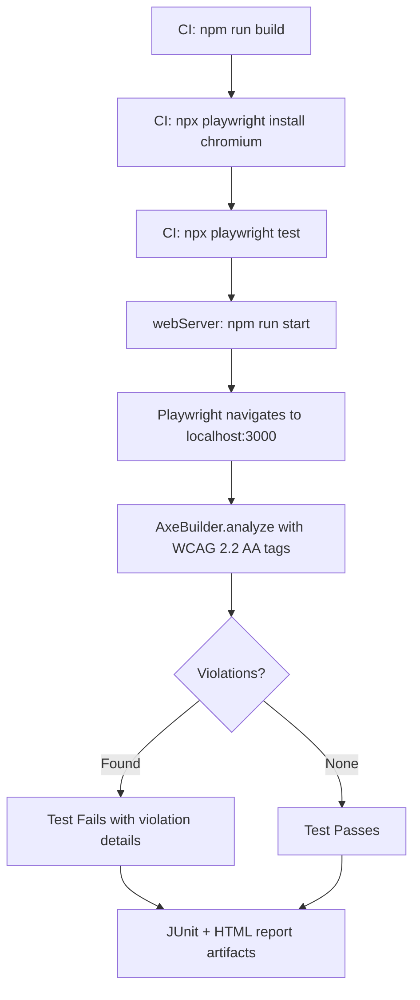

<!-- markdownlint-disable-file -->
# Task Research: Self-Testing Accessibility of the Scanner App (Epic 1974)

Use the AODA WCAG scanner itself to test the accessibility of its own web UI and generated HTML report pages. This creates a compelling dogfooding use case: the product validates its own accessibility compliance, ensuring the scanner UI and report output are themselves WCAG 2.2 AA compliant.

## Task Implementation Requests

* Self-scan of the app's pages (home, scan results, crawl results) for WCAG 2.2 AA compliance
* Self-scan of generated HTML report pages for accessibility violations
* Threshold-based pass/fail in CI
* Remediation of any violations found in UI components
* Remediation of any violations found in HTML report templates

## ADO Work Item Hierarchy

```text
Epic 1974: Self-Testing Accessibility of the Scanner App
├── Feature 1979: Self-Scan Integration for App UI Pages
│   ├── US 1996: Self-scan scanner home page for WCAG 2.2 AA compliance in CI
│   ├── US 1997: Self-scan crawl results page for WCAG 2.2 AA compliance in CI
│   └── US 1998: Self-scan scan results page for WCAG 2.2 AA compliance in CI
├── Feature 1981: Self-Scan of Generated HTML Reports
│   └── US 2000: Self-scan generated HTML report page for WCAG 2.2 AA compliance
└── Feature 1978: Accessibility Remediation of Scanner UI
    ├── US 1999: Fix WCAG violations found by self-scan in scanner UI components
    └── US 2001: Fix WCAG violations found by self-scan in HTML report templates
```

## Scope and Success Criteria

* Scope: Automated self-scan of the scanner's own pages (home `/`, scan results `/scan/[id]`, crawl results `/crawl/[id]`), self-scan of generated HTML reports, threshold-based CI pass/fail, remediation of discovered violations
* Assumptions:
  * The scanner uses Playwright + axe-core for scanning (manual injection in `engine.ts`)
  * The CI workflow uses GitHub Actions (`ci.yml`)
  * The app is a Next.js 15 app on `localhost:3000`
  * `@axe-core/playwright` is already a dependency (unused) — can be leveraged for self-scan tests
  * `@playwright/test` is available as a transitive dependency
  * The SSRF protection in API routes does NOT exist in the engine — direct engine usage bypasses SSRF
* Success Criteria:
  * CI workflow starts the Next.js app and self-scans all key pages
  * All pages meet a configurable score threshold (e.g., 90+)
  * Generated HTML reports have zero critical/serious violations
  * Violations are reported as test failures with details
  * All critical and serious violations are remediated
  * Tests integrate into GitHub Actions CI with new steps after build

## Outline

1. Scanner engine architecture and axe-core integration
2. UI pages and components to scan (with known accessibility concerns)
3. Report template HTML generation pipeline
4. SSRF protection analysis and bypass strategy
5. Self-scan implementation alternatives (Playwright Test vs vitest vs shell)
6. CI workflow integration approach
7. Test data setup for dynamic pages
8. Accessibility remediation strategy
9. Implementation phasing and dependencies

## Potential Next Research

* Exact color contrast ratio verification for Tailwind gray utilities against background values
* Playwright browser caching strategies for GitHub Actions CI
* `npm run build && npm run start` vs `npm run dev` performance in CI for self-scan
* Test-only data seeding patterns for Phase 2 results page scanning
* Whether `@playwright/test` version needs to be pinned to match `playwright ^1.58.2`

## Research Executed

### ADO Work Items Analysis

* Epic 1974: Self-Testing Accessibility of the Scanner App — 3 Features, 6 User Stories
* Feature 1979 (Self-Scan Integration for App UI Pages): 3 User Stories covering home, scan results, crawl results pages
* Feature 1981 (Self-Scan of Generated HTML Reports): 1 User Story for scanning report HTML output
* Feature 1978 (Accessibility Remediation): 2 User Stories for fixing UI component and report template violations
* All work items tagged with "Agentic AI"

### File Analysis

* `src/lib/scanner/engine.ts` — Two functions: `scanPage(page)` (low-level, takes navigated Page) and `scanUrl(url)` (full lifecycle). Manual axe-core injection via `page.evaluate()`. WCAG 2.2 AA tags: `wcag2a`, `wcag2aa`, `wcag21a`, `wcag21aa`, `wcag22aa`. No SSRF protection.
* `src/lib/scanner/result-parser.ts` — `parseAxeResults()` maps raw AxeResults to app types with scoring. Maps violations, passes, incomplete, inapplicable.
* `src/lib/scanner/store.ts` — In-memory `Map` store for scans/crawls. TTL cleanup: scans 1hr, crawls 4hr. No persistence.
* `src/lib/ci/threshold.ts` — `evaluateThreshold()` with three checks: score (default 70), violation counts (default: 0 critical, 5 serious), rule-based. Returns `ThresholdEvaluation`.
* `src/lib/ci/formatters/` — JSON, SARIF, JUnit output formatters for CI results.
* `src/cli/commands/scan.ts` — CLI scan command. Exit codes 0/1/2. No SSRF protection. Can scan localhost.
* `src/cli/commands/crawl.ts` — CLI crawl command with `--max-pages`, `--max-depth`, `--concurrency`.
* `.github/workflows/ci.yml` — lint → test:ci (vitest) → build. No self-scan step, no Playwright install, no app startup.
* `src/app/page.tsx` — Home page with `ScanForm` component.
* `src/app/scan/[id]/page.tsx` — Scan results page. Polls `GET /api/scan/{id}`, renders `ReportView` on completion.
* `src/app/crawl/[id]/page.tsx` — Crawl results page. Polls `GET /api/crawl/{id}`, renders `SiteScoreDisplay` + `PageList` + `ViolationList`.
* `src/lib/report/templates/report-template.ts` — `generateReportHtml()` returns complete HTML string with inline styles. Used as PDF intermediate.
* `src/lib/report/templates/site-report-template.ts` — `generateSiteReportHtml()` returns complete site report HTML with inline styles.
* `src/lib/report/generator.ts` — `assembleReportData()` transforms `ScanResults` → `ReportData`.
* `src/lib/report/pdf-generator.ts` — `generatePdf()` uses Puppeteer `page.setContent()` to render HTML to PDF.

### Code Search Results

* SSRF `isValidScanUrl()` — found in 4 API route files only: `src/app/api/scan/route.ts`, `src/app/api/ci/scan/route.ts`, `src/app/api/crawl/route.ts`, `src/app/api/ci/crawl/route.ts`. NOT in engine.ts or CLI.
* `@axe-core/playwright` — listed in `package.json` dependencies but unused in entire codebase.
* All 50+ existing tests are unit tests with mocked dependencies. No integration tests that run actual browser scans.

### Project Conventions

* ADO workflow: `.github/instructions/ado-workflow.instructions.md`
* Branching: `feature/{work-item-id}-short-description` from `main`
* Commits: `AB#{id}` linking syntax
* Tags: All work items must include `Agentic AI`
* Tests: vitest with `src/**/__tests__/**/*.test.ts` discovery pattern
* Coverage thresholds: 80% statement/function/line, 65% branch

## Key Discoveries

### Project Structure

* **3 main pages** to self-scan: Home (`/`), Scan Results (`/scan/[id]`), Crawl Results (`/crawl/[id]`)
* **8 UI components**: `ScanForm`, `ScanProgress`, `CrawlProgress`, `ReportView`, `ScoreDisplay`, `SiteScoreDisplay`, `ViolationList`, `PageList`
* **2 report HTML templates**: `report-template.ts` (single-page) and `site-report-template.ts` (site-level) — generate self-contained HTML with inline styles
* **15 API routes** covering scan CRUD, crawl CRUD, SSE progress streams, PDF downloads, CI endpoints

### Critical Finding: SSRF Does Not Block Self-Scan

The SSRF protection (`isValidScanUrl()`) exists **only** in API route handlers. The scanning engine (`scanPage()`, `scanUrl()`) has NO URL validation. Self-scan tests that call the engine directly or use `@axe-core/playwright` AxeBuilder on already-navigated pages completely bypass SSRF — no production code changes needed.

### Known Accessibility Concerns in Scanner UI

| Component | Issue | WCAG Criterion |
|-----------|-------|----------------|
| All score/grade displays | Color-only information | 1.4.1 Use of Color |
| ReportView, ScoreDisplay | Unicode symbols (✓, ✕, ?) without ARIA | 1.1.1 Non-text Content |
| Multiple components | `text-gray-400`/`text-gray-500` low contrast | 1.4.3 Contrast (Minimum) |
| ScanProgress, CrawlProgress | Step indicators lack `aria-current` | 4.1.2 Name, Role, Value |
| Home page | "How It Works" uses divs instead of `<ol>` | 1.3.1 Info and Relationships |
| ReportView | `<th>` without `scope="col"` | 1.3.1 Info and Relationships |
| Report templates | No landmarks, skip links, or `scope` on table headers | 1.3.1, 2.4.1 |

### Implementation Patterns

* Scanner engine: `scanUrl()` launches Chromium, navigates, injects axe-core, returns results, closes browser
* Report HTML is self-contained (inline styles) — can be tested via `page.setContent()` without HTTP server
* CI threshold system already supports score-based and violation-count-based pass/fail
* Existing tests use factory functions (`makeViolation()`, `makeAxeResults()`, `makeCiResult()`)

### Complete Examples

#### Self-Scan Live Page with AxeBuilder

```typescript
import { test, expect } from '@playwright/test';
import AxeBuilder from '@axe-core/playwright';

test('home page is accessible', async ({ page }) => {
  await page.goto('/');
  const results = await new AxeBuilder({ page })
    .withTags(['wcag2a', 'wcag2aa', 'wcag21a', 'wcag21aa', 'wcag22aa'])
    .analyze();
  expect(results.violations).toEqual([]);
});
```

#### Self-Scan Generated Report HTML

```typescript
import { test, expect } from '@playwright/test';
import AxeBuilder from '@axe-core/playwright';
import { generateReportHtml } from '../src/lib/report/templates/report-template';
import { assembleReportData } from '../src/lib/report/generator';

test('generated report HTML is accessible', async ({ page }) => {
  const mockResults = createMockScanResults();
  const reportData = assembleReportData(mockResults);
  const html = generateReportHtml(reportData);
  await page.setContent(html, { waitUntil: 'load' });
  const results = await new AxeBuilder({ page })
    .withTags(['wcag2a', 'wcag2aa', 'wcag21a', 'wcag21aa', 'wcag22aa'])
    .analyze();
  const critical = results.violations.filter(
    v => v.impact === 'critical' || v.impact === 'serious'
  );
  expect(critical).toHaveLength(0);
});
```

### API and Schema Documentation

* `POST /api/scan` — Start scan, returns `{ id }`. SSRF protected.
* `GET /api/scan/{id}` — Get scan status/results.
* `POST /api/crawl` — Start crawl, returns `{ id }`. SSRF protected.
* `GET /api/crawl/{id}` — Get crawl status/results.
* `POST /api/ci/scan` — Synchronous CI scan, returns `CiResult`. SSRF protected.
* `POST /api/ci/crawl` — Synchronous CI crawl, returns aggregated `CiResult`. SSRF protected.

### Configuration Examples

#### playwright.config.ts (Proposed)

```typescript
import { defineConfig } from '@playwright/test';

export default defineConfig({
  testDir: './e2e',
  timeout: 60_000,
  retries: process.env.CI ? 1 : 0,
  reporter: process.env.CI
    ? [['html', { open: 'never' }], ['junit', { outputFile: 'test-results/a11y-junit.xml' }]]
    : [['html', { open: 'on-failure' }]],
  use: {
    baseURL: 'http://localhost:3000',
    headless: true,
  },
  webServer: {
    command: 'npm run build && npm run start',
    url: 'http://localhost:3000',
    reuseExistingServer: !process.env.CI,
    timeout: 120_000,
  },
});
```

#### CI Workflow Addition (Proposed)

```yaml
- name: Install Playwright browsers
  run: npx playwright install --with-deps chromium

- name: Self-scan accessibility tests
  run: npx playwright test

- name: Upload accessibility report
  uses: actions/upload-artifact@v4
  if: ${{ !cancelled() }}
  with:
    name: a11y-results
    path: playwright-report/
```

## Technical Scenarios

### Scenario 1: Self-Scan of Live App Pages (Feature 1979)

Use `@playwright/test` with `webServer` configuration to auto-start Next.js, then scan live pages using `@axe-core/playwright` AxeBuilder.

**Requirements:**

* CI workflow starts the Next.js app on localhost:3000 (US 1996, 1997, 1998)
* Scanner scans home page, scan results page, crawl results page
* Test asserts score meets threshold (e.g., 90+)
* Violations reported as test failures with details
* Tests run as part of GitHub Actions CI workflow

**Preferred Approach: `@playwright/test` with `webServer` and `@axe-core/playwright`**

* `webServer` config auto-manages Next.js lifecycle (start before tests, stop after)
* `@axe-core/playwright` AxeBuilder provides clean chainable API with `.withTags()`, `.include()`, `.exclude()`
* Standard Playwright accessibility testing pattern
* Clean separation from unit tests (separate config, separate `e2e/` directory)
* JUnit reporter integrates with existing CI test reporting
* Retry support for flaky browser tests

```text
New files:
  playwright.config.ts          # webServer config, reporter, baseURL
  e2e/
    self-scan-home.spec.ts      # Home page accessibility scan
    self-scan-report.spec.ts    # Generated report HTML scan
    self-scan-site-report.spec.ts # Generated site report HTML scan
    fixtures/
      axe-fixture.ts            # Shared AxeBuilder config (WCAG tags)
      report-data.ts            # Mock ReportData/SiteReportData factories

Modified files:
  .github/workflows/ci.yml     # Add Playwright install + test:a11y steps
  package.json                  # Add @playwright/test devDep, test:a11y script
```



**Implementation Details:**

1. Add `@playwright/test` as devDependency
2. Create `playwright.config.ts` with `webServer` pointing to `npm run start` (requires prior build)
3. Create `e2e/` test files using AxeBuilder
4. Add `test:a11y` script to `package.json`
5. Add CI steps after the build step in `ci.yml`

**Phase 1 (MVP) pages:** Home page (`/`) — always renders without data
**Phase 2 pages:** Scan results (`/scan/[id]`), Crawl results (`/crawl/[id]`) — require data seeding mechanism

#### Considered Alternatives

**Alternative A: Vitest integration test with programmatic app start** — Rejected because manual process management (start, wait, kill) is fragile, port conflicts possible, vitest 10s timeout too short, mixing unit and integration tests causes issues.

**Alternative B: Shell script with CLI scan** — Rejected because CLI calls the API which has SSRF protection blocking localhost, can't test individual pages easily, platform-specific (bash vs PowerShell), no structured per-page test output.

**Alternative C: Direct `scanUrl()` in vitest** — Viable but inferior to Playwright Test because no `webServer` auto-management, no retries, no HTML reporter, and mixing browser processes with vitest is risky.

### Scenario 2: Self-Scan of Generated HTML Reports (Feature 1981)

Use `page.setContent()` to load generated HTML report directly into a browser page, then run AxeBuilder on it.

**Requirements:**

* Test generates HTML report via the report template functions (US 2000)
* Serves the HTML report and scans it with axe-core
* Asserts the report page has zero critical/serious violations
* Runs in CI

**Preferred Approach: `page.setContent()` + AxeBuilder in Playwright Test**

* Report templates produce self-contained HTML with inline styles — no external resources needed
* `page.setContent()` is the same pattern used by `pdf-generator.ts` for PDF rendering
* No HTTP server needed — fast and deterministic
* Can test with multiple data scenarios (empty violations, many violations, mixed impact levels)
* Tests run alongside live page tests in the same Playwright Test suite

```typescript
test('single-page report HTML is accessible', async ({ page }) => {
  const mockResults = createMockScanResults();
  const reportData = assembleReportData(mockResults);
  const html = generateReportHtml(reportData);
  await page.setContent(html, { waitUntil: 'load' });
  const results = await new AxeBuilder({ page })
    .withTags(['wcag2a', 'wcag2aa', 'wcag21a', 'wcag21aa', 'wcag22aa'])
    .analyze();
  const critical = results.violations.filter(
    v => v.impact === 'critical' || v.impact === 'serious'
  );
  expect(critical).toHaveLength(0);
});
```

#### Considered Alternatives

**Alternative: Temp HTTP server** — Rejected. Unnecessary complexity since report HTML is self-contained with inline styles. Port management adds fragility.

### Scenario 3: Accessibility Remediation (Feature 1978)

Fix WCAG violations discovered by self-scan tests in UI components and HTML report templates.

**Requirements:**

* All critical and serious violations fixed (US 1999, US 2001)
* All self-scan tests pass with score threshold met
* Changes maintain existing visual design and functionality
* Fixes committed with ADO work item reference

**Preferred Approach: Run self-scan first, then systematically remediate**

Implementation order:
1. Run self-scan tests (will fail initially)
2. Categorize violations by severity (critical → serious → moderate → minor)
3. Fix UI component violations (US 1999): aria labels, color contrast, semantic HTML, keyboard nav
4. Fix report template violations (US 2001): landmarks, skip links, table headers, ARIA
5. Re-run self-scan tests to verify fixes
6. Iterate until all tests pass

**Known areas requiring remediation** (from code review):

| Area | Fix | Files |
|------|-----|-------|
| Color-only information | Add text/icon indicators alongside colors | ScoreDisplay, SiteScoreDisplay, ViolationList |
| Missing ARIA labels | Add `aria-label` or `aria-hidden` to decorative symbols | ReportView, ScoreDisplay |
| Low contrast text | Upgrade gray utilities to darker values | Multiple components |
| Step indicators | Add `aria-current="step"` | ScanProgress, CrawlProgress |
| Semantic HTML on home | Change "How It Works" divs to `<ol>` | page.tsx |
| Table headers | Add `scope="col"` to `<th>` | ReportView |
| Report template landmarks | Add `<main>`, `<nav>`, skip link | report-template.ts, site-report-template.ts |
| Report table headers | Add `scope="col"` | report-template.ts, site-report-template.ts |

#### Considered Alternatives

**Alternative: Fix before testing** — Rejected. Cannot know exact violations without running axe-core against the actual rendered pages. Code review catches some issues but axe-core will find more (especially contrast ratios, keyboard traps, focus management).

## Implementation Phasing

### Phase 1: Self-Scan Infrastructure + Home Page + Report HTML (Features 1979 partial, 1981)

1. Add `@playwright/test` as devDependency
2. Create `playwright.config.ts` with `webServer`
3. Create shared fixture (`e2e/fixtures/axe-fixture.ts`) with WCAG tag configuration
4. Create `e2e/self-scan-home.spec.ts` — scan home page (US 1996)
5. Create `e2e/self-scan-report.spec.ts` — scan generated report HTML (US 2000)
6. Create `e2e/self-scan-site-report.spec.ts` — scan generated site report HTML (US 2000)
7. Add `test:a11y` script to `package.json`
8. Add CI steps to `ci.yml`

### Phase 2: Remediation (Feature 1978)

1. Run Phase 1 tests — capture violation reports
2. Fix UI component violations (US 1999)
3. Fix report template violations (US 2001)
4. Re-run tests until passing

### Phase 3: Dynamic Pages (Feature 1979 completion)

1. Implement data seeding mechanism for test environment
2. Create `e2e/self-scan-scan-results.spec.ts` (US 1998)
3. Create `e2e/self-scan-crawl-results.spec.ts` (US 1997)
4. Remediate any new violations found

## Subagent Research Documents

* `.copilot-tracking/research/subagents/2026-03-07/scanner-engine-ci-research.md` — Scanner engine, CI threshold, CLI, CI workflow, test patterns
* `.copilot-tracking/research/subagents/2026-03-07/ui-pages-report-templates-research.md` — UI pages, components, report templates, API routes, accessibility concerns
* `.copilot-tracking/research/subagents/2026-03-07/self-scan-integration-approach-research.md` — SSRF analysis, integration approaches, CI integration, test data setup
