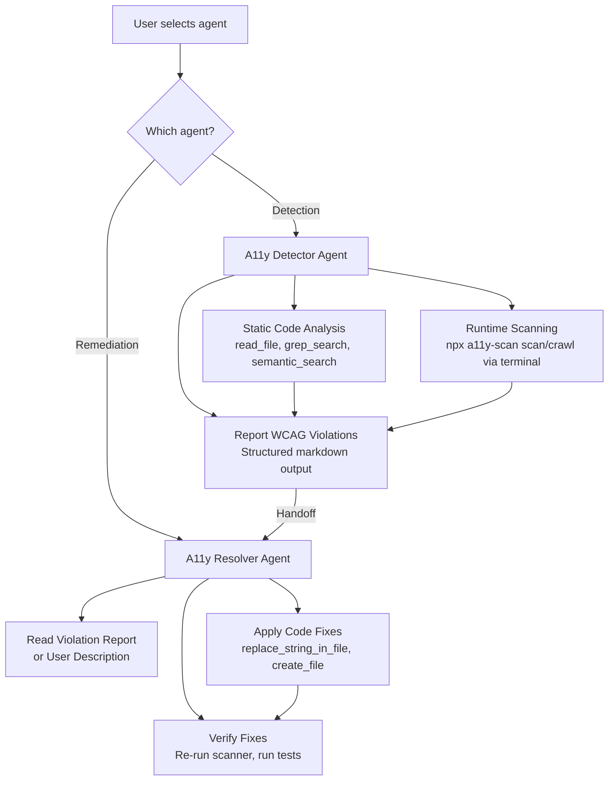

<!-- markdownlint-disable-file -->
# Task Research: Custom Copilot Agents for AODA WCAG 2.2 Accessibility

Research how to create two custom GitHub Copilot agents for AODA WCAG 2.2 accessibility compliance: one for detecting accessibility issues in web applications and one for resolving those issues in code. Both agents must work in VS Code (shift-left) and GitHub UI (Copilot custom agents).

## Task Implementation Requests

* Create a custom Copilot agent that detects AODA WCAG 2.2 accessibility issues in a web app repository
* Create a custom Copilot agent that is an expert at addressing and resolving accessibility issues in code
* Both agents must work in VS Code as custom agents and in GitHub UI as custom Copilot agents
* Agents should leverage the existing accessibility scanning capabilities in this repository

## Scope and Success Criteria

* Scope: Custom Copilot agent creation for both VS Code and GitHub.com; AODA WCAG 2.2 compliance rules; integration with axe-core, IBM Equal Access, and custom checks; agent file authoring standards
* Assumptions:
  * Agents will be used with this accessibility-scan-demo-app repository
  * VS Code agents use the `.github/agents/` convention for `.agent.md` files
  * GitHub.com Copilot reads `.github/agents/` from the repository (same files work cross-platform)
  * AODA aligns with WCAG 2.2 Level AA standards (AODA legally references WCAG 2.0 but 2.2 is backwards compatible)
  * No server-side infrastructure is needed (`.agent.md` + instructions files + optional MCP)
* Success Criteria:
  * Complete `.agent.md` definitions for both detection and remediation agents
  * Supporting `.instructions.md` files with WCAG 2.2 compliance rules
  * Cross-platform compatibility (VS Code, GitHub.com, JetBrains, CLI)
  * Integration patterns with the existing scanner engine, scoring, and CLI
  * Clear examples of detection and remediation workflows

## Outline

1. Key Discoveries (consolidated from all subagent research)
2. Technical Scenarios and Architecture Options
3. Selected Approach with Complete Implementation Details
4. Agent 1: AODA WCAG Accessibility Detector
5. Agent 2: AODA WCAG Accessibility Resolver
6. Supporting Files (instructions, skills, prompts)
7. Considered Alternatives

## Research Executed

### File Analysis

* [src/lib/scanner/engine.ts](src/lib/scanner/engine.ts) — Three-engine scanning architecture (axe-core + IBM Equal Access + 5 custom checks). axe-core tags: `wcag2a`, `wcag2aa`, `wcag21a`, `wcag21aa`, `wcag22aa`, `best-practice` ([L41-L45](src/lib/scanner/engine.ts#L41-L45))
* [src/lib/scanner/custom-checks.ts](src/lib/scanner/custom-checks.ts) — Five custom Playwright checks: ambiguous-link-text, aria-current-page, emphasis-strong-semantics, discount-price-accessibility, sticky-element-overlap
* [src/lib/scoring/calculator.ts](src/lib/scoring/calculator.ts) — Weighted impact scoring (critical=10, serious=7, moderate=3, minor=1). Grades: A≥90, B≥70, C≥50, D≥30, F<30
* [src/lib/scoring/wcag-mapper.ts](src/lib/scoring/wcag-mapper.ts) — Maps WCAG tags to POUR principles (1=Perceivable, 2=Operable, 3=Understandable, 4=Robust)
* [src/lib/report/sarif-generator.ts](src/lib/report/sarif-generator.ts) — SARIF 2.1.0 output (GitHub Security compatible)
* [src/lib/ci/threshold.ts](src/lib/ci/threshold.ts) — CI threshold evaluation: min score, per-impact max counts, rule fail/ignore lists
* [src/cli/commands/scan.ts](src/cli/commands/scan.ts) — CLI single-page scan command
* [src/cli/commands/crawl.ts](src/cli/commands/crawl.ts) — CLI site-wide crawl command
* [src/lib/types/scan.ts](src/lib/types/scan.ts) — Complete TypeScript interfaces for scan lifecycle
* [.github/workflows/a11y-scan.yml](.github/workflows/a11y-scan.yml) — CI workflow integration
* [action/action.yml](action/action.yml) — GitHub Action definition

### Subagent Research Documents

* [vscode-custom-agents-research.md](.copilot-tracking/research/subagents/2026-03-08/vscode-custom-agents-research.md) — Complete VS Code `.agent.md` schema, tools API, instructions integration, skills, agent orchestration patterns
* [github-copilot-extensions-research.md](.copilot-tracking/research/subagents/2026-03-08/github-copilot-extensions-research.md) — Copilot Extensions architecture (Skillsets vs Agents), ecosystem shift toward `.agent.md` + MCP, cross-platform analysis
* [aoda-wcag22-standards-research.md](.copilot-tracking/research/subagents/2026-03-08/aoda-wcag22-standards-research.md) — AODA/WCAG relationship, all WCAG 2.2 Level AA criteria, detection capabilities, remediation patterns
* [codebase-analysis-research.md](.copilot-tracking/research/subagents/2026-03-08/codebase-analysis-research.md) — Scanner engine architecture, scoring, reports, CLI, crawler, CI integration, type system

### Project Conventions

* ADO workflow: `.github/instructions/ado-workflow.instructions.md` — work item hierarchy, branching, commit messages with `AB#` linking
* Commit messages: HVE Core `commit-message.instructions.md` — Conventional Commits with types/scopes, footer with emoji and `Generated by Copilot`
* Markdown: HVE Core `markdown.instructions.md` — YAML frontmatter required, heading hierarchy, ATX style
* Agent authoring: HVE Core `prompt-builder.instructions.md` — `.agent.md` schema, subagent template, skills structure

## Key Discoveries

### 1. Platform Architecture: `.agent.md` is the Right Approach

**Critical finding**: GitHub has shifted its extensibility model from server-side Copilot Extensions toward declarative `.agent.md` files + MCP servers (as of March 2026). Evidence:

* All Copilot Extensions builder docs redirect to MCP docs
* The Copilot customization cheat sheet lists: custom agents, MCP servers, agent skills, custom instructions, prompt files, and subagents — but NOT "Copilot Extensions"
* The `copilot-extensions/preview-sdk` last released October 2024 (18 months stale)
* The `copilot-extensions/user-feedback` repo is archived

**`.agent.md` files provide cross-platform support**:

| Environment | Support Status |
|-------------|---------------|
| VS Code | Full support, auto-detected in `.github/agents/` |
| GitHub.com (Copilot coding agent) | Full support, reads `.github/agents/` from repo |
| JetBrains IDEs | Public preview |
| Eclipse | Public preview |
| Xcode | Public preview |
| GitHub Copilot CLI | Supported |

### 2. Agent Definition Schema

Only `description` is required in YAML frontmatter. Key optional fields: `name`, `tools`, `agents`, `model`, `user-invocable`, `disable-model-invocation`, `target`, `handoffs`, `mcp-servers`.

Tools can reference built-in VS Code tools, MCP server tools (`server/*` syntax), and extension tools. Omitting `tools` grants access to all tools.

The `target` field controls environment: `vscode` (IDE only), `github-copilot` (GitHub.com only), or omit for both.

### 3. AODA and WCAG 2.2 Relationship

* AODA legally references WCAG 2.0 Level AA, but conforming to WCAG 2.2 Level AA automatically satisfies AODA
* AODA has no additional technical criteria — extras are procedural (reporting, training, feedback, procurement)
* WCAG 2.2 adds 6 new Level A/AA criteria requiring compliance: Focus Not Obscured (2.4.11), Dragging Movements (2.5.7), Target Size Minimum (2.5.8), Consistent Help (3.2.6), Redundant Entry (3.3.7), Accessible Authentication (3.3.8)

### 4. Automated Detection Covers ~35-40% of WCAG 2.2

* Fully automatable: ~35-40% (missing alt, contrast, labels, lang, ARIA, headings)
* Partially automatable: ~25% (target size, focus obscured, keyboard operability)
* Manual testing only: ~35-40% (cross-page consistency, authentication flows, drag alternatives, semantic accuracy)

### 5. Existing Codebase Has Strong Scanner Infrastructure

* Three-engine architecture: axe-core (primary), IBM Equal Access (secondary), 5 custom Playwright checks
* Weighted scoring with POUR principle breakdown
* Five output formats: HTML, PDF, SARIF (GitHub Security), JSON, JUnit XML
* CLI with `scan` and `crawl` commands
* CI threshold evaluation with minimum score, per-impact limits, and rule lists
* Complete TypeScript type system (20+ interfaces)

### 6. Top React/Next.js Violations (Agent Knowledge Base)

The top 10 most common violations in React/Next.js apps:

1. `color-contrast` (1.4.3) — Tailwind/CSS colors with insufficient contrast
2. `image-alt` (1.1.1) — `<Image>` components missing `alt` prop
3. `link-name` (2.4.4) — Icon-only links without `aria-label`
4. `button-name` (4.1.2) — Icon-only buttons without accessible name
5. `label` (3.3.2) — Form inputs without associated labels
6. `html-has-lang` (3.1.1) — Missing `lang` attribute in `layout.tsx`
7. `heading-order` (2.4.6) — Skipping heading levels
8. `empty-heading` (2.4.6) — Headings with no text content
9. `document-title` (2.4.2) — Missing or generic page titles
10. `aria-hidden-focus` (4.1.2) — `aria-hidden` on focusable elements

## Technical Scenarios

### Scenario 1: Declarative `.agent.md` Files — SELECTED APPROACH

Two `.agent.md` files in `.github/agents/` with supporting `.instructions.md` files providing WCAG 2.2 knowledge and remediation patterns. No server infrastructure required.

**Requirements:**

* Cross-platform support (VS Code, GitHub.com, JetBrains, CLI)
* Zero infrastructure and maintenance
* WCAG 2.2 Level AA knowledge embedded in instructions
* Integration with existing codebase scanning tools via terminal
* Git-based distribution through the repository

**Preferred Approach:**

* Use `.agent.md` for agent definitions with code analysis tools
* Use `.instructions.md` files for WCAG 2.2 compliance rules (auto-applied to relevant file types)
* Agents can invoke the CLI scanner via `run_in_terminal` for runtime scanning
* Agents perform static code analysis using `read_file`, `grep_search`, `semantic_search`

**File Structure:**

```text
.github/
├── agents/
│   ├── a11y-detector.agent.md          # Detection agent
│   └── a11y-resolver.agent.md          # Remediation agent
├── instructions/
│   ├── ado-workflow.instructions.md    # Existing
│   └── wcag-compliance.instructions.md # NEW: WCAG 2.2 rules (auto-applied)
└── prompts/
    ├── a11y-scan.prompt.md             # Quick single-page scan prompt
    └── a11y-fix.prompt.md              # Quick remediation prompt
```

**Architecture Diagram:**



**Implementation Details:**

The detection agent combines two approaches:

1. **Static analysis** — reads source files and identifies common WCAG antipatterns (missing alt, missing labels, heading hierarchy violations, missing lang, contrast issues in Tailwind classes, non-semantic interactive elements, missing ARIA attributes)
2. **Runtime scanning** — invokes `npx a11y-scan scan <url>` or `npx a11y-scan crawl <url>` via terminal to run the three-engine scanner (axe-core + IBM Equal Access + custom checks)

The remediation agent:

1. Receives violation details (from scan results, handoff from detector, or user description)
2. Looks up the WCAG success criterion and standard fix pattern from embedded knowledge
3. Reads the affected source files
4. Applies code fixes following React/Next.js best practices
5. Runs tests and optionally re-scans to verify fixes

**Handoff workflow**: Detection agent includes a handoff button to the Resolver agent, passing discovered violations as context.

### Scenario 2: Agent 1 — AODA WCAG Accessibility Detector

**Core Capabilities:**

1. **Static HTML/JSX/TSX Analysis** — Identifies missing alt text, missing labels, heading hierarchy violations, missing lang attributes, ambiguous link text, non-semantic elements used as interactive controls
2. **CSS/Tailwind Analysis** — Flags potential contrast issues, missing focus styles, small target sizes, zoom restrictions via `maximum-scale`
3. **ARIA Pattern Validation** — Detects invalid ARIA roles, missing required ARIA attributes, conflicting ARIA properties
4. **Runtime Scanning** — Invokes the CLI scanner against local dev server or any URL
5. **WCAG 2.2 New Criteria Awareness** — Checks for focus obscured by sticky elements, missing drag alternatives, insufficient target sizes, inconsistent help placement
6. **Priority-Based Reporting** — Reports violations ordered by WCAG impact level (critical > serious > moderate > minor)

**Agent Definition:**

```yaml
---
name: A11y Detector
description: 'Detects AODA WCAG 2.2 accessibility violations in web application code through static analysis and runtime scanning'
tools:
  - read_file
  - grep_search
  - semantic_search
  - file_search
  - list_dir
  - run_in_terminal
  - manage_todo_list
  - runSubagent
handoffs:
  - label: "🔧 Fix Violations"
    agent: A11y Resolver
    prompt: "Fix the accessibility violations found above"
    send: false
---
```

**Key Agent Body Sections:**

* AODA/WCAG 2.2 prioritization rules and compliance requirements
* Static analysis checklist mapping code patterns to WCAG criteria
* Runtime scanning integration via `npx a11y-scan scan <url>` and `npx a11y-scan crawl <url>`
* Structured violation report template with WCAG SC, impact, affected elements, and remediation guidance
* WCAG 2.2 new criteria guidance (Focus Not Obscured, Target Size, Dragging Movements, Consistent Help, Redundant Entry, Accessible Authentication)

### Scenario 3: Agent 2 — AODA WCAG Accessibility Resolver

**Core Capabilities:**

1. **Violation-Specific Fixes** — Standard remediation patterns for each axe-core rule ID
2. **React/Next.js Best Practices** — Fixes that follow React accessibility patterns (hooks like `useId()`, proper component patterns, SSR considerations)
3. **ARIA Pattern Implementation** — Correct ARIA widget patterns, focus management, live regions
4. **Verification** — Re-runs scanner after fixes to verify improvements
5. **Batch Remediation** — Can fix multiple violations in a single session with impact-severity priority ordering
6. **Non-Breaking Changes** — Preserves existing functionality while adding accessibility

**Agent Definition:**

```yaml
---
name: A11y Resolver
description: 'Expert at resolving AODA WCAG 2.2 accessibility violations with standards-compliant code fixes'
tools:
  - read_file
  - replace_string_in_file
  - multi_replace_string_in_file
  - create_file
  - grep_search
  - semantic_search
  - file_search
  - list_dir
  - run_in_terminal
  - manage_todo_list
  - get_errors
  - runTests
handoffs:
  - label: "🔍 Re-scan"
    agent: A11y Detector
    prompt: "Scan the codebase again to verify the fixes applied"
    send: false
---
```

**Key Agent Body Sections:**

* Fix prioritization by impact severity (critical → serious → moderate → minor)
* Complete remediation patterns for top 20 violations
* React/Next.js specific accessibility patterns
* WCAG 2.2 new criteria remediation guide
* Verification workflow (re-scan after fixes)
* Common pitfalls and anti-patterns to avoid

### Remediation Patterns Reference (for Agent Knowledge)

| Violation | WCAG SC | Standard Fix |
|-----------|---------|-------------|
| Missing `alt` on image | 1.1.1 | Add `alt="Description"` or `alt=""` for decorative |
| Missing `alt` on Next.js Image | 1.1.1 | Add `alt` prop to `<Image>` component |
| Icon-only link/button | 2.4.4 / 4.1.2 | Add `aria-label="Purpose"` or visually hidden text |
| Color contrast below 4.5:1 | 1.4.3 | Darken text or lighten background |
| Missing form label | 3.3.2 | Add `<label htmlFor="id">` or `aria-label` |
| Missing `lang` attribute | 3.1.1 | Add `lang="en"` to `<html>` in `layout.tsx` |
| Skipped heading levels | 2.4.6 | Use sequential levels (h1 → h2 → h3) |
| No skip navigation | 2.4.1 | Add `<a href="#main" className="sr-only focus:not-sr-only">` |
| `div` as button | 4.1.2 | Replace with `<button>` element |
| Missing focus indicator | 2.4.7 | Add `:focus-visible` CSS with visible outline |
| Focus obscured by sticky header | 2.4.11 | Add `scroll-padding-top` CSS |
| Small target size | 2.5.8 | Ensure ≥24×24px with padding |
| Missing `aria-live` for dynamic content | 4.1.3 | Add `role="status"` or `aria-live="polite"` |
| Duplicate IDs | 4.1.2 | Use `useId()` hook for unique IDs |
| Zoom disabled via meta viewport | 1.4.4 | Remove `maximum-scale=1` from viewport meta |
| Ambiguous link text | 2.4.4 | Replace "Click here" with descriptive text |
| Missing `aria-current="page"` | 1.3.1 | Add to active navigation links |
| Non-semantic emphasis (`<b>`, `<i>`) | Best practice | Replace with `<strong>`, `<em>` |

### Supporting Instructions File: WCAG Compliance

A `.instructions.md` file auto-applied to all TSX/JSX/HTML/CSS files:

```yaml
---
description: 'AODA WCAG 2.2 Level AA compliance rules for accessibility in web components'
applyTo: '**/*.tsx, **/*.jsx, **/*.ts, **/*.html, **/*.css'
---
```

This file contains the complete WCAG 2.2 Level AA checklist that Copilot references when editing any matching file, even without the agents active. It provides passive accessibility guidance during all development.

### Supporting Prompt Files

**Quick Scan Prompt** (`a11y-scan.prompt.md`):

```yaml
---
description: 'Run an AODA WCAG 2.2 accessibility scan on the current project'
agent: A11y Detector
argument-hint: "[url=http://localhost:3000] [scope={page|site}]"
---
```

**Quick Fix Prompt** (`a11y-fix.prompt.md`):

```yaml
---
description: 'Fix accessibility violations in the current file or project'
agent: A11y Resolver
argument-hint: "[file=current] [violations=...]"
---
```

## Considered Alternatives

### Alternative A: GitHub Copilot Extensions (Server-side GitHub Apps)

Build two server-side applications registered as GitHub Apps with webhook endpoints. A detection extension would spin up a Playwright browser, scan pages with axe-core, and stream results back via SSE. A remediation extension would analyze violations and suggest fixes using the Copilot LLM API.

**Benefits:**

* Full LLM control — custom prompts, model selection
* Persistent state — scan result caching, historical trending
* GitHub Marketplace distribution
* Server-side Playwright scanning of live URLs

**Drawbacks and rejection reasons:**

* Requires deployed web server infrastructure (hosting, uptime, security)
* GitHub is actively moving away from this approach (docs redirect to MCP, SDK stale 18 months)
* Significant development effort (Node.js/Express server, SSE streaming, signature verification)
* Maintenance burden (security patches, dependency updates, server monitoring)
* `.agent.md` provides the same cross-platform reach with zero infrastructure
* The Preview SDK is in preview with no updates, suggesting uncertain future

**Evidence for rejection:**

* All GitHub Copilot Extensions builder docs redirect to MCP docs as of March 2026
* Copilot customization cheat sheet (March 2026) does not list "Copilot Extensions"
* `copilot-extensions/user-feedback` repository is archived
* `@copilot-extensions/preview-sdk` last released October 2024

### Alternative B: `.agent.md` + Remote MCP Server for Live Scanning

Same as selected approach but with an MCP server deployed to Azure that wraps the accessibility scanner for remote execution against live URLs.

**Benefits:**

* Enables scanning external/production URLs from any IDE
* MCP is the recommended extensibility mechanism
* Can serve multiple repositories/users
* Aligns with GitHub's current direction

**Not rejected but deferred because:**

* Adds infrastructure complexity (Azure deployment, OAuth/PAT authentication)
* For shift-left development workflow, terminal-based local scanning suffices
* Can be added later as an enhancement without changing agent definitions
* The `mcp-servers` frontmatter property makes this a seamless future addition

### Alternative C: VS Code Chat Participants API (Extension)

Build a VS Code extension using `vscode.chat.createChatParticipant()` for `@a11y-detect` and `@a11y-resolve` participants with programmatic TypeScript handlers.

**Benefits:**

* Full programmatic control over request/response
* Custom UI elements, follow-up suggestions
* Published via VS Code Extension Marketplace

**Drawbacks and rejection reasons:**

* Requires building and publishing a VS Code extension in TypeScript
* Limited to VS Code only (no GitHub.com, JetBrains, CLI support)
* Much higher development and maintenance effort
* `.agent.md` provides equivalent functionality declaratively
* Extension API is a different system from `.agent.md` (invoked via `@participant` not agent picker)

### Alternative D: Agent Skills (SKILL.md) Only

Package accessibility knowledge as skills rather than agents, providing on-demand scanning and fix recipes.

**Benefits:**

* Portable across VS Code, CLI, and Copilot coding agent
* Open standard (agentskills.io)
* Can include executable scripts

**Not selected as primary because:**

* Skills are invoked on-demand, not as persistent specialized agents
* Cannot maintain agent persona/expertise across a conversation
* Better suited as supplements to agents (future enhancement)
* Agents with instructions provide more comprehensive coverage

## Potential Next Research

* MCP server architecture for wrapping the accessibility scanner for remote/cloud scanning
* Organization-level agent sharing via `.github-private` repository
* Agent skills (`SKILL.md`) for scanning workflows and remediation recipe libraries
* Integration with GitHub Advanced Security SARIF upload for scan results
* Custom checks to expand WCAG 2.2 coverage (2.5.7 Dragging Movements, 3.3.8 Accessible Authentication)
* IBM Equal Access WCAG 2.2 policy support timeline
* `jest-axe` and `@testing-library` accessibility matchers for unit-level detection
* Background agents and cloud agents support for CI-integrated scanning
