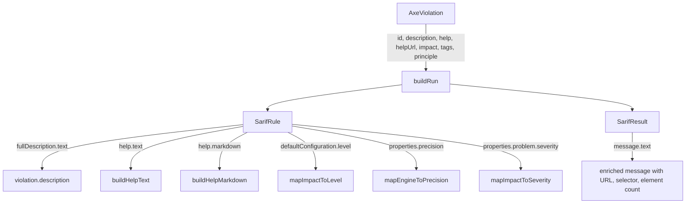

<!-- markdownlint-disable-file -->
# Task Research: Improve SARIF Output for GitHub Code Scanning

Enhance the SARIF output produced by the accessibility-scanner so that results displayed in GitHub Security > Code Scanning are complete, rich, and useful for developers — matching the quality of commercial SAST tools like CodeQL.

## Task Implementation Requests

* Add `fullDescription`, `help` (with `text` and `markdown`), and `defaultConfiguration` to SARIF rule descriptors so GitHub shows "Rule help" content inline.
* Fix broken IBM Equal Access `helpUri` URLs — two sub-bugs: wrong URL pattern in normalizer, and potential underscore-escaping.
* Enrich SARIF result `message.text` with structured content including violation details, affected snippet, selector, failure summary, and WCAG criteria.
* Ensure SARIF `properties` carry proper tags (`precision`, `problem.severity`) so GitHub can categorize/filter/order results.
* Add `tool.driver.informationUri`, `tool.driver.semanticVersion`, and `automationDetails.id` for proper tool identification.

## Scope and Success Criteria

* Scope: SARIF generator (`src/lib/report/sarif-generator.ts`), result normalizer (`src/lib/scanner/result-normalizer.ts`), and supporting types. Does not cover the web UI, PDF, or HTML report.
* Assumptions:
  * GitHub Code Scanning uses a **specific subset** of SARIF v2.1.0 — not all spec fields are rendered.
  * `helpUri` is **NOT supported by GitHub** — help URLs must be embedded in `help.markdown`.
  * Existing `AxeViolation` and `AxeNode` fields contain all data needed for enrichment.
  * IBM raw `help` field contains a valid archive URL that should be used directly.
* Success Criteria:
  * GitHub displays inline "Rule help" with description, WCAG mapping, remediation guidance, and learn more links for every accessibility alert.
  * IBM rule links resolve correctly (use archive URL pattern, not the `/tools/help/` pattern).
  * Result messages include violation description, affected element count, and scanned URL.
  * Tags/properties enable filtering by WCAG principle and severity ordering.

## Outline

1. Current SARIF output analysis — complete field inventory and gaps
2. GitHub SARIF ingestion — exact fields that enable rich display
3. IBM Equal Access URL issue — root cause (two bugs) and fix
4. Selected approach — enriched SARIF with all GitHub-supported fields
5. Implementation plan with code examples
6. Considered alternatives

## Potential Next Research

* Validate with a test SARIF upload — confirm `help.markdown` renders as expected.
* Research whether IBM `/rules/tools/help/{ruleId}` endpoint redirects or is deprecated.
* Investigate whether `result.message.markdown` is silently supported by GitHub (not documented).
* Consider adding WCAG success criterion text directly to `help.markdown` using a static mapping table.

## Research Executed

### File Analysis

* `src/lib/report/sarif-generator.ts` (142 lines) — The entire SARIF generator. Produces `SarifRule` with only 5 fields (`id`, `name`, `shortDescription`, `helpUri`, `properties.tags`). Missing: `fullDescription`, `help`, `defaultConfiguration`, precision/severity properties.
* `src/lib/scanner/result-normalizer.ts` (lines 60–86) — IBM normalizer. Line 74 maps `r.help` (actually a URL) to the text `help` field. Line 75 constructs a different `helpUrl` using `/rules/tools/help/` pattern instead of the raw IBM archive URL.
* `src/lib/types/scan.ts` (lines 32–65) — `AxeViolation` has fields `description`, `help`, `helpUrl`, `nodes`, `principle`, `engine`. `AxeNode` has `html`, `target`, `impact`, `failureSummary`. `failureSummary`, `principle`, and `engine` never reach SARIF.
* `src/components/ViolationList.tsx` — HTML report renders all rich data including impact badges, description, snippet, selector, failure summary, element count, and learn more links. This is the quality target for SARIF.
* `results/https_/example.com.json` (lines 1–40) — Raw IBM results. The `help` field contains full archive URLs like `https://able.ibm.com/rules/archives/2026.03.04/doc/en-US/style_color_misuse.html#...` — these work correctly.

### Code Search Results

* `helpUri` appears only in `sarif-generator.ts` — set from `violation.helpUrl`.
* `able.ibm.com` appears in `result-normalizer.ts:75` (constructed URL) and raw result files (archive URL).
* `fullDescription`, `help.text`, `help.markdown` never appear in the codebase — confirming they are missing.

### External Research

* GitHub SARIF Support: `https://docs.github.com/en/code-security/code-scanning/integrating-with-code-scanning/sarif-support-for-code-scanning`
  * `fullDescription.text` — **Required** by GitHub.
  * `help.text` — **Required** by GitHub. This is the "Rule help" panel.
  * `help.markdown` — **Recommended**. When present, **displayed instead of** `help.text`.
  * `helpUri` — **NOT listed** in GitHub's supported properties. GitHub does not render it.
  * `properties.precision` — **Recommended**. Affects result ordering.
  * `properties.problem.severity` — **Recommended**. Affects result ordering.
* SARIF v2.1.0 OASIS Spec: `https://docs.oasis-open.org/sarif/sarif/v2.1.0/sarif-v2.1.0.html`
  * §3.49.13: `help` is a `multiformatMessageString` with `text` (required) and `markdown` (optional).
  * §3.49.12: `helpUri` is valid SARIF but not guaranteed to be displayed by any viewer.

### Project Conventions

* Standards referenced: SARIF v2.1.0 OASIS spec, GitHub SARIF support docs, CodeQL SARIF patterns
* Instructions followed: `ado-workflow.instructions.md`, `a11y-remediation.instructions.md`, `wcag22-rules.instructions.md`

## Key Discoveries

### Discovery 1: Root Cause of "No Rule Help Available"

GitHub Code Scanning requires `help.text` and recommends `help.markdown` on every `reportingDescriptor` (rule). The current generator produces neither. This is why **every** accessibility alert shows "no rule help available for this alert."

**Evidence**: GitHub docs explicitly state `help.text` is Required. Current `SarifRule` interface at [sarif-generator.ts](src/lib/report/sarif-generator.ts#L20-L26) only has `id`, `name`, `shortDescription`, `helpUri`, `properties`.

### Discovery 2: `helpUri` Is Ignored by GitHub

GitHub's supported properties documentation does **not list `helpUri`** at all. The current tool relies on `helpUri` for "Learn more" links, but GitHub never renders them. The fix is to embed help URLs as markdown links inside `help.markdown`.

**Evidence**: GitHub SARIF support docs — `helpUri` absent from the `reportingDescriptor` supported properties table.

### Discovery 3: IBM Equal Access URL — Two Bugs

**Bug A — Wrong URL pattern**: `normalizeIbmResults()` at [result-normalizer.ts](src/lib/scanner/result-normalizer.ts#L75) constructs `https://able.ibm.com/rules/tools/help/${r.ruleId}` — a generic endpoint that may not exist. The raw IBM data contains a working archive URL in the `help` field: `https://able.ibm.com/rules/archives/2026.03.04/doc/en-US/{ruleId}.html#...`.

**Bug B — Underscore markdown escaping**: Somewhere in the pipeline, underscores in rule IDs (e.g., `label_name_visible`) are backslash-escaped to `label\_name\_visible`, producing 404s. This likely happens when GitHub renders `helpUri` or SARIF content through a markdown processor.

**Fix**: Extract the base URL (before `#` fragment) from the raw IBM `help` field and use it as the canonical help URL. Embed it in `help.markdown` instead of relying on `helpUri`.

### Discovery 4: IBM `help` Field Is a URL, Not Text

The normalizer at [result-normalizer.ts](src/lib/scanner/result-normalizer.ts#L74) does `help: r.help ?? r.message`. But `r.help` in the raw IBM data is a **URL** (e.g., `https://able.ibm.com/rules/archives/...`), not a text description. This means the `help` field of the normalized violation contains a URL string instead of human-readable guidance for IBM rules.

**Evidence**: [example.com.json](results/https_/example.com.json) line 29 — the `help` field is a full URL with encoded JSON fragment.

### Discovery 5: Rich Data Available But Lost

The HTML report (ViolationList component) displays: `failureSummary`, CSS selectors (`target`), element count, principle grouping, and engine source. None of these flow into SARIF output. The SARIF `message.text` is a simple concatenation: `"{help} ({url} — {target})"`.

### Discovery 6: `fullDescription.text` Is Missing

GitHub marks `fullDescription.text` as **Required**. The current generator only sets `shortDescription.text` from `violation.description`. `fullDescription` is not set at all.

### Discovery 7: GitHub Upload Limits

| Limit | Value |
|---|---|
| File size (gzip) | 10 MB |
| Runs per file | 20 |
| Results per run | 25,000 (top 5,000 shown) |
| Rules per run | 25,000 |
| Tags per rule | 20 (10 shown) |

### Implementation Patterns

#### Current SarifRule Interface (5 fields)

```typescript
// sarif-generator.ts lines 20-26
interface SarifRule {
  id: string;
  name: string;
  shortDescription: { text: string };
  helpUri: string;
  properties: { tags: string[] };
}
```

#### Target SarifRule Interface (all GitHub-supported fields)

```typescript
interface SarifRule {
  id: string;
  name: string;
  shortDescription: { text: string };
  fullDescription: { text: string };
  helpUri: string;               // keep for SARIF compliance, but not rendered by GitHub
  help: {
    text: string;                // required by GitHub — plain text rule documentation
    markdown: string;            // recommended — rich markdown, displayed instead of text
  };
  defaultConfiguration: {
    level: 'error' | 'warning' | 'note';
  };
  properties: {
    tags: string[];
    precision: 'very-high' | 'high' | 'medium' | 'low';
    'problem.severity': 'error' | 'warning' | 'recommendation';
  };
}
```

### Complete Examples

#### Ideal SARIF Rule for an Accessibility Violation

```json
{
  "id": "color-contrast",
  "name": "color-contrast",
  "shortDescription": {
    "text": "Ensure the contrast between foreground and background colors meets WCAG 2 AA thresholds"
  },
  "fullDescription": {
    "text": "Ensures the contrast between foreground and background colors meets WCAG 2 AA minimum contrast ratio thresholds. Low contrast text is difficult or impossible for many users to read."
  },
  "help": {
    "text": "Ensure sufficient color contrast\n\nElements must meet minimum color contrast ratio thresholds.\n\nFix: Increase the contrast ratio between foreground and background colors. Use at least 4.5:1 for normal text and 3:1 for large text.\n\nWCAG: 1.4.3 Contrast (Minimum) (Level AA)\n\nLearn more: https://dequeuniversity.com/rules/axe/4.10/color-contrast",
    "markdown": "# Ensure sufficient color contrast\n\nElements must meet minimum color contrast ratio thresholds.\n\n## Why This Matters\n\nLow contrast text is difficult or impossible to read for many users, including those with low vision, color blindness, or age-related vision changes.\n\n## How to Fix\n\n- Increase the contrast ratio between foreground and background colors\n- Use a contrast ratio of at least **4.5:1** for normal text\n- Use a contrast ratio of at least **3:1** for large text (18pt or 14pt bold)\n\n## WCAG Criteria\n\n- [1.4.3 Contrast (Minimum) (Level AA)](https://www.w3.org/WAI/WCAG22/Understanding/contrast-minimum.html)\n\n## Learn More\n\n- [Deque University: color-contrast](https://dequeuniversity.com/rules/axe/4.10/color-contrast)\n"
  },
  "helpUri": "https://dequeuniversity.com/rules/axe/4.10/color-contrast",
  "defaultConfiguration": {
    "level": "error"
  },
  "properties": {
    "tags": ["accessibility", "WCAG2AA", "wcag143"],
    "precision": "very-high",
    "problem.severity": "error"
  }
}
```

#### Ideal SARIF Result

```json
{
  "ruleId": "color-contrast",
  "ruleIndex": 0,
  "level": "error",
  "message": {
    "text": "Ensure sufficient color contrast: Elements must meet minimum color contrast ratio thresholds. Scanned URL: https://example.com — Selector: button.btn-secondary — 3 elements affected"
  },
  "locations": [
    {
      "physicalLocation": {
        "artifactLocation": { "uri": "example.com/index" },
        "region": {
          "startLine": 1,
          "startColumn": 1,
          "snippet": {
            "text": "<button class=\"btn-secondary\">Submit</button>"
          }
        }
      }
    }
  ],
  "partialFingerprints": {
    "primaryLocationLineHash": "a1b2c3d4"
  }
}
```

### Configuration Examples

#### IBM helpUrl Fix in result-normalizer.ts

```typescript
// Extract base URL from IBM help field (strip fragment with encoded JSON context)
function extractIbmHelpUrl(rawHelp: string | undefined): string {
  if (!rawHelp) return '';
  try {
    const url = new URL(rawHelp);
    return `${url.origin}${url.pathname}`;  // strip #fragment
  } catch {
    return rawHelp;
  }
}

// In normalizeIbmResults():
helpUrl: extractIbmHelpUrl(r.help) || `https://able.ibm.com/rules/archives/latest/doc/en-US/${r.ruleId}.html`,
help: r.message,  // Use the message text, not the URL, as the help text
```

#### help.markdown Build Function

```typescript
function buildHelpMarkdown(violation: AxeViolation): string {
  const wcagTags = violation.tags.filter(t => /^wcag\d/.test(t));
  const lines: string[] = [
    `# ${violation.help}`,
    '',
    violation.description,
    '',
    `**Impact:** ${violation.impact}`,
  ];

  if (violation.principle) {
    lines.push(`**Principle:** ${violation.principle}`);
  }

  if (wcagTags.length > 0) {
    lines.push('', '## WCAG Criteria', '');
    for (const tag of wcagTags) {
      lines.push(`- \`${tag}\``);
    }
  }

  lines.push('', '## Learn More', '');
  lines.push(`- [Rule documentation](${violation.helpUrl})`);

  return lines.join('\n');
}
```

## Technical Scenarios

### Scenario: Enriched SARIF Rule Descriptors

The core problem is that GitHub cannot display rule help because the `help` property is missing from every `reportingDescriptor` in the SARIF output.

**Requirements:**

* Every rule must have `fullDescription.text`, `help.text`, and `help.markdown`.
* `help.markdown` should include: rule title, description, impact, WCAG criteria, principle, and a learn more link.
* `defaultConfiguration.level` must map from `violation.impact`.
* `properties` must include `precision` and `problem.severity`.

**Preferred Approach:**

Build a `buildHelpMarkdown()` function that generates structured markdown from `AxeViolation` data. Update the `SarifRule` interface and the `buildRun()` function to populate all GitHub-required fields. Keep `helpUri` for SARIF spec compliance but do not rely on it for display.

```text
src/lib/report/sarif-generator.ts  (modify — add fields to interface and buildRun)
src/lib/scanner/result-normalizer.ts  (modify — fix IBM helpUrl and help text)
```



**Implementation Details:**

1. Update `SarifRule` interface to include all GitHub-supported fields.
2. Add `buildHelpMarkdown(violation)` function.
3. Add `buildHelpText(violation)` function (plain text fallback).
4. Update `buildRun()` to populate new fields on each rule.
5. Enrich `SarifResult.message.text` with description and element count.
6. Add `tool.driver.informationUri` and `tool.driver.semanticVersion`.

#### Considered Alternatives

**Alternative A: Minimal fix — only add `help.text`**

* Pros: Smallest change, addresses the "no rule help" issue.
* Cons: Loses the opportunity for rich markdown display. No structured help.
* Rejected because: `help.markdown` is the key differentiator for useful alerts. Minimal effort to add both.

**Alternative B: Generate help content from a static WCAG mapping table**

* Pros: Could provide detailed WCAG success criterion text and specific remediation guidance.
* Cons: Requires maintaining a mapping table. Current data already contains `description` and `help` fields with useful content.
* Rejected because: The violation data already contains sufficient content. A static table may become stale. Can be added later as an enhancement.

**Alternative C: Use `result.message.markdown` for rich results**

* Pros: Could render rich markdown in the result detail view.
* Cons: GitHub docs do **not** list `message.markdown` as a supported property. Relies on undocumented behavior.
* Rejected because: Unreliable. Use `message.text` with information-dense first sentence instead.

### Scenario: Fix IBM Equal Access URLs

The root cause is two bugs: wrong URL pattern in the normalizer, and the IBM `help` field being treated as text when it is actually a URL.

**Requirements:**

* IBM rule `helpUrl` must use the working archive URL pattern from the raw IBM data.
* The `help` text on the normalized violation must be human-readable (the message), not a URL.
* URLs in `help.markdown` must not have underscores escaped.

**Preferred Approach:**

Extract the base URL (before `#` fragment) from the raw IBM `help` field: `r.help`. Use it as `helpUrl`. Use `r.message` as the human-readable `help` text. If `r.help` is not a valid URL, fall back to constructing the archive URL from `r.ruleId`.

```text
src/lib/scanner/result-normalizer.ts  (modify lines 74-75)
```

**Implementation Details:**

```typescript
// Add helper function
function extractIbmHelpUrl(rawHelp: string | undefined, ruleId: string): string {
  if (rawHelp) {
    try {
      const url = new URL(rawHelp);
      return `${url.origin}${url.pathname}`;  // strip #fragment with encoded JSON
    } catch {
      // not a URL, fall through
    }
  }
  return `https://able.ibm.com/rules/archives/latest/doc/en-US/${ruleId}.html`;
}

// In normalizeIbmResults():
help: r.message,  // human-readable text, not the URL
helpUrl: extractIbmHelpUrl(r.help, r.ruleId),
```

#### Considered Alternatives

**Alternative: Keep the `/rules/tools/help/{ruleId}` pattern**

* Rejected because: This URL pattern produces 404s. The raw IBM data provides working archive URLs.

**Alternative: Hardcode a specific archive version like `2026.03.04`**

* Rejected because: The version changes over time. Extracting from the raw data is forward-compatible.

## Summary

| Area | Current State | Target State | Priority |
|---|---|---|---|
| `rules[].help.text` | Missing | Build from `violation.help` + `description` | **P0** |
| `rules[].help.markdown` | Missing | Rich markdown with title, impact, WCAG, learn more | **P0** |
| `rules[].fullDescription.text` | Missing | Set to `violation.description` | **P0** |
| IBM helpUrl | Wrong URL pattern | Extract from raw IBM `help` field | **P0** |
| IBM help text | Contains URL string | Use `r.message` instead | **P0** |
| `rules[].defaultConfiguration.level` | Missing | Map from `violation.impact` | **P1** |
| `rules[].properties.precision` | Missing | Map from engine (`very-high` for axe, `high` for IBM) | **P1** |
| `rules[].properties.problem.severity` | Missing | Map from impact | **P1** |
| `result.message.text` | Basic concatenation | Enriched: description + URL + element count | **P1** |
| `tool.driver.informationUri` | Missing | Link to GitHub repo | **P2** |
| `tool.driver.semanticVersion` | Missing | Same as version | **P2** |
| `helpUri` | Present but ignored | Keep for spec compliance | **P2** |

### Files to Modify

1. **`src/lib/report/sarif-generator.ts`** — Update `SarifRule` interface, add `buildHelpMarkdown()` and `buildHelpText()`, update `buildRun()` to populate all new fields, enrich `message.text`.
2. **`src/lib/scanner/result-normalizer.ts`** — Fix IBM `helpUrl` construction (extract from raw `help` field), fix IBM `help` text (use `r.message`).
3. **`src/lib/report/__tests__/sarif-generator.test.ts`** — Update tests for new fields.
4. **`src/lib/scanner/__tests__/result-normalizer.test.ts`** — Update IBM helpUrl and help text tests.
