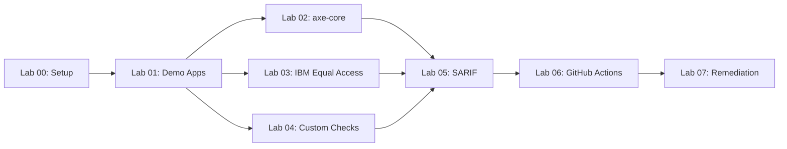

<!-- markdownlint-disable-file -->
# Task Research: Create accessibility-scan-workshop Repository and Refactor accessibility-scan-demo-app

Create a sibling `accessibility-scan-workshop` repository following the established `finops-scan-workshop` pattern, with placeholder screenshots and automated capture. Refactor `accessibility-scan-demo-app` to embed the 5 demo apps as templates (matching the `finops-scan-demo-app` hub-and-spoke pattern), and add bootstrap/OIDC scripts.

## Task Implementation Requests

* Create `accessibility-scan-workshop` repository with labs, placeholder screenshots, and automated capture script
* Embed the 5 a11y demo apps (001–005) as template directories inside `accessibility-scan-demo-app`
* Add `scripts/bootstrap-demo-apps.ps1` to `accessibility-scan-demo-app`
* Add `scripts/setup-oidc.ps1` to `accessibility-scan-demo-app`
* Create `scripts/capture-screenshots.ps1` in the workshop repo to auto-generate all lab screenshots
* Establish a repeatable pattern consistent with the `agentic-accelerator-framework` blueprint

## Scope and Success Criteria

* Scope: Two repositories — `accessibility-scan-demo-app` (refactored) and `accessibility-scan-workshop` (new). Does not modify the `agentic-accelerator-framework` or `agentic-accelerator-workshop` repos, but aligns with their patterns.
* Assumptions:
  * The 5 existing separate repos (`a11y-demo-app-001` to `005`) will continue to exist as deployed targets but the source of truth moves into the scanner repo
  * The workshop follows the finops workshop pattern (Jekyll GitHub Pages, 8 labs, half-day/full-day tiers)
  * The scanner repo uses OIDC for Azure auth, same as finops
  * ADO integration (existing pipelines) is preserved
* Success Criteria:
  * `accessibility-scan-demo-app` contains `a11y-demo-app-001/` through `a11y-demo-app-005/` template directories
  * `accessibility-scan-demo-app` contains `scripts/bootstrap-demo-apps.ps1` and `scripts/setup-oidc.ps1`
  * `accessibility-scan-workshop` contains 8 labs (00–07), screenshot inventory READMEs, and `scripts/capture-screenshots.ps1`
  * `capture-screenshots.ps1` can generate all lab screenshots automatically
  * Both repos structurally mirror their finops counterparts

## Outline

1. Current State Analysis — How the a11y ecosystem differs from finops
2. Structural Mapping — Finops → A11y element-by-element translation
3. Refactoring Plan for accessibility-scan-demo-app
4. Workshop Repository Design for accessibility-scan-workshop
5. Capture-Screenshots Script Design
6. Technical Scenarios and Alternatives
7. Implementation Steps

## Potential Next Research

* ADO pipeline refactoring to support embedded demo apps
  * Reasoning: Current ADO pipelines use `resources.repositories` for external demo apps
  * Reference: .azuredevops/pipelines/deploy-all.yml, templates/deploy-app-stage.yml
* Power BI dashboard documentation for accessibility (equivalent to finops docs/)
  * Reasoning: Finops has 5 Power BI integration docs; accessibility may need similar
  * Reference: finops-scan-demo-app docs/ directory
* Workshop Jekyll GitHub Pages theme customization
  * Reasoning: Custom Mermaid.js support via `_includes/head-custom.html`
  * Reference: finops-scan-workshop Gemfile and _includes/

## Research Executed

### File Analysis

* .github/workflows/ci.yml — CI pipeline: lint, test, build, e2e self-scan (lines 1–end)
* .github/workflows/deploy.yml — Scanner app deploy: OIDC login, Bicep, ACR, Web App restart (lines 1–end)
* .github/workflows/deploy-all.yml — Orchestrator: dispatches ci-cd to 5 sibling repos, deploys scanner, teardown gate (lines 1–end)
* .github/workflows/a11y-scan.yml — Weekly scheduled scan: matrix of 3 sites via scanner API (lines 1–end)
* .github/workflows/scan-all.yml — Dispatches a11y-scan to 5 sibling repos (lines 1–end)
* .github/agents/a11y-detector.agent.md — WCAG 2.2 detector with scoring, top-10 violations, handoff to resolver
* .github/agents/a11y-resolver.agent.md — Remediation agent with pattern table, priority ordering
* .github/instructions/ — 3 files: a11y-remediation, ado-workflow, wcag22-rules
* .github/prompts/ — 2 files: a11y-scan.prompt.md, a11y-fix.prompt.md
* infra/main.bicep — ACR + Log Analytics + App Insights + App Service Plan (P1v3) + Web App (Linux container port 3000)
* Dockerfile — Multi-stage Node 20 build with Playwright Chromium + Puppeteer Chrome for PDF
* action/action.yml — Composite GitHub Action for accessibility scanning (inputs: url, mode, threshold, etc.)
* package.json — Next.js 15.5, axe-core, crawlee, commander, puppeteer, accessibility-checker
* start-local.ps1 — Local dev (npm) or Docker modes
* stop-local.ps1 — Kill process or Docker container

### Code Search Results

* `deploy-all.yml` matrix — dispatches to: a11y-demo-app-001 (Rust 8001), 002 (C# 8002), 003 (Java 8003), 004 (Python 8004), 005 (Go 8005)
* `.azuredevops/pipelines/` — 6 pipelines + 2 reusable templates for ADO dual-platform CI/CD
* SSRF prevention in API routes — blocks localhost, private IPs, .local, .internal hostnames
* ADO org: MngEnvMCAP675646, project: AODA WCAG compliance
* Azure region: canadacentral, RG: rg-a11y-scan-demo, service connection: AODA-svc-conn

### External Research

* GitHub: `devopsabcs-engineering/finops-scan-demo-app`
  * Hub-and-spoke architecture with 5 embedded demo app template directories
  * scripts/bootstrap-demo-apps.ps1 (309 lines) — creates repos, pushes content, sets OIDC/secrets/environments/wiki
  * scripts/setup-oidc.ps1 (142 lines) — Azure AD app registration + 11 federated credentials + Contributor role
  * 4 workflows: finops-scan.yml, finops-cost-gate.yml, deploy-all.yml, teardown-all.yml
  * Each demo app: Dockerfile (nginx:alpine), src/index.html, infra/main.bicep, README.md, start-local.ps1, stop-local.ps1
  * Source: [finops-scan-demo-app](https://github.com/devopsabcs-engineering/finops-scan-demo-app)

* GitHub: `devopsabcs-engineering/finops-scan-workshop`
  * 8 labs (00–07), ~3.5h half-day / ~7.25h full-day delivery tiers
  * scripts/capture-screenshots.ps1 (710 lines) — Charm freeze + Playwright, 46 PNGs, 3-phase system
  * 4 capture methods: FreezeScreenshot, CapturedFreezeScreenshot, FreezeFile, PlaywrightScreenshot
  * Jekyll GitHub Pages site with Mermaid.js support
  * images/lab-XX/ directories with README.md inventory manifests
  * CONTRIBUTING.md with lab authoring style guide
  * Source: [finops-scan-workshop](https://github.com/devopsabcs-engineering/finops-scan-workshop)

* GitHub: `devopsabcs-engineering/a11y-demo-app-001` through `005`
  * 5 deliberately inaccessible web apps in Rust, C#, Java, Python, Go
  * Same HTML template with 15+ WCAG violation categories each
  * Identical Bicep infra (ACR + App Service Plan B1 + Web App)
  * Ports 8001–8005, themes: travel/e-commerce/learning/recipes/fitness
  * Source: [a11y-demo-app-001](https://github.com/devopsabcs-engineering/a11y-demo-app-001) through 005

* GitHub: `devopsabcs-engineering/agentic-accelerator-framework`
  * Defines the repeatable per-domain blueprint: scanner repo + agent pair + instructions + skills + prompts + CI/CD + SARIF category
  * Accessibility mapped to `accessibility-scan-demo-app` as Phase 2 reference
  * Detector-Resolver handoff pattern (A11yDetector ↔ A11yResolver)
  * Source: [agentic-accelerator-framework](https://github.com/devopsabcs-engineering/agentic-accelerator-framework)

* GitHub: `devopsabcs-engineering/agentic-accelerator-workshop`
  * 12 labs (00–11), template repository pattern, Lab 04 = Accessibility
  * Contains sample-app/ with intentional issues + .github/ customization files
  * Source: [agentic-accelerator-workshop](https://github.com/devopsabcs-engineering/agentic-accelerator-workshop)

### Project Conventions

* Standards referenced: WCAG 2.2 Level AA, AODA compliance, SARIF v2.1.0
* Instructions followed: ado-workflow.instructions.md (ADO work items, branching, PR workflow), a11y-remediation.instructions.md (fix patterns), wcag22-rules.instructions.md (POUR principles)

## Key Discoveries

### Project Structure

**Current State — Split Architecture:**
The accessibility ecosystem uses a 6-repo model: 1 scanner repo + 5 separate demo app repos. Orchestration uses `gh workflow run` cross-repo dispatch and ADO `resources.repositories`.

**Target State — Hub-and-Spoke (like finops):**
The scanner repo should embed all 5 demo apps as template directories, with a bootstrap script that creates separate deployed repos from them. This provides:
- Single source of truth for demo app content
- Idempotent bootstrap for environment setup
- Simplified maintenance (update in one place, re-push to all)

**Structural Delta (what needs to change in accessibility-scan-demo-app):**

| Component | Current | Target |
|-----------|---------|--------|
| Demo apps | 5 external repos | 5 embedded directories + bootstrap creates repos |
| Scripts | None (no `scripts/` dir) | `scripts/bootstrap-demo-apps.ps1` + `scripts/setup-oidc.ps1` |
| Workflows | `deploy-all.yml` dispatches to external repos | Keep dispatch pattern but source content from local dirs |
| ADO pipelines | `resources.repositories` for external repos | Keep reference pattern (deployed repos still needed) |

**What stays the same:**
- Scanner engine, CLI, GitHub Action, scoring, reports, API routes
- Scanner app's own deployment pipeline
- SARIF upload, Advanced Security integration
- Copilot AI customization files (agents, instructions, skills, prompts)
- The 5 separate repos still exist as deployment targets

### Implementation Patterns

**Finops Bootstrap Pattern (to replicate):**

```powershell
# bootstrap-demo-apps.ps1 pattern:
# 1. Collect OIDC values (env vars or prompted)
# 2. Collect ORG_ADMIN_TOKEN for wiki push
# 3. Run setup-oidc.ps1 if Azure CLI is logged in
# 4. For each of 5 apps:
#    a. Create public repo (gh repo create) — idempotent
#    b. Push content from local template directory
#    c. Set topics, enable code scanning
#    d. Configure OIDC secrets
#    e. Create 'production' environment
#    f. Configure ORG_ADMIN_TOKEN
#    g. Initialize wiki
# 5. Configure secrets on scanner repo
```

**Finops OIDC Pattern (to replicate):**

```powershell
# setup-oidc.ps1 pattern:
# 1. Get/create Azure AD app registration
# 2. Create federated credentials for all 6 repos (scanner + 5 demo apps)
#    - main branch credential per repo
#    - production environment credential per demo app
# 3. Create/get service principal
# 4. Assign Contributor role on subscription
# 5. Output AZURE_CLIENT_ID / AZURE_TENANT_ID / AZURE_SUBSCRIPTION_ID
```

**Finops capture-screenshots.ps1 Pattern (to adapt):**

```powershell
# 4 capture methods:
# 1. Invoke-FreezeScreenshot — terminal command output via Charm freeze --execute
# 2. Invoke-CapturedFreezeScreenshot — pre-capture output, render file with freeze
# 3. Invoke-FreezeFile — source file with line numbers via freeze --show-line-numbers
# 4. Invoke-PlaywrightScreenshot — browser pages via npx playwright screenshot
#
# 3-phase system:
# Phase 1: Offline tools (versions, config files, scan outputs)
# Phase 2: Azure-dependent (deployed app pages, portal screenshots)
# Phase 3: GitHub web UI (Security tab, Actions, PRs)
```

### Complete Examples

**Demo App Template Directory Structure (per app):**

```text
a11y-demo-app-001/
├── .github/
│   └── workflows/
│       ├── ci-cd.yml
│       └── a11y-scan.yml
├── .azuredevops/
│   └── pipelines/
│       ├── ci-cd.yml
│       └── a11y-scan.yml
├── infra/
│   └── main.bicep
├── Cargo.toml          (language-specific)
├── Dockerfile
├── README.md
├── start-local.ps1
├── stop-local.ps1
└── src/
    └── main.rs         (language-specific)
    └── static/
        └── index.html
```

**Workshop Repository Structure:**

```text
accessibility-scan-workshop/
├── README.md
├── index.md                          # Jekyll landing page
├── CONTRIBUTING.md
├── LICENSE
├── Gemfile                           # Jekyll dependencies
├── _config.yml                       # Jekyll config
├── _includes/
│   └── head-custom.html              # Mermaid.js support
├── labs/
│   ├── lab-00-setup.md               # Prerequisites and Environment Setup
│   ├── lab-01.md                     # Explore Demo Apps and WCAG Violations
│   ├── lab-02.md                     # axe-core — Automated Accessibility Testing
│   ├── lab-03.md                     # IBM Equal Access — Comprehensive Policy Scanning
│   ├── lab-04.md                     # Custom Playwright Checks — Manual Inspection
│   ├── lab-05.md                     # SARIF Output and GitHub Security Tab
│   ├── lab-06.md                     # GitHub Actions Pipelines and Scan Gates
│   └── lab-07.md                     # Remediation Workflows with Copilot Agents
├── images/
│   ├── lab-dependency-diagram.mmd
│   ├── lab-00/
│   │   └── README.md                 # Screenshot inventory
│   ├── lab-01/ through lab-07/
│   │   └── README.md
└── scripts/
    └── capture-screenshots.ps1       # Automated screenshot capture
```

### API and Schema Documentation

**A11y Scanner API Endpoints (for workshop labs):**

| Endpoint | Method | Purpose |
|----------|--------|---------|
| `/api/scan` | POST | Start accessibility scan (body: `{ url, mode }`) |
| `/api/scan/[id]` | GET | Poll scan status/results |
| `/api/crawl` | POST | Start site crawl (body: `{ url }`) |
| `/api/crawl/[id]` | GET | Poll crawl status/results |
| `/api/ci/scan` | POST | CI mode scan (returns SARIF directly) |
| `/api/ci/crawl` | POST | CI mode crawl |

**SARIF Category:** `accessibility-scan/` (per framework convention)

### Configuration Examples

**Workshop _config.yml:**

```yaml
title: Accessibility Scan Workshop
description: Learn to scan web applications for WCAG 2.2 accessibility violations using axe-core, IBM Equal Access, and custom Playwright checks.
theme: jekyll-theme-minimal
plugins:
  - jekyll-relative-links
```

**Workshop Gemfile:**

```ruby
source 'https://rubygems.org'
gem 'jekyll', '~> 3.10'
gem 'jekyll-theme-minimal'
gem 'jekyll-relative-links'
```

## Technical Scenarios

### Scenario 1: Refactor accessibility-scan-demo-app to Embed Demo Apps

The current 6-repo model requires manual coordination. The finops pattern embeds demo app templates inside the scanner repo, using a bootstrap script to create deployed repos.

**Requirements:**

* Embed 5 demo app directories (`a11y-demo-app-001/` through `a11y-demo-app-005/`) inside the scanner repo
* Each directory contains the complete app source (Dockerfile, src, infra, workflows, pipelines, start/stop scripts)
* Add `scripts/bootstrap-demo-apps.ps1` (adapted from finops, ~300 lines)
* Add `scripts/setup-oidc.ps1` (adapted from finops, ~140 lines)
* Preserve existing scanner functionality unchanged

**Preferred Approach:**

Copy the 5 demo app repo contents into the scanner repo as subdirectories. Adapt the finops bootstrap and OIDC scripts, replacing finops-specific names/topics with a11y equivalents. Keep the existing `deploy-all.yml` dispatch pattern since the deployed repos are still separate.

```text
accessibility-scan-demo-app/
├── (existing scanner code unchanged)
├── a11y-demo-app-001/              ← NEW: copied from external repo
│   ├── .github/workflows/ci-cd.yml
│   ├── .azuredevops/pipelines/
│   ├── infra/main.bicep
│   ├── Cargo.toml
│   ├── Dockerfile
│   ├── README.md
│   ├── start-local.ps1
│   ├── stop-local.ps1
│   └── src/
├── a11y-demo-app-002/              ← NEW
├── a11y-demo-app-003/              ← NEW
├── a11y-demo-app-004/              ← NEW
├── a11y-demo-app-005/              ← NEW
├── scripts/                         ← NEW
│   ├── bootstrap-demo-apps.ps1
│   └── setup-oidc.ps1
└── (rest of scanner repo unchanged)
```

**Key Adaptations from Finops Scripts:**

| Finops Element | A11y Equivalent |
|----------------|-----------------|
| `finops-demo-app-NNN` | `a11y-demo-app-NNN` |
| `finops-scan-demo-app` | `accessibility-scan-demo-app` |
| `finops-scanner-github-actions` | `a11y-scanner-github-actions` |
| Topics: finops, demo, azure, cost-governance | Topics: accessibility, a11y, wcag, aoda |
| VM_ADMIN_PASSWORD (app-004 VM) | Not needed (no VMs in a11y apps) |
| INFRACOST_API_KEY | Not needed |
| deploy.yml with Playwright screenshot + wiki push | ci-cd.yml with Azure deploy + app restart |

**Implementation Details:**

1. Copy demo app directories from their external repos into the scanner repo root
2. Create `scripts/bootstrap-demo-apps.ps1` (~280 lines, simpler than finops since no VM password or Infracost key)
3. Create `scripts/setup-oidc.ps1` (~140 lines, same 5-step pattern)
4. Update scanner repo README to document the embedded apps and quick start
5. Demo app workflows (`ci-cd.yml`, `a11y-scan.yml`) stay inside the template dirs and get pushed to created repos

#### Considered Alternatives

**Alternative A: Keep demo apps as separate repos only (status quo)**
- Pros: No refactoring needed, existing workflows work
- Cons: No single source of truth, bootstrap is manual, does not match finops pattern, harder to maintain
- Rejected: Does not meet the stated goal of establishing a consistent pattern with finops

**Alternative B: Monorepo with direct builds (no external repos)**
- Pros: Simplest model, no cross-repo coordination
- Cons: Breaks existing ADO pipeline references, loses independent app deployment, loses Security tab per-app SARIF upload
- Rejected: Too disruptive, breaks existing CI/CD integrations

### Scenario 2: Create accessibility-scan-workshop Repository

A new workshop repository mirroring the finops-scan-workshop structure, teaching WCAG 2.2 accessibility scanning.

**Requirements:**

* 8 labs (00–07) covering scanner tools, SARIF, CI/CD, and remediation
* Screenshot inventory READMEs in `images/lab-XX/` directories
* Jekyll GitHub Pages site with Mermaid.js support
* `scripts/capture-screenshots.ps1` for automated screenshot generation
* Lab topics mapped to the accessibility scanner toolchain (axe-core, IBM Equal Access, custom Playwright)
* CONTRIBUTING.md with lab authoring style guide
* Delivery tiers: half-day (~3.5h, no Azure) and full-day (~7.25h)

**Preferred Approach:**

Follow the finops-scan-workshop structure exactly, replacing finops tools with accessibility tools.

**Lab Plan:**

| Lab | Title | Duration | Level | Scanner Tools |
|-----|-------|----------|-------|---------------|
| 00 | Prerequisites and Environment Setup | 30 min | Beginner | — |
| 01 | Explore the Demo Apps and WCAG Violations | 25 min | Beginner | — |
| 02 | axe-core — Automated Accessibility Testing | 35 min | Intermediate | axe-core (via scanner API + CLI) |
| 03 | IBM Equal Access — Comprehensive Policy Scanning | 30 min | Intermediate | accessibility-checker |
| 04 | Custom Playwright Checks — Manual Inspection Automation | 35 min | Intermediate | Playwright + custom checks |
| 05 | SARIF Output and GitHub Security Tab | 30 min | Intermediate | All engines |
| 06 | GitHub Actions Pipelines and Scan Gates | 40 min | Advanced | GitHub Actions |
| 07 | Remediation Workflows with Copilot Agents | 45 min | Advanced | A11yDetector + A11yResolver |

**Lab Dependency Diagram (Mermaid):**



**Delivery Tiers:**

| Tier | Labs | Duration | Azure Required |
|------|------|----------|---------------|
| Half-Day | 00, 01, 02, 03, 05 | ~3 hours | No |
| Full-Day | 00–07 (all) | ~6.5 hours | Yes |

```text
accessibility-scan-workshop/
├── README.md                         # Template badge, architecture, lab table, prerequisites
├── index.md                          # Jekyll landing page (layout: default)
├── CONTRIBUTING.md                   # Lab authoring style guide
├── LICENSE                           # MIT
├── Gemfile                           # Jekyll + theme + relative-links
├── _config.yml                       # Jekyll config
├── _includes/
│   └── head-custom.html              # Mermaid.js CDN script
├── labs/
│   ├── lab-00-setup.md
│   ├── lab-01.md through lab-07.md
├── images/
│   ├── lab-dependency-diagram.mmd
│   └── lab-00/ through lab-07/
│       └── README.md                 # Screenshot inventory per lab
└── scripts/
    └── capture-screenshots.ps1       # ~600-700 lines
```

**Implementation Details:**

Each lab follows the finops lab structure:
1. YAML frontmatter (`permalink`, `title`, `description`)
2. Overview table (duration, level, prerequisites)
3. Learning Objectives bullet list
4. Numbered Exercises with code blocks and `` references
5. Verification Checkpoint checklist
6. Next Steps link

**Screenshot Inventory Estimates:**

| Lab | Screenshots | Types |
|-----|-------------|-------|
| 00 | 7 | freeze (tool versions), Playwright (fork page) |
| 01 | 6 | freeze-file (HTML violations), Playwright (deployed apps, browser DevTools) |
| 02 | 6 | freeze (axe-core scan output, SARIF), freeze-file (scanner config) |
| 03 | 5 | freeze (IBM scanner output), freeze-file (checker config) |
| 04 | 5 | freeze (Playwright check output), freeze-file (custom checks code) |
| 05 | 6 | freeze (SARIF structure), Playwright (Security tab, alert detail) |
| 06 | 7 | freeze-file (workflow YAML, OIDC script), Playwright (Actions, matrix, artifacts) |
| 07 | 5 | Playwright (Copilot chat, remediation PR, before/after) |
| **Total** | **~47** | 26 freeze + 8 file + 13 browser |

#### Considered Alternatives

**Alternative A: Single lab covering all three engines in one**
- Pros: Shorter workshop, quicker to deliver
- Cons: Loses depth, does not match finops per-tool lab pattern, harder to follow
- Rejected: Separate labs per engine allow deeper exploration and mix-and-match delivery

**Alternative B: Include demo apps inside the workshop repo**
- Pros: Single repo for students to fork
- Cons: Breaks the established two-repo model (scanner + workshop), demo apps are complex multi-language projects
- Rejected: Finops uses two-repo model; demo app content belongs in the scanner repo template dirs

### Scenario 3: Screenshot Capture Script Design

Automated generation of all workshop screenshots using Charm freeze (terminal) and Playwright (browser).

**Requirements:**

* Capture ~47 screenshots covering all 8 labs
* Support 3 phases (offline, Azure-deployed, GitHub web UI)
* Support lab filtering for incremental capture
* Use Charm freeze for terminal output and file content
* Use Playwright for browser pages (deployed apps, GitHub Security tab, Azure Portal)
* Produce consistent styling (theme, font size, window borders)

**Preferred Approach:**

Adapt the finops capture-screenshots.ps1 architecture, replacing finops commands with accessibility scanner commands.

```powershell
# Key differences from finops capture-screenshots.ps1:
#
# 1. Scanner repo reference:
#    $ScannerRepo = Join-Path (Split-Path $PSScriptRoot) 'accessibility-scan-demo-app'
#
# 2. Tools captured (replacing PSRule/Checkov/Custodian/Infracost):
#    - axe-core: via scanner CLI (npx a11y-scan scan --url <url>)
#    - IBM Equal Access: via accessibility-checker node module
#    - Custom Playwright: via scanner Playwright checks
#    - SARIF output from all three engines
#
# 3. Deployed app URLs:
#    https://a11y-demo-app-001-<unique>.azurewebsites.net through 005
#
# 4. File captures:
#    - Demo app index.html files (showing violations)
#    - Scanner engine.ts, custom-checks.ts
#    - Workflow YAML files
#    - setup-oidc.ps1
#
# 5. Browser captures:
#    - Deployed demo apps (showing inaccessible pages)
#    - GitHub Security tab with a11y findings
#    - GitHub Actions workflow runs
#    - Copilot Chat remediation session
```

**Phase System:**

| Phase | Labs | Captures | Requirements |
|-------|------|----------|-------------|
| 1 | All | Tool versions, file captures, local scan outputs | Tools installed, scanner repo cloned |
| 2 | 00, 01, 04, 05 | Deployed app pages, Azure portal | Demo apps deployed to Azure |
| 3 | 05, 06, 07 | GitHub Security tab, Actions, Copilot chat | GitHub auth |

**Implementation Details:**

The script follows the exact same structure as finops:

```powershell
param(
    [string]$OutputDir = 'images',
    [string]$LabFilter = '',
    [string]$Theme = 'dracula',
    [int]$FontSize = 14,
    [string]$Org = 'devopsabcs-engineering',
    [string]$GitHubAuthState = 'github-auth.json',
    [string]$AzureAuthState = 'azure-auth.json',
    [ValidateSet('', '1', '2', '3')]
    [string]$Phase = ''
)

# Same 4 helper functions: Invoke-FreezeScreenshot, Invoke-CapturedFreezeScreenshot,
#   Invoke-FreezeFile, Invoke-PlaywrightScreenshot
# Same phase filtering via Test-ShouldCapture
# Same summary section with captured/failed/elapsed counts
```

#### Considered Alternatives

**Alternative A: Use only Playwright for all screenshots (no Charm freeze)**
- Pros: Single tool dependency, consistent output
- Cons: No terminal-style screenshots (code blocks, CLI output look worse), loses the polished freeze styling
- Rejected: Charm freeze produces significantly better terminal screenshots with syntax highlighting

**Alternative B: Manual screenshots with placeholder images**
- Pros: No script complexity
- Cons: Inconsistent styling, time-consuming, not reproducible, does not meet the requirement
- Rejected: Automated capture is a stated requirement

## Appendix: Element-by-Element Mapping (Finops → A11y)

| Finops Element | A11y Equivalent |
|----------------|-----------------|
| `finops-scan-demo-app` | `accessibility-scan-demo-app` |
| `finops-scan-workshop` | `accessibility-scan-workshop` |
| `finops-demo-app-NNN` | `a11y-demo-app-NNN` |
| PSRule | axe-core (via scanner engine) |
| Checkov | IBM Equal Access (accessibility-checker) |
| Cloud Custodian | Custom Playwright checks |
| Infracost | Score calculator / threshold gating |
| `finops-scan.yml` | `a11y-scan.yml` (already exists) |
| `finops-cost-gate.yml` | N/A (no equivalent cost gate; ci.yml threshold covers this) |
| `deploy-all.yml` | `deploy-all.yml` (already exists) |
| `teardown-all.yml` | Teardown stage in `deploy-all.yml` (already exists) |
| `finops-scanner-github-actions` (Azure AD app) | `a11y-scanner-github-actions` |
| `VM_ADMIN_PASSWORD` secret | Not needed |
| `INFRACOST_API_KEY` secret | Not needed |
| `DISPATCH_PAT` secret | `DISPATCH_PAT` (already used) |
| `ORG_ADMIN_TOKEN` secret | `ORG_ADMIN_TOKEN` (already used) |
| Power BI docs (5 files) | Future: WCAG compliance dashboard docs |
| 5 Copilot agents | 2 Copilot agents (A11yDetector, A11yResolver) — already exist |
| `finops-governance.instructions.md` | `a11y-remediation.instructions.md` + `wcag22-rules.instructions.md` — already exist |
| `finops-scan/SKILL.md` | Skills directory (HVE skills present, no a11y-scan skill yet) |
| SARIF category: `finops-finding/v1` | SARIF category: `accessibility-scan/` |
| Bicep intentional violations: `// INTENTIONAL-FINOPS-ISSUE:` | HTML intentional violations (15+ WCAG categories) |
| Tags: finops, demo, azure, cost-governance | Tags: accessibility, a11y, wcag, aoda |
| App registration: `finops-scanner-github-actions` | App registration: `a11y-scanner-github-actions` |
| Federated repos: scanner + 5 demo apps × (main + production) = 11 creds | Same pattern: scanner + 5 demo apps × (main + production) = 11 creds |

## Appendix: Demo App Comparison Table

| Aspect | A11y Apps | Finops Apps |
|--------|-----------|-------------|
| Purpose | Deliberately inaccessible web pages | Deliberately misconfigured IaC |
| Languages | Rust, C#, Java, Python, Go | All nginx:alpine (static HTML) |
| Violations | HTML/CSS/JS accessibility issues | Bicep infrastructure cost issues |
| Container port | 8080 internal, 8001-8005 local | 80 internal, 8081-8085 local |
| Infra | ACR + ASP (B1) + Web App | Varies by violation type |
| Scanner | axe-core + IBM + custom | PSRule + Checkov + Custodian + Infracost |
| SARIF output | Scanner produces SARIF directly | Converters transform tool output to SARIF |
| Complexity | Full web server apps (5 languages) | Simple static HTML (1 Dockerfile each) |

## Implementation Roadmap

### Phase 1: Refactor accessibility-scan-demo-app (Scanner Repo)

1. **Copy demo app content into scanner repo:**
   - Clone each `a11y-demo-app-NNN` repo
   - Copy contents into `a11y-demo-app-NNN/` directories at scanner repo root
   - Include `.github/workflows/`, `.azuredevops/pipelines/`, `infra/`, `src/`, `Dockerfile`, `README.md`, `start-local.ps1`, `stop-local.ps1`

2. **Create `scripts/bootstrap-demo-apps.ps1`:**
   - Adapt from finops version (~280 lines)
   - Params: `-Org`, `-ScannerRepo` (default: `accessibility-scan-demo-app`)
   - DemoApps array with 5 entries: Rust/C#/Java/Python/Go violations
   - Topics: accessibility, a11y, wcag, aoda
   - Remove VM_ADMIN_PASSWORD and INFRACOST_API_KEY sections
   - Keep OIDC secrets, ORG_ADMIN_TOKEN, production environment, wiki init

3. **Create `scripts/setup-oidc.ps1`:**
   - Adapt from finops version (~140 lines)
   - AppName: `a11y-scanner-github-actions`
   - ScannerRepo: `accessibility-scan-demo-app`
   - FederatedRepos: scanner + 5 demo apps (11 credentials)
   - Role: Contributor (for deployments)

4. **Update README.md:**
   - Add demo app section, scripts section, quick start with bootstrap
   - Add project structure showing embedded demo apps

### Phase 2: Create accessibility-scan-workshop (Workshop Repo)

1. **Repository setup:**
   - Create `devopsabcs-engineering/accessibility-scan-workshop` as a template repository
   - Initialize with MIT license, CONTRIBUTING.md, Gemfile, _config.yml

2. **Create 8 lab documents** (labs/lab-00-setup.md through lab-07.md)

3. **Create screenshot inventories** (images/lab-00/ through lab-07/ with README.md manifests)

4. **Create `scripts/capture-screenshots.ps1`** (~600-700 lines)
   - 4 capture methods (same as finops)
   - 3-phase system
   - ~47 screenshots across 8 labs
   - Scanner repo reference: `../accessibility-scan-demo-app`

5. **Create Jekyll GitHub Pages infrastructure:**
   - `_config.yml`, `Gemfile`, `_includes/head-custom.html` (Mermaid.js)
   - `index.md` (landing page with lab checklist)

### Phase 3: Validate and Integrate

1. Run bootstrap script to verify demo app repos are created/updated correctly
2. Run capture-screenshots.ps1 Phase 1 (offline) to verify screenshot generation
3. Deploy demo apps and run Phase 2 and Phase 3 captures
4. Review workshop labs end-to-end
5. Update agentic-accelerator-framework references if needed
