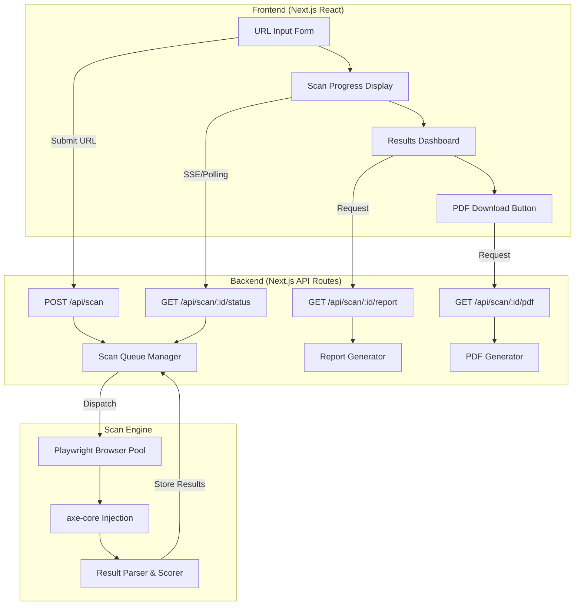

<!-- markdownlint-disable-file -->
# Architecture, Scoring Methodology & Report Generation Research

## Research Status: Complete

---

## 1. Web App Architecture

### Recommended Architecture: Client-Server with Async Scan Pipeline

```
┌─────────────────┐     ┌──────────────────┐     ┌─────────────────────┐
│   Frontend       │────▶│   Backend API    │────▶│  Scan Worker        │
│   (Next.js)      │◀────│   (Next.js API   │◀────│  (Playwright +      │
│                  │ SSE │    Routes)       │     │   axe-core)         │
│  - URL input     │     │  - POST /scan    │     │  - Launch browser   │
│  - Progress bar  │     │  - GET /scan/:id │     │  - Navigate to URL  │
│  - Report view   │     │  - GET /report   │     │  - Inject axe-core  │
│  - PDF download  │     │                  │     │  - Return results   │
└─────────────────┘     └──────────────────┘     └─────────────────────┘
```

**Why this architecture:**

- **Single codebase**: Next.js provides both frontend (React) and backend (API routes) in one project
- **SSE for progress**: Server-Sent Events are simpler than WebSockets for one-way progress updates, no library needed
- **Scan isolation**: Headless browser runs in a worker/subprocess to avoid blocking the API

### Architecture Diagram (Mermaid)



---

## 2. Technology Stack Recommendation

| Layer | Technology | Rationale |
|---|---|---|
| **Framework** | Next.js 15 (App Router) | Unified frontend + backend, React Server Components, API routes, built-in SSR |
| **Language** | TypeScript | Type safety for complex scan result objects, better DX |
| **Accessibility Engine** | axe-core v4.11+ | Industry standard, WCAG 2.2 AA support, zero false positives policy, 13M+ users |
| **Headless Browser** | Playwright | Multi-browser support, faster than Puppeteer, better reliability, Microsoft-maintained |
| **axe Integration** | @axe-core/playwright | Official adapter, chainable API, 2.2M weekly downloads |
| **PDF Generation** | Puppeteer (page.pdf()) or PDFKit | HTML-to-PDF for report layout fidelity (Puppeteer), or programmatic generation (PDFKit) |
| **Styling** | Tailwind CSS | Rapid UI development, accessible patterns |
| **State Management** | React hooks / Zustand | Lightweight for scan state tracking |

---

## 3. Headless Browser: Playwright vs Puppeteer

### Recommendation: **Playwright**

| Feature | Playwright | Puppeteer |
|---|---|---|
| **Multi-browser** | Chromium, Firefox, WebKit | Chromium only (Firefox experimental) |
| **Maintainer** | Microsoft | Google |
| **npm Weekly Downloads** | ~10M | ~8.3M |
| **axe-core Adapter** | @axe-core/playwright (official) | @axe-core/puppeteer (official) |
| **Auto-wait** | Built-in smart waiting | Manual waitForSelector needed |
| **Test Framework** | @playwright/test built-in | External test runner needed |
| **Browser Install** | `npx playwright install` | Downloads Chrome on `npm install` |
| **Contexts** | Isolated browser contexts | Incognito contexts |
| **Performance** | Faster execution, parallel contexts | Slightly slower |
| **Stability** | More reliable in CI/server environments | Occasional flakiness |

**Key reason for Playwright**: Playwright's `@axe-core/playwright` integration has first-class accessibility testing documentation at <https://playwright.dev/docs/accessibility-testing>, and Playwright handles page loading, waiting, and context isolation more reliably for scanning arbitrary URLs.

### Integration Example

```javascript
const { chromium } = require('playwright');
const { AxeBuilder } = require('@axe-core/playwright');

async function scanUrl(url) {
  const browser = await chromium.launch({ headless: true });
  const context = await browser.newContext();
  const page = await context.newPage();

  await page.goto(url, { waitUntil: 'networkidle', timeout: 30000 });

  const results = await new AxeBuilder({ page })
    .withTags(['wcag2a', 'wcag2aa', 'wcag21a', 'wcag21aa', 'wcag22aa'])
    .analyze();

  await browser.close();
  return results;
}
```

---

## 4. Handling Long-Running Scans

### Recommendation: **Server-Sent Events (SSE)**

| Approach | Pros | Cons | Best For |
|---|---|---|---|
| **SSE** | Simple, HTTP-native, auto-reconnect, one-way server→client | One-way only | Progress updates ✅ |
| **WebSocket** | Bidirectional, real-time | Complex setup, overkill for this | Chat, collaborative editing |
| **Polling** | Simplest to implement | Wastes resources, latency | Fallback if SSE unsupported |

**Implementation pattern:**

1. `POST /api/scan` — Accepts URL, returns `scanId`, starts scan asynchronously
2. `GET /api/scan/:id/events` — SSE endpoint streaming progress updates
3. Progress events: `{ status: 'navigating' | 'scanning' | 'scoring' | 'complete', progress: 0-100, message: string }`
4. On completion, SSE sends final event with score summary; client fetches full results

---

## 5. Recommended Project Structure

```
accessibility-scanner/
├── src/
│   ├── app/                        # Next.js App Router
│   │   ├── page.tsx                # Home page with URL input
│   │   ├── scan/[id]/
│   │   │   └── page.tsx            # Scan results page
│   │   ├── api/
│   │   │   ├── scan/
│   │   │   │   ├── route.ts        # POST: start scan
│   │   │   │   └── [id]/
│   │   │   │       ├── route.ts    # GET: scan results
│   │   │   │       ├── status/
│   │   │   │       │   └── route.ts # GET: SSE progress
│   │   │   │       └── pdf/
│   │   │   │           └── route.ts # GET: PDF download
│   │   │   └── health/
│   │   │       └── route.ts        # Health check
│   │   └── layout.tsx
│   ├── components/
│   │   ├── ScanForm.tsx            # URL input + submit
│   │   ├── ScanProgress.tsx        # Progress indicator
│   │   ├── ScoreDisplay.tsx        # Score circle/gauge
│   │   ├── ViolationList.tsx       # Violations by principle
│   │   ├── ReportView.tsx          # Full report rendering
│   │   └── PdfDownloadButton.tsx
│   ├── lib/
│   │   ├── scanner/
│   │   │   ├── engine.ts           # Playwright + axe-core scan logic
│   │   │   ├── browser-pool.ts     # Browser instance management
│   │   │   └── result-parser.ts    # Parse axe results
│   │   ├── scoring/
│   │   │   ├── calculator.ts       # Score computation
│   │   │   ├── weights.ts          # Impact/principle weights
│   │   │   └── wcag-mapper.ts      # Map violations to WCAG principles
│   │   ├── report/
│   │   │   ├── generator.ts        # Report data assembly
│   │   │   ├── pdf-generator.ts    # PDF creation
│   │   │   └── templates/          # PDF/HTML report templates
│   │   └── types/
│   │       ├── scan.ts             # Scan result types
│   │       ├── score.ts            # Score types
│   │       └── report.ts           # Report types
│   └── styles/
├── public/
│   └── assets/                     # Logos, icons
├── package.json
├── tsconfig.json
├── next.config.js
└── README.md
```

---

## 6. Existing Scoring Methodologies

### Lighthouse Accessibility Score

- **Method**: Weighted average of all accessibility audits
- **Weights**: Based on axe user impact assessments (3, 7, or 10 points per audit)
- **Pass/Fail**: Each audit is binary — partial passes score 0
- **Weight distribution**:
  - Weight 10: `aria-hidden-body`, `aria-required-attr`, `aria-required-children`, `aria-required-parent`, `aria-roles`, `aria-valid-attr-values`, `aria-valid-attr`, `button-name`, `duplicate-id-aria`, `image-alt`, `input-image-alt`, `label`, `meta-refresh`, `meta-viewport`, `select-name`, `video-caption`, etc.
  - Weight 7: `accesskeys`, `aria-allowed-attr`, `aria-command-name`, `color-contrast`, `document-title`, `html-has-lang`, `html-lang-valid`, `link-name`, `list`, `listitem`, `td-has-header`, etc.
  - Weight 3: `duplicate-id-active`, `heading-order`, `html-xml-lang-mismatch`, `label-content-name-mismatch`, `landmark-one-main`, `skip-link`
- **Formula**: `score = Σ(weight_i × pass_i) / Σ(weight_i)` → normalized to 0-100

### WAVE (WebAIM)

- **Method**: Issue counting with severity categories
- **Categories**: errors, contrast errors, alerts, features, structural elements, ARIA
- **Each item maps to specific WCAG success criteria**
- **No composite score** — presents raw counts per category
- **API returns**: JSON with issue names, types, summaries, WCAG guideline links

### accessiBe accessScan

- **Method**: AI-powered scanning, WCAG-based
- **Output**: "Accessible" or "Inaccessible" determination per page
- **Report**: Downloadable PDF with findings, compliance badge (ADA, AODA, Section 508)
- **Supported standards**: ADA, Section 508, AODA, ACA, EAA, WCAG

---

## 7. Recommended WCAG 2.2 Scoring Methodology

### Hybrid Approach: Weighted Pass Rate by Impact

```
Score = 100 × Σ(weight_i × pass_rate_i) / Σ(weight_i)
```

Where:
- **pass_rate_i** = rules in impact level i that passed / total applicable rules in impact level i
- **weight_i** = impact weight for level i

### Impact Weights (from axe-core)

| axe-core Impact | Weight | Description |
|---|---|---|
| **critical** | 10 | Blocks access completely (e.g., no alt text on sole content image) |
| **serious** | 7 | Significantly impairs access (e.g., insufficient color contrast) |
| **moderate** | 3 | Causes some difficulty (e.g., heading order skipped) |
| **minor** | 1 | Inconvenience (e.g., tabindex > 0) |

### Scoring Formula

```typescript
interface ScoreResult {
  overallScore: number;        // 0-100
  principleScores: {
    perceivable: number;       // 0-100
    operable: number;          // 0-100
    understandable: number;    // 0-100
    robust: number;            // 0-100
  };
  impactBreakdown: {
    critical: { passed: number; failed: number; };
    serious: { passed: number; failed: number; };
    moderate: { passed: number; failed: number; };
    minor: { passed: number; failed: number; };
  };
}

function calculateScore(axeResults: AxeResults): number {
  const weights = { critical: 10, serious: 7, moderate: 3, minor: 1 };
  const allRules = [...axeResults.passes, ...axeResults.violations];

  let weightedPassSum = 0;
  let weightedTotalSum = 0;

  for (const rule of allRules) {
    const impact = rule.impact || 'minor';
    const weight = weights[impact];
    const passed = axeResults.passes.some(p => p.id === rule.id) ? 1 : 0;

    weightedPassSum += weight * passed;
    weightedTotalSum += weight;
  }

  return weightedTotalSum > 0
    ? Math.round((weightedPassSum / weightedTotalSum) * 100)
    : 100;
}
```

### Score Grading

| Score Range | Grade | Label | Color |
|---|---|---|---|
| 90-100 | A | Excellent | Green |
| 70-89 | B | Good | Light Green |
| 50-69 | C | Needs Improvement | Yellow |
| 30-49 | D | Poor | Orange |
| 0-29 | F | Critical Issues | Red |

---

## 8. Categorizing Issues by WCAG 2.2 Principles (POUR)

### Mapping axe-core Tags to Principles

axe-core violations include `tags` that map to WCAG success criteria. The WCAG SC number prefix determines the principle:

| Principle | WCAG Guidelines | axe-core Tag Prefix |
|---|---|---|
| **Perceivable** | 1.x (1.1, 1.2, 1.3, 1.4) | `wcag1*` (e.g., `wcag111`, `wcag143`) |
| **Operable** | 2.x (2.1, 2.2, 2.3, 2.4, 2.5) | `wcag2*` (e.g., `wcag211`, `wcag258`) |
| **Understandable** | 3.x (3.1, 3.2, 3.3) | `wcag3*` (e.g., `wcag311`, `wcag338`) |
| **Robust** | 4.x (4.1) | `wcag4*` (e.g., `wcag412`) |

### Implementation

```typescript
function mapViolationToPrinciple(tags: string[]): string {
  const wcagTag = tags.find(t => /^wcag\d{3,}$/.test(t));
  if (!wcagTag) return 'best-practice';

  const firstDigit = wcagTag.charAt(4);
  switch (firstDigit) {
    case '1': return 'perceivable';
    case '2': return 'operable';
    case '3': return 'understandable';
    case '4': return 'robust';
    default: return 'other';
  }
}
```

---

## 9. Mapping axe-core Impact Levels to Scoring

axe-core provides four impact levels on every violation node:

| Impact | Meaning | Example Rules |
|---|---|---|
| **critical** | Completely blocks access | `image-alt` (missing), `aria-hidden-body` |
| **serious** | Significantly impairs access | `color-contrast`, `label`, `link-name` |
| **moderate** | Some difficulty accessing | `heading-order`, `region` |
| **minor** | Minor inconvenience | `tabindex`, `meta-viewport-large-scale` |

Each violation can have a different impact per node (element). For scoring:

- Use the **highest impact** across all nodes for a given rule as the rule's impact
- Weight the score calculation by the impact weights defined above

---

## 10. PDF Report Generation

### Recommendation: **Puppeteer `page.pdf()` (HTML-to-PDF)**

| Approach | Pros | Cons | Best For |
|---|---|---|---|
| **Puppeteer page.pdf()** | Exact HTML/CSS rendering, supports complex layouts, headers/footers | Requires Chromium, heavier | Branded reports with charts ✅ |
| **PDFKit** | Lightweight, no browser needed, programmatic, MIT license | Manual layout, no HTML/CSS | Simple data reports |
| **jsPDF** | Browser-compatible, lightweight | Limited styling, no server rendering | Client-side only |
| **@react-pdf/renderer** | React components to PDF | Learning curve, limited CSS | React-heavy projects |

### Recommended Approach: Render HTML Report → Puppeteer PDF

```typescript
import puppeteer from 'puppeteer';

async function generatePdf(reportHtml: string): Promise<Buffer> {
  const browser = await puppeteer.launch({ headless: true });
  const page = await browser.newPage();

  await page.setContent(reportHtml, { waitUntil: 'networkidle0' });

  const pdfBuffer = await page.pdf({
    format: 'A4',
    printBackground: true,
    margin: { top: '1cm', right: '1cm', bottom: '1cm', left: '1cm' },
    displayHeaderFooter: true,
    headerTemplate: '<div style="font-size:10px; text-align:center; width:100%;">WCAG 2.2 Accessibility Report</div>',
    footerTemplate: '<div style="font-size:10px; text-align:center; width:100%;">Page <span class="pageNumber"></span> of <span class="totalPages"></span></div>',
  });

  await browser.close();
  return Buffer.from(pdfBuffer);
}
```

**Note**: Since Playwright is already used for scanning, the project can use Puppeteer specifically for PDF generation (since Playwright lacks a `page.pdf()` equivalent with the same fidelity), or use a shared Chromium instance.

### Alternative: PDFKit for Lightweight Generation

PDFKit (2.1M weekly downloads, MIT license) supports:

- Vector graphics, text, images, fonts
- Tables, lists, multi-page documents
- Accessibility features (Tagged PDF, PDF/UA support)
- Works in Node.js and browser

---

## 11. Report Content Requirements

### Report Structure

1. **Header Section**
   - Organization logo / app branding
   - Report title: "WCAG 2.2 Level AA Accessibility Report"
   - Scanned URL
   - Scan date/time
   - Scan engine version (axe-core version)

2. **Executive Summary**
   - Overall accessibility score (0-100 with grade)
   - Score gauge/donut chart visualization
   - Compliance status: "Compliant" / "Needs Remediation"
   - Total violations / passes / incomplete count
   - Quick stat badges: Critical, Serious, Moderate, Minor counts

3. **Score Breakdown by Principle (POUR)**
   - Perceivable score + violation count
   - Operable score + violation count
   - Understandable score + violation count
   - Robust score + violation count
   - Radar/bar chart visualization

4. **Issue Summary Table**
   - Violation ID, description, impact, WCAG criteria, element count

5. **Detailed Violations** (per violation)
   - Rule ID and description
   - Impact level (with color code)
   - WCAG success criterion reference
   - Number of affected elements
   - For each affected element:
     - CSS selector (target)
     - HTML snippet
     - Fix/remediation suggestion (from axe-core `help` and `helpUrl`)

6. **Passes Section** (collapsible)
   - List of rules that passed with count

7. **Incomplete/Manual Review**
   - Items axe-core could not fully determine
   - Guidance for manual testing

8. **AODA Compliance Note**
   - AODA requires WCAG 2.0 Level AA (IASR regulation)
   - WCAG 2.2 conformance provides superset coverage

9. **Footer**
   - Disclaimer: "Automated testing detects ~57% of WCAG issues. Manual testing recommended."
   - Link to axe-core documentation
   - Generation timestamp

---

## 12. Reference: accessiBe Report Structure

Based on research of accessiBe's accessScan:

- **3-step process**: Enter URL → Get results → Download free report
- **650,000+ scans performed annually**
- **Output**: "Accessible" or "Inaccessible" binary determination
- **Report delivery**: PDF emailed to user
- **Compliance badges**: ADA, Section 508, AODA, ACA
- **Structure**: Summary finding, detailed issue breakdown, remediation roadmap
- **Note**: The user has a sample report at `assets/sample-accessibility-report.pdf` which should be reviewed for exact layout reference

---

## 13. AODA Requirements

### Key Facts from Ontario Legislation

- **Full name**: Accessibility for Ontarians with Disabilities Act, 2005 (S.O. 2005, c. 11)
- **Purpose**: Develop, implement, and enforce accessibility standards for Ontario
- **Original target date**: Full accessibility by January 1, 2025
- **Penalties**: Up to $50,000/day for individuals, $100,000/day for corporations
- **Applies to**: All public and private sector organizations in Ontario

### Web Accessibility Under AODA

Under the **Information and Communications Standards** (O. Reg. 191/11, sections 9-19):

- **Who must comply**: Designated public sector organizations AND businesses/non-profits with 50+ employees
- **Requirement**: Public websites and web content posted after January 1, 2012 must meet **WCAG 2.0 Level AA**
- **Exceptions**: SC 1.2.4 (live captions) and SC 1.2.5 (pre-recorded audio descriptions) are exempted
- **Internal websites**: Not required to meet WCAG 2.0 Level AA (except Government of Ontario and Legislative Assembly)

### Obligations

- Organizations controlling a website (directly or contractually) must ensure compliance
- Must meet Level A criteria before Level AA
- If compliance is not possible, must explain why and provide summary of unconvertible content

---

## 14. AODA to WCAG Mapping

| AODA Requirement | WCAG Standard | Level | Notes |
|---|---|---|---|
| **Legally required** | WCAG 2.0 | Level AA | O. Reg. 191/11 under AODA |
| **Excluded SC** | 1.2.4 (Live Captions) | AA | Not required by AODA |
| **Excluded SC** | 1.2.5 (Audio Description) | AA | Not required by AODA |
| **Recommended** | WCAG 2.2 | Level AA | Latest W3C standard, superset of 2.0 |

### Implications for the Scanner

- **Test against WCAG 2.2 Level AA** (superset of AODA's WCAG 2.0 Level AA requirement)
- **Flag AODA compliance**: A page that passes WCAG 2.2 Level AA (minus 1.2.4 and 1.2.5) is AODA-compliant
- **Report should note**: "AODA requires WCAG 2.0 Level AA. This scan tests against WCAG 2.2 Level AA, which includes and exceeds AODA requirements."

---

## 15. AODA-Specific Rules Beyond WCAG

**There are no AODA-specific technical rules beyond WCAG.** AODA's web accessibility requirements are entirely defined by reference to WCAG 2.0 Level AA success criteria (with two exclusions).

However, AODA has **procedural/organizational requirements** not related to web content testing:

- Organizations must file accessibility reports with a director annually
- Organizations must make accessibility reports available to the public
- Organizations must have accessibility policies and plans
- Customer service standards, employment standards, transportation standards, etc.

**For the scanner**: Testing WCAG 2.2 Level AA covers all technical requirements of AODA. The report should include AODA context/language to help Ontario organizations understand their compliance status.

---

## 16. Phase 2: URL Crawling for Multi-Page Scanning

### Recommended Libraries

| Library | Description | Use Case |
|---|---|---|
| **simplecrawler** | Lightweight Node.js crawler | Basic site crawling |
| **crawlee** | Apify's crawler framework (Playwright/Puppeteer) | Full-featured crawling with browser rendering |
| **Playwright built-in** | `page.$$eval('a')` to extract links | Simple same-domain link extraction |
| **sitemap-parser** | Parse XML sitemaps | Sitemap-based URL discovery |

### Recommended Approach

1. Accept a home URL
2. Discover sub-URLs via:
   - Parse sitemap.xml if available
   - Extract `<a href>` links from the home page
   - Filter to same-domain only
3. Respect `robots.txt` (use `robots-parser` npm package)
4. Queue pages for scanning with concurrency limit
5. Aggregate results into a site-wide report with per-page scores

---

## 17. CI/CD Pipeline Integration

### GitHub Actions Integration

```yaml
name: Accessibility Scan
on: [push, pull_request]
jobs:
  a11y-test:
    runs-on: ubuntu-latest
    steps:
      - uses: actions/checkout@v4
      - uses: actions/setup-node@v4
        with:
          node-version: 20
      - run: npm ci
      - run: npx playwright install chromium
      - run: npm run build && npm start &
      - run: npx pa11y-ci --config .pa11yci.json
      # OR using axe-core directly:
      - run: npx @axe-core/cli http://localhost:3000 --tags wcag2a,wcag2aa
```

### Integration Points

- **Pre-commit**: Lint HTML for basic accessibility (eslint-plugin-jsx-a11y)
- **PR checks**: Run pa11y-ci against preview deployment URLs
- **Post-deploy**: Scan production URLs, fail deployment if critical issues found
- **Scheduled**: Weekly full-site crawl and report generation

---

## 18. Existing CI/CD Accessibility Tools

| Tool | Type | Description |
|---|---|---|
| **pa11y-ci** (v4.1.0) | CLI/CI runner | Runs pa11y against URL list or sitemap, JSON/CLI/HTML reporters, threshold-based exit codes, LGPL-3.0 |
| **@axe-core/cli** | CLI | Run axe-core from command line against URLs |
| **axe-linter** | GitHub App | Automated accessibility linting on PRs |
| **eslint-plugin-jsx-a11y** | ESLint plugin | Static analysis for JSX accessibility |
| **lighthouse-ci** | CLI/CI | Run Lighthouse audits in CI, includes accessibility category |
| **accessibility-insights-action** | GitHub Action | Microsoft's action using axe-core |
| **cypress-axe** | Cypress plugin | axe-core integration for Cypress E2E tests |
| **jest-axe** | Jest matcher | `toHaveNoViolations()` assertion for Jest |

### pa11y-ci Key Features

- Supports URL list or sitemap scanning
- Configurable via `.pa11yci` JSON or JavaScript config
- Concurrency control for parallel scanning
- Custom reporters (CLI, JSON, HTML, custom)
- Threshold setting: permit N errors before failing
- Docker-compatible with Puppeteer images
- Active maintenance: v4.1.0, Node 20/22/24 support

---

## WCAG 2.2 New Success Criteria (for Scanner Coverage)

### New in WCAG 2.2 (9 new SCs)

| Success Criterion | Level | Category |
|---|---|---|
| **2.4.11** Focus Not Obscured (Minimum) | AA | Operable |
| **2.4.12** Focus Not Obscured (Enhanced) | AAA | Operable |
| **2.4.13** Focus Appearance | AAA | Operable |
| **2.5.7** Dragging Movements | AA | Operable |
| **2.5.8** Target Size (Minimum) | AA | Operable |
| **3.2.6** Consistent Help | A | Understandable |
| **3.3.7** Redundant Entry | A | Understandable |
| **3.3.8** Accessible Authentication (Minimum) | AA | Understandable |
| **3.3.9** Accessible Authentication (Enhanced) | AAA | Understandable |

### Removed in WCAG 2.2

- **4.1.1 Parsing** — obsolete and removed (assistive technology no longer needs direct HTML parsing)

### axe-core Coverage

axe-core uses the tag `wcag22aa` to identify WCAG 2.2 Level AA rules. The scanner should filter with:

```javascript
.withTags(['wcag2a', 'wcag2aa', 'wcag21a', 'wcag21aa', 'wcag22aa'])
```

**Note**: axe-core can automatically detect ~57% of WCAG issues. Items it cannot determine are returned as "incomplete" for manual review.

---

## References & Evidence

| Source | URL | Key Finding |
|---|---|---|
| AODA Legislation | <https://www.ontario.ca/laws/statute/05a11> | Full AODA statute text, penalties, compliance requirements |
| Ontario WCAG Guide | <https://www.ontario.ca/page/how-make-websites-accessible> | AODA requires WCAG 2.0 AA with 2 exclusions (1.2.4, 1.2.5) |
| WCAG 2.2 Spec | <https://www.w3.org/TR/WCAG22/> | 9 new SCs, 4.1.1 removed, conformance model |
| WCAG 2.2 New in 22 | <https://www.w3.org/WAI/standards-guidelines/wcag/new-in-22/> | New SC summaries with persona examples |
| Lighthouse Scoring | <https://developer.chrome.com/docs/lighthouse/accessibility/scoring> | Weighted average, weights 3/7/10 per audit |
| WAVE API | <https://wave.webaim.org/api/docs> | Issue types, WCAG mappings per WAVE item |
| Playwright a11y docs | <https://playwright.dev/docs/accessibility-testing> | Official @axe-core/playwright integration guide |
| @axe-core/playwright | <https://www.npmjs.com/package/@axe-core/playwright> | v4.11.1, MPL-2.0, 2.2M weekly downloads |
| axe-core (prior research) | <https://github.com/dequelabs/axe-core> | v4.11.1, 6.9k stars, WCAG 2.2 AA support |
| PDFKit | <https://www.npmjs.com/package/pdfkit> | v0.17.2, MIT, 2.1M weekly downloads, PDF/UA support |
| Puppeteer | <https://www.npmjs.com/package/puppeteer> | v24.38.0, 8.3M weekly downloads, page.pdf() |
| pa11y-ci | <https://www.npmjs.com/package/pa11y-ci> | v4.1.0, sitemap support, CI-focused, custom reporters |
| accessiBe accessScan | <https://accessibe.com/accessscan> | Reference scanner, AODA/ADA compliance badges |
| Prior engine research | `accessibility-engines-research.md` | axe-core, pa11y, Lighthouse comparison |

---

## Clarifying Questions

1. **Sample report review**: The sample report at `assets/sample-accessibility-report.pdf` should be reviewed to match its specific layout, sections, and branding in the report generator. This is a binary file and cannot be read by the research tools.

2. **Deployment target**: Should the app be deployable to Azure App Service, Vercel, or Docker? This affects whether Puppeteer/Playwright binaries need special handling.

3. **Authentication**: Should the scanner support scanning pages behind authentication (login)? pa11y supports browser actions (fill forms, click buttons) for this purpose.

4. **Rate limiting**: Should the scanner include rate limiting to prevent abuse (e.g., max scans per IP/hour)?

5. **Data persistence**: Should scan results be stored in a database for history, or are they ephemeral (scan and forget)?
