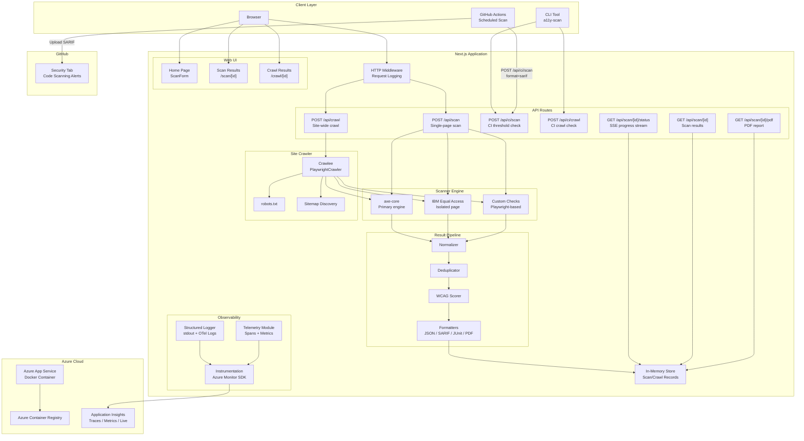

## Overview

A full-stack accessibility scanning platform that tests websites against WCAG 2.2 Level AA criteria using
three complementary engines: axe-core, IBM Equal Access, and custom Playwright-based checks. Results are
normalized, deduplicated, and scored to produce actionable reports in multiple formats.

Built with Next.js 15, React 19, and TypeScript. Supports single-page scans, full-site crawls with
configurable depth and concurrency, and CI/CD integration through a CLI, GitHub Action, and scheduled
SARIF-based security scanning.

## Features

* **Multi-engine scanning** with axe-core, IBM Equal Access, and custom checks running together
  with cross-engine deduplication and severity-based prioritization.
* **Single-page scan** via the web UI or API to scan one page.
* **Site-wide crawl** with BFS traversal, robots.txt compliance, sitemap discovery, configurable
  max pages (1-200), depth (1-10), and concurrency (1-5).
* **WCAG scoring** weighted by impact (critical, serious, moderate, minor) mapped to
  WCAG principles (Perceivable, Operable, Understandable, Robust) with A-F grading.
* **AODA compliance** reporting (WCAG 2.0 AA as a subset of WCAG 2.2 AA).
* **Multiple output formats** including JSON, SARIF 2.1.0, JUnit XML, PDF, and HTML reports.
* **CLI tool** with `a11y-scan scan` and `a11y-scan crawl` commands including threshold gating.
* **GitHub Action** for CI pipelines with score/pass outputs and SARIF upload support.
* **Scheduled accessibility scanning** via GitHub Actions with SARIF results published to the
  GitHub Security tab.
* **CI threshold gating** to fail builds on score, violation count per severity, or specific rule IDs.
* **Structured logging** with configurable log levels, writing to both stdout and OpenTelemetry.
* **Azure Application Insights** integration with custom metrics, traces, live metrics, and
  100% sampling for full telemetry visibility.
* **HTTP request logging** via Next.js middleware for all API and page routes.
* **SSRF prevention** blocking scans of localhost, private IPs, and internal hostnames.
* **Self-testing** where the app scans itself in CI using Playwright e2e tests.

## Tech Stack

| Category | Technology |
| --- | --- |
| Framework | Next.js 15.5 (standalone output, Turbopack) |
| Language | TypeScript 5, React 19 |
| Styling | Tailwind CSS 4 |
| Scan engines | axe-core 4.11, IBM Equal Access 4.0, custom Playwright checks |
| Crawling | Crawlee 3.16 (Playwright-based) |
| PDF generation | Puppeteer 24 |
| Observability | Azure Monitor OpenTelemetry 1.16, OpenTelemetry API 1.9, OTel Logs API 0.57 |
| Unit tests | Vitest 4 with coverage-v8 |
| E2E tests | Playwright 1.58 with @axe-core/playwright |
| CLI | Commander 14 |
| Container | Docker (multi-stage, node:20-bookworm-slim) |
| Infrastructure | Azure Bicep (ACR + App Service) |
| CI/CD | GitHub Actions |

## Quick Start

### Prerequisites

* Node.js 20+
* npm 10+
* Docker (optional, for container mode)

### Install dependencies

```bash
npm install
npx playwright install --with-deps chromium
```

### Run locally

```powershell
# Fast dev mode (default) — uses Next.js dev server with Turbopack
.\start-local.ps1

# Docker mode — builds container, closer to production
.\start-local.ps1 -Mode docker
```

The app starts at `http://localhost:3000`.

### Stop

```powershell
# Stop dev server
.\stop-local.ps1

# Stop Docker container
.\stop-local.ps1 -Mode docker
```

## Scanning Engines

### axe-core

The primary engine. Runs axe-core directly on the page via `@axe-core/playwright` with the original
`axe.min.js` read from disk (not the webpack-bundled version) wrapped in a closure to prevent
CommonJS `module` reference errors on sites with AMD loaders.

Tags tested: `wcag2a`, `wcag2aa`, `wcag21a`, `wcag21aa`, `wcag22aa`, `best-practice`.

### IBM Equal Access

Runs IBM's accessibility-checker ACE engine in an **isolated Playwright page** to prevent its
`eval()`-based script injection from corrupting the main page's JavaScript context. If the IBM
scan fails, results gracefully degrade to axe-core only.

### Custom Checks

Playwright-based checks that catch issues the other engines miss:

* **ambiguous-link-text** — detects generic link text ("Learn More", "Click Here", etc.)
* **aria-current-page** — verifies navigation links to the current page have `aria-current="page"`
* **emphasis-strong-semantics** — flags `<b>` and `<i>` tags that should be `<strong>` and `<em>`
* **discount-price-accessibility** — ensures strikethrough pricing provides screen reader context
* **sticky-element-overlap** — detects focusable elements obscured by fixed/sticky positioned elements

## Architecture



## CLI

The CLI is available as `a11y-scan` after building:

```bash
npm run build
```

### Single-page scan

```bash
a11y-scan scan --url https://example.com --threshold 80 --format sarif --output results/
```

### Site-wide crawl

```bash
a11y-scan crawl --url https://example.com --max-pages 100 --max-depth 3 --concurrency 3 --threshold 70 --format json
```

### Configuration file

Create `.a11yrc.json` in the project root:

```json
{
  "url": "https://example.com",
  "threshold": 80,
  "output": "./results",
  "format": "sarif",
  "crawl": {
    "maxPages": 100,
    "maxDepth": 3,
    "concurrency": 3
  }
}
```

## GitHub Action

Use the built-in action in your workflow:

```yaml
- uses: devopsabcs-engineering/accessibility-scan-demo-app@main
  with:
    url: https://example.com
    mode: single          # or "crawl"
    threshold: 70
    max-pages: 50         # crawl mode only
    output-format: sarif  # json, sarif, or junit
    output-directory: ./a11y-results
```

**Outputs:** `score` (0–100), `passed` (true/false), `report-path`.

## Testing

### Unit tests

```bash
npm test                # run once
npm run test:watch      # watch mode
npm run test:coverage   # with coverage report
```

356 unit tests covering scanner engines, result normalization, scoring, crawling, CLI commands,
report generation, and CI formatters.

### E2E accessibility tests

```bash
npm run test:a11y
```

7 Playwright tests that scan the app's own pages (home, scan results, crawl results, reports)
against WCAG 2.2 AA to ensure the scanner UI itself is accessible.

### Lint

```bash
npm run lint
```

## Docker

### Build

```bash
docker build -t a11y-scan-demo:local .
```

### Run

```bash
docker run -d --name a11y-scan -p 3000:3000 a11y-scan-demo:local
```

The multi-stage Dockerfile:

1. **deps** installs npm dependencies (node:20-alpine)
2. **builder** builds the Next.js standalone output
3. **runner** is the production image (node:20-bookworm-slim) with Chromium, Chrome, and procps
   pre-installed. All node_modules are copied to ensure serverExternalPackages (Crawlee,
   Azure Monitor OpenTelemetry, etc.) have their full transitive dependency trees.

## Infrastructure

Azure deployment is defined in `infra/main.bicep`:

* Azure Container Registry (Basic SKU)
* App Service Plan (Linux)
* Web App for Containers pulling from ACR

Deploy via GitHub Actions (`.github/workflows/deploy.yml`) using OIDC authentication.

## CI/CD Pipelines

### CI workflow

The CI workflow (`.github/workflows/ci.yml`) runs on every push to `main` and on pull requests:

1. **Lint** with ESLint
2. **Unit tests** with Vitest and coverage (thresholds: 80% lines, 80% statements, 80% functions, 65% branches)
3. **Build** the Next.js production output
4. **E2E tests** with Playwright self-scan accessibility tests
5. **Reports** uploaded as artifacts (test results, coverage, accessibility reports)

### Deploy workflow

The deploy workflow (`.github/workflows/deploy.yml`) builds a Docker image and deploys to Azure
App Service via OIDC authentication. It provisions infrastructure with Bicep, pushes the image
to Azure Container Registry, and restarts the web app.

### Accessibility scan workflow

The accessibility scan workflow (`.github/workflows/a11y-scan.yml`) runs on a weekly schedule
(Monday 06:00 UTC) and on manual dispatch. It scans three target websites using the deployed
app's CI API and publishes SARIF results to the GitHub Security tab:

| Target | URL |
| --- | --- |
| codepen-sample | `https://codepen.io/leezee/pen/eYbXzpJ` |
| a11y-scan-demo-app | `https://a11y-scan-demo-app.azurewebsites.net/` |
| ontario-gov | `https://www.ontario.ca/page/government-ontario` |

Each site is scanned independently via matrix strategy. SARIF files are uploaded using
`github/codeql-action/upload-sarif@v4` with per-site categories, making accessibility
violations visible as Code Scanning alerts under the repository Security tab.

### Azure Pipelines

An equivalent Azure Pipelines definition (`.azuredevops/pipelines/a11y-scan.yml`) scans the
same three URLs via the deployed app's CI API, using matrix strategy for parallel execution
and publishing SARIF artifacts. Configure it in Azure DevOps by pointing a pipeline to this
file in the GitHub repository.

## Observability

The application includes structured logging and telemetry that work together to provide
visibility in both the Azure App Service log stream and Application Insights.

### Structured logging

A lightweight logger (`src/lib/logger.ts`) writes structured messages to stdout/stderr with
ISO timestamps, log levels, and component names. Every log call also emits an OpenTelemetry
log record via `@opentelemetry/api-logs`, which the Azure Monitor exporter sends to
Application Insights as Traces.

Example log stream output:

```text
[2026-03-08T21:32:57.539Z] [INFO] [api:scan] Scan requested {"scanId":"d340...","url":"https://example.com"}
[2026-03-08T21:33:07.613Z] [INFO] [telemetry] Scan completed {"scanId":"d340...","durationMs":10073,"score":31}
```

### HTTP request middleware

A Next.js middleware (`src/middleware.ts`) logs every HTTP request to `/api/*`, `/scan/*`, and
`/crawl/*` routes with method, path, status code, duration, and user agent.

### OpenTelemetry integration

The telemetry module (`src/lib/telemetry.ts`) emits custom spans and metrics for scan and
crawl operations:

| Metric | Type | Description |
| --- | --- | --- |
| `scan.total` | Counter | Total scans initiated |
| `scan.errors` | Counter | Total scan errors |
| `scan.duration_ms` | Histogram | Duration per scan |
| `crawl.total` | Counter | Total crawls initiated |
| `crawl.errors` | Counter | Total crawl errors |
| `crawl.duration_ms` | Histogram | Duration per crawl |
| `crawl.pages_scanned` | Histogram | Pages scanned per crawl |

### Application Insights

When `APPLICATIONINSIGHTS_CONNECTION_STRING` is set, the instrumentation module
(`src/instrumentation.ts`) initializes Azure Monitor OpenTelemetry with:

* 100% sampling ratio (no telemetry dropped)
* Live Metrics enabled for real-time monitoring
* Automatic export of spans, metrics, and log records

Data appears in Application Insights under Traces, Dependencies, Custom Metrics, and Live
Metrics.

## Environment Variables

| Variable | Required | Default | Description |
| --- | --- | --- | --- |
| `APPLICATIONINSIGHTS_CONNECTION_STRING` | No | (none) | Azure Application Insights connection string. Enables telemetry export. |
| `LOG_LEVEL` | No | `info` | Minimum log level: `debug`, `info`, `warn`, or `error`. |
| `PORT` | No | `3000` | Server listening port. |
| `NODE_OPTIONS` | No | (none) | Set to `--max-old-space-size=1024` in Docker for memory control. |

## Scoring

Scores are calculated using weighted impact severity:

| Impact | Weight |
| --- | --- |
| Critical | 10 |
| Serious | 7 |
| Moderate | 3 |
| Minor | 1 |

**Overall score** = (weighted passes / weighted total) × 100

**Grades:** A (90+), B (70+), C (50+), D (30+), F (<30)

**AODA compliant** when zero violations are found.

Site-wide scores aggregate per-page results with overall, lowest, highest, and
median page scores.

## AI-Assisted Development

The repository includes Copilot agent customizations under `.github/` that encode AODA
WCAG 2.2 domain knowledge for AI-assisted accessibility work.

### Agents

| File | Description |
| --- | --- |
| `.github/agents/a11y-detector.agent.md` | Detects AODA WCAG 2.2 violations through static code analysis and runtime scanning. Covers the top 10 React/Next.js violations, produces structured findings, and hands off to the Resolver agent. |
| `.github/agents/a11y-resolver.agent.md` | Resolves AODA WCAG 2.2 violations with standards-compliant code fixes. Applies fixes in priority order (critical → serious → moderate → minor) and can hand back to the Detector for re-scanning. |

### Prompts

| File | Description |
| --- | --- |
| `.github/prompts/a11y-scan.prompt.md` | Runs an AODA WCAG 2.2 accessibility scan on a target URL or the full project via the Detector agent. Accepts URL and scope (page or site) as inputs. |
| `.github/prompts/a11y-fix.prompt.md` | Fixes accessibility violations in the current file or project via the Resolver agent. Accepts file path and specific violation IDs as inputs. |

### Instructions

| File | Applies To | Description |
| --- | --- | --- |
| `.github/instructions/wcag22-rules.instructions.md` | `*.tsx, *.jsx, *.ts, *.html, *.css` | WCAG 2.2 Level AA compliance rules organized by POUR principles (Perceivable, Operable, Understandable, Robust) with React/Next.js-specific guidance. |
| `.github/instructions/a11y-remediation.instructions.md` | `*.tsx, *.jsx, *.ts, *.html, *.css` | Remediation lookup table mapping violation IDs to WCAG success criteria and code fix patterns, including React hooks and Next.js component recipes. |
| `.github/instructions/ado-workflow.instructions.md` | `**` | Required workflow for Azure DevOps work item tracking, Git branching (`feature/{id}-description`), commit message linking (`AB#{id}`), pull request creation, and post-merge branch cleanup. |

## Demo Applications

This repository embeds 5 intentionally inaccessible web applications used as scan targets
for workshop exercises and CI/CD pipeline testing:

| App | Language | Theme | Local Port |
| --- | --- | --- | --- |
| a11y-demo-app-001 | Rust | Travel Agency | 8001 |
| a11y-demo-app-002 | C# | E-Commerce | 8002 |
| a11y-demo-app-003 | Java | Learning Platform | 8003 |
| a11y-demo-app-004 | Python | Recipe Sharing | 8004 |
| a11y-demo-app-005 | Go | Fitness Tracker | 8005 |

Each app contains 15+ intentional WCAG 2.2 violations across categories including missing
alt text, contrast failures, keyboard traps, heading hierarchy violations, and more. Use
`scripts/bootstrap-demo-apps.ps1` to create individual repositories from these templates.

## Scripts

| Script | Purpose |
| --- | --- |
| `scripts/bootstrap-demo-apps.ps1` | Creates demo app repos from template directories, configures OIDC secrets, environments, and wikis |
| `scripts/setup-oidc.ps1` | Creates Azure AD app registration with federated credentials for GitHub Actions OIDC auth |

### Bootstrap Quick Start

```powershell
# 1. Log in to Azure CLI
az login

# 2. Log in to GitHub CLI with org admin permissions
gh auth login

# 3. Run OIDC setup (creates Azure AD app and federated credentials)
./scripts/setup-oidc.ps1

# 4. Run bootstrap (creates 5 demo app repos, configures secrets)
./scripts/bootstrap-demo-apps.ps1
```

## Project Structure

```text
a11y-demo-app-001/               # Rust/Actix-web travel booking demo app (port 8001)
a11y-demo-app-002/               # C#/ASP.NET e-commerce demo app (port 8002)
a11y-demo-app-003/               # Java/Spring Boot learning platform demo app (port 8003)
a11y-demo-app-004/               # Python/Flask recipe sharing demo app (port 8004)
a11y-demo-app-005/               # Go fitness tracker demo app (port 8005)
scripts/
├── bootstrap-demo-apps.ps1      # Create demo app repos from templates
└── setup-oidc.ps1               # Azure AD OIDC federation setup
src/
├── instrumentation.ts          # OpenTelemetry + Azure Monitor bootstrap
├── middleware.ts                # HTTP request logging middleware
├── app/                         # Next.js pages and API routes
│   ├── api/scan/                # Single-page scan API
│   ├── api/crawl/               # Site crawl API
│   ├── api/ci/                  # CI threshold API (scan + crawl)
│   ├── scan/[id]/               # Scan results page
│   └── crawl/[id]/              # Crawl results page
├── cli/                         # CLI tool (scan, crawl commands)
├── components/                  # React components (ScanForm, ReportView, etc.)
└── lib/
    ├── logger.ts                # Structured logger (stdout + OTel log records)
    ├── telemetry.ts             # Custom spans and metrics for scans/crawls
    ├── scanner/                 # Multi-engine scanner (axe, IBM, custom)
    ├── crawler/                 # Site crawler (robots, sitemap, URL utils)
    ├── scoring/                 # WCAG scoring and grading
    ├── report/                  # Report generators (HTML, PDF, SARIF)
    ├── ci/                      # CI threshold checking and formatters
    └── types/                   # TypeScript type definitions
e2e/                             # Playwright self-scan accessibility tests
infra/                           # Azure Bicep infrastructure
action/                          # GitHub Action definition
.github/
├── agents/
│   ├── a11y-detector.agent.md   # WCAG violation detection agent
│   └── a11y-resolver.agent.md   # WCAG violation fix agent
├── prompts/
│   ├── a11y-scan.prompt.md      # Accessibility scan prompt
│   └── a11y-fix.prompt.md       # Accessibility fix prompt
├── instructions/
│   ├── wcag22-rules.instructions.md        # WCAG 2.2 AA compliance rules
│   ├── a11y-remediation.instructions.md    # Remediation patterns and recipes
│   └── ado-workflow.instructions.md        # ADO work item and branching workflow
└── workflows/
    ├── ci.yml                   # Lint, test, build on push/PR
    ├── deploy.yml               # Docker build + Azure deploy
    └── a11y-scan.yml            # Scheduled SARIF accessibility scan
```

## License

This project is private.
